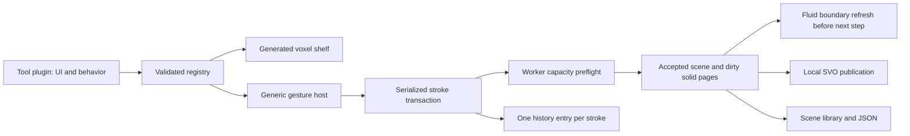

# Live voxel editor: research, UX and architecture

## Requirements

- Every accepted edit changes the rendered solid and the fluid boundary during the gesture, by the next simulation step. No reset, long-running simulation pause, global remesh or pipeline compilation is permitted in the interactive path. Bounded asynchronous GPU acceptance receipts may run while simulation continues; they must not fence the simulation loop.
- Each tool is a plugin that colocates UI contribution, controls, targeting and implementation. The viewport and tool shelf contain no tool-ID dispatch.
- One stroke is one undo entry. Undo restores authored geometry, not elapsed fluid evolution. Saving stores the scene recipe, not a fluid checkpoint.
- Existing user scenes, scene JSON, the library and autosave remain the persistence authority.

## Research

These recommendations translate established interactions to this application's volume representation; they do not imply that the source applications implement their brushes using voxels.

| Operation | Established interaction | Application here | Representation / cost |
| --- | --- | --- | --- |
| Build / carve | ZBrush Standard and Clay, inverted to subtract | Draw walls, barriers, channels and outlets with a spherical or box brush | Local union / difference; direct occupancy edits today |
| Primitive stamp / boolean | Houdini VDB Combine; Blender Box Trim | Add boxes, spheres and cylinders; cut doors, drains and tunnels | Bound the primitive; evaluate only intersecting pages |
| Face extrusion | Region extrusion in polygon modeling | Pick a face, draw its footprint and extrude by a voxel depth | Sweep a selected cross-section; no mesh face identity needed |
| Trim / flatten | ZBrush Planar/Trim; Blender Line Project | Level a spillway, cut a bank or establish a sloped plane | Trim is intersection with a half-space; flatten relaxes toward a plane and is a different operation |
| Smooth | ZBrush Smooth; Houdini VDB Smooth SDF | Round a channel and remove jagged terrain | Local field filter with a halo. Preserve thin barriers; ordinary smoothing can shrink volume |
| Inflate / erode | Houdini VDB Reshape SDF | Thicken a wall, widen a channel, close narrow gaps | SDF offset / morphology; update the active narrow band as it moves |
| Close holes / remove specks | VDB closing / opening | Repair accidental pinholes or floating fragments | Local dilate/erode pairs. Connectivity cleanup needs a bounded selection |
| Mask / isolate | Nomad masking | Protect the tank floor or work on one region | Independent edit-weight field. Visual hiding never removes a fluid collider |
| Move / duplicate / mirror | Nomad gizmo and symmetry | Reuse barriers and build symmetric experiments | Exact integer translation and axis mirrors for voxels; arbitrary transforms require resampling |
| Tube / curve sweep | Nomad Tube | Draw channels, pipes and curved barriers | Swept sphere/capsule or profile; local union/difference |
| Material paint | Nomad surface painting | Change the appearance without changing occupancy | Independent material mutation; no pressure-boundary refresh |

Primary sources, reviewed 2026-09-08:

- [ZBrush brush types](https://help.maxon.net/zbr/en-us/Content/html/reference-guide/brush/brush-types/brush-types.html): build/carve, move, smooth and planar brushes.
- [Houdini VDB Combine](https://www.sidefx.com/docs/houdini/nodes/sop/vdbcombine.html): SDF union, intersection and difference.
- [Houdini VDB Smooth SDF](https://www.sidefx.com/docs/houdini/nodes/sop/vdbsmoothsdf.html): mean, median, curvature and Laplacian smoothing.
- [Houdini VDB Reshape SDF](https://www.sidefx.com/docs/houdini/nodes/sop/vdbreshapesdf.html): dilation, erosion, opening, closing and active-band maintenance.
- [Blender Box Trim](https://docs.blender.org/manual/en/latest/sculpt_paint/sculpting/tools/box_trim.html) and [Line Project](https://docs.blender.org/manual/en/latest/sculpt_paint/sculpting/tools/line_project.html): gesture-defined cuts and planar projection.
- [Nomad tools](https://nomadsculpt.com/manual/tools), [symmetry](https://nomadsculpt.com/manual/symmetry) and [interface](https://nomadsculpt.com/manual/interface): masks, gizmos, tubes, local/world symmetry and temporary tool overrides.
- [Blender voxel remesh](https://docs.blender.org/manual/en/latest/sculpt_paint/sculpting/tool_settings/remesh.html): voxel resolution controls detail and remeshing rebuilds the mesh. Global remeshing is not appropriate inside this application's live stroke path.

## Contextual UX

> **Superseded 2026-09-08.** The compact Scene / Tools / Undo / Redo strip and the collapsed
> "Scene settings" / "Object settings" disclosures described below shipped and were then removed:
> frequent controls were a click behind a label, and the strip was persistent chrome. Current
> behaviour: the sculpt tools are wedges on the scene's right-click ring (Build / Carve / Water
> shapes, composed from the plugin registry); the document verbs (Open / New / Save / Export /
> Import / Add water) live on the ring's Scene wedge and as rows in the container strip while the
> tank is selected; scene and selected-object rows stand open; undo/redo are keyboard-only. The
> armed tool's contextual card, gesture host, plugin contract and acceptance path below are
> unchanged. See `docs/VOXEL_EDITOR_GUIDE.md`.

The review separated three intents that had accumulated in a tall persistent panel: document operations, tool choice and detailed settings. At rest the viewport shows a compact **Scene / Tools / Undo / Redo** strip. **Tools** opens a grouped chooser and closes after selection. A small active-tool card shows the gesture hint and primary width/depth controls; **More** reveals targeting, construction height and symmetry. Nondefault advanced settings stay visible as badges. **Done** disarms the tool; closing the chooser does not.

Scene and selected-object settings start collapsed. Voxel tools hide those ambient strips while armed. **Add tree** enters EDIT and selects the new oak; its tree settings live beside that selected object. Each voxel plugin declares its icon, label, group, order and control prominence alongside its behavior, so the contextual host does not dispatch on tool IDs.

Start on a visible solid face or an explicit construction plane. Freeze that plane for the stroke so new geometry cannot pull the cursor forward and accidentally grow a tower. A work-plane height enables building in empty scenes. A visible depth control makes extrusion and cuts predictable. Navigation remains available while a tool is armed.

Brush movement is interpolated in voxel space so fast pointer motion leaves no gaps. Stroke updates are coalesced per animation frame; pointer-up flushes the final sample. Box tools revise their provisional footprint live, including when the user drags back. Escape restores the pre-stroke solid geometry through the same live path. It cannot rewind water that has already moved.

Save as a named scene in the current library; export/import the same validated JSON. Explain that reopening starts from the authored initial fluid configuration. A separate simulation-checkpoint feature is outside this work.

## Plugin contract

Each module exports a tool definition with:

- Stable ID and version.
- UI contribution: label, hint, SVG icon, group, order and numeric/toggle controls.
- Availability predicate with a reason (for example, unsupported field representation).
- Target acquisition and hover footprint.
- `begin(context)` returning an encapsulated gesture with `update(ray)`. The shared transaction supplies finish/cancel semantics.
- Pure updates producing bounded patches, a highlight and a caption; the host uses the plugin label for history.

The registry validates IDs and sorts contributions. The generic shelf renders declarations. The generic gesture host owns pointer capture, frame coalescing, transaction lifetime, cancellation and history; it invokes plugin behavior without knowing the tool ID. Tool algorithms can be tested without React or WebGPU. Registration is the only shared edit required to add a tool.

The existing entity/action/probe catalogs remain valid for object manipulation. New voxel tools must not add another switch to `WebGPUViewport.tsx`. Shared kernels implement rasterization, morphology, bounds and stroke interpolation; they contain no UI tool names.

## Live boundary architecture

The live seam is `scene.solidVoxels` → `gpuSceneUniformKey` → `applySceneUniforms` → sparse-world `set-scene` → `setSolidWorld` → occupancy upload and aperture refresh. Voxel transactions and voxel-only history use this path while preserving resident fluid state. Copy-on-write pages, fixed editing reserves and preflight validation keep a stroke from triggering a rebuild. Renderer-only scenes stage the same authored edit directly into their live SVO source.

The implemented transaction path uses persistent sparse solid pages and a bounded edit queue:

1. Rasterize a tool's affected region, plus any required filter halo, into changed solid pages.
2. Preflight the entire small edit against existing GPU capacity before modifying the accepted scene or live occupancy.
3. Upload dirty page payloads and refresh the fixed-capacity directory in preallocated storage; no synchronous readback or on-demand compilation.
4. Refresh fluid volume fractions, face apertures and boundary conditions before the next pressure/transport step. These are precompiled resident GPU passes; localized retained-moment host preparation is tracked in the acceptance record.
5. Publish a shared solid generation to rendering and collision. The fluid clock and resident fluid state continue.
6. Finish history independently of physics publication. Save the accepted authored document.

Adding solid inside water is rejected before acceptance until static editing supports conservative displacement. A precompiled GPU transaction inspects at most 32,768 newly closed fine coordinates against accepted liquid owners. Positive density, including water temporarily covered by a rigid body, rejects the proposal before writes. Otherwise the same command buffer scatters bounded occupancy/support changes and refreshes fluid apertures. A four-byte asynchronous receipt confirms the result after GPU publication; ordinary physics continues while it maps. CPU generation replacement waits for this short acceptance window, and the matching document is published even if a subsequent physics frame faults. Deleting solid creates available space; it does not fabricate water. Tests must measure volume accounting, pressure stability and boundary leakage, not merely show that a buffer changed.

Large operations are not allowed to stall a frame: split them into bounded, visibly progressive edits while simulation continues, or reject them before mutation with a useful limit. A renderer-only preview awaiting a slow bake does not satisfy the live contract. Capacity growth, if required, prepares storage asynchronously while the current generation keeps running; publication must not partially expose an edit.

Implicit sculpting needs a real scalar-field edit representation. The present fill/clear boxes cannot faithfully save smooth/flatten results or arbitrary deformations. Add versioned sparse field pages (including scale, transform, material and mask semantics) before enabling those plugins. For negative-inside SDFs, hard union is `min(a,b)` and difference is `max(a,-b)`; these preserve the intended sign boundary but may require local distance repair. Do not treat a fluid density field as an SDF.

## Implementation sequence and acceptance

1. Generic plugin registry, generated shelf and gesture host; add/carve, box build/cut, sphere and cylinder stamps, depth extrusion and line strokes. Pure tests cover negative coordinates, symmetry, bounds and fast-pointer interpolation.
2. Bounded live transactions, dirty-page publication and capacity handling; live undo/cancel; save/load round trips. No tool may silently fall back to resetting a running simulation.
3. GPU acceptance: carve a submerged barrier and observe flow through it; restore the barrier and observe blocked flux; insert a solid into water and account for displaced volume or reject it atomically. Assert continuing clock, unchanged resident world identity, no compilation or synchronous readback, and bounded edit latency under repeated strokes.
4. Run the full canonical `npm run test:dawn:sparse-cm12` without a concurrent browser or Dawn process. Keep existing timing ceilings unchanged. Record any failures in the already modified simulation checkout separately from editor failures.
5. Add masks, selection transforms and duplication on the same plugin contract. Then add smooth, flatten and inflate/erode after scalar-field persistence and fluid coupling are implemented and tested.

The latency target should be measured on the repository's reference M1 Max: accepted small edits reach the next simulation step and do not turn a passing frame-time lane into a failure. Until that measurement exists, “no reset” must not be presented as “no stall”.

## Implemented first suite and validation

The registry, eight colocated plugins (Build, Carve, Box, Cut, Sphere, Drill,
Wall and Channel), generic shelf and asynchronous gesture transaction host are
implemented. The shelf provides new/open, named save, JSON import/export,
voxel-only live undo/redo, construction height, face depth, optional tank-wall
picking and X symmetry. Capacity rejection preserves the last accepted scene.

Small edits reuse their stroke's base SolidWorld, copy only touched pages and
reuse unchanged payload uploads. The worker preflights fluid and presentation
capacity before the main thread publishes the accepted scene. Initial arenas
reserve editing headroom. The SVO uses mutable voxel pages for authored solids;
static environment geometry retains planar acceleration. SVO invalidation is
limited to changed/removed pages. No edit invokes reset. Fluid actions use small
asynchronous acceptance receipts; a bounded wet-overlap receipt for solid
insertion is being implemented to reject edits that cannot conserve water.

**Current scope:** voxel-authored scenes and Sparse CM12 fluid coupling.
Terrain-backed scenes now have a mutable ordered fill/clear overlay over their
immutable refined heightfield; native and browser acceptance of this extension
is in progress. Each renderer reserves 4,096 additional overlay patches and
rejects excess work before publication. Actual terrain-height or lattice edits
remain scene rebuild operations. Smooth, flatten, masks and arbitrary selection transforms
remain proposed follow-up plugins, not implemented controls. Displaced-liquid
conservation and full browser latency under large scenes remain acceptance work.

Validation (2026-09-08; final integrated browser acceptance is in progress):

The operation-by-operation evidence, reproduced defects, native checks and
unchanged canonical regression results are tracked in
[the browser acceptance record](VOXEL_EDITOR_BROWSER_QA.md). Earlier snapshot
successes are distinguished from the latest shared solver integration. The saved scene's retained-density failure has been reproduced and corrected;
the exact fixture now passes 90 native frames. The final browser sweep follows
the bounded live-moment integration checks.

See [the editing guide](VOXEL_EDITOR_GUIDE.md) for the shipped interaction model.

The fluid-tool extension is specified in [Live fluid tools](LIVE_FLUID_EDITOR_PLAN.md),
including contextual primitive drops and the distinction between transient
fluid injection and authored scene history.
