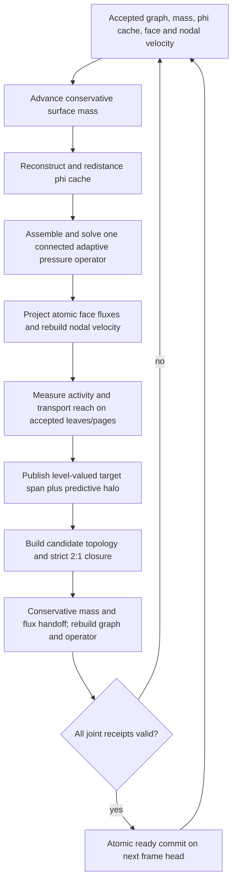

# Activity-adaptive multiresolution Eulerian fluids

Date: 2026-08-11

Status: **SUPERSEDED — do not implement.** Replaced by
`docs/uniform-region-fluid-handoff.md` (uniform-method-per-region /
block-structured architecture). Retained for its research interpretation
(Section 2), T-junction operator gates (Section 10), test-scene ideas
(Section 13), and risk register (Section 16), which the successor cites.
The octree-leaf approach was dropped: graded-octree liquid operators have no
interactive-GPU precedent, and this plan's factor-one foundation claims were
found overstated (the sizing score never fires at factor 1; the lane pins
interface leaves to unit size; a dense finest-domain tracker still runs every
frame).

Primary target: the factor-one adaptive Losasso lane

## 1. Outcome

Build one sparse, dyadic Eulerian fluid simulation in which local physical
resolution follows local fluid activity:

- violent, deforming, forced, or geometrically detailed regions use small
  octree leaves;
- calm, smooth regions use larger leaves and therefore execute less transport,
  surface, pressure, and velocity work;
- connected regions exchange one authoritative normal flux across every shared
  coarse/fine subface;
- long waves can cross a large coarse domain and enter or leave fine regions;
- refinement and coarsening are transactional and conserve the graph-owned
  surface mass;
- the pressure solve retains the non-local coupling required by
  incompressibility.

The first production architecture is **one globally coupled adaptive operator
per connected liquid component**, not independent box simulations. A later
domain-decomposition phase may partition that operator for scheduling or
multi-device execution, but it must preserve a connected coarse/interface
solve. Solving only neighboring region pairs with no global coarse correction
is not an acceptable first implementation: low-frequency pressure error and
hydrostatic imbalance can span the entire connected component.

The primary optimization is spatial resolution. Pressure tolerances and
iteration limits remain ordinary convergence controls; calm water is cheaper
because it has fewer degrees of freedom, not because it is allowed to remain
more divergent.

## 2. Research interpretation

The sources play different roles:

- [GVDB FLIP](papers/wu-2018-gvdb-flip-critique.md) supports sparse, GPU-owned
  hierarchical storage, active-region worklists, and topology/data locality.
  It does not define the multiresolution coarse/fine fluid operator needed
  here.
- [Losasso et al.](papers/losasso-2004-octree-water-smoke.txt) supplies the
  octree field placement, T-junction constraints, adaptive transport, and
  first-order pressure foundation.
- [Power Particles](papers/aanjaneya-2017-power-liquids.txt) identifies a major
  risk in the simple Losasso transition operator: parasitic hydrostatic
  currents and loss of accuracy at T-junctions. The repository already has a
  selectable `power2017` lane, which should remain the quality comparison.
- [Ando and Batty](papers/ando-batty-2020-octree-liquid.txt) is the direct
  reference for a more accurate octree free-surface pressure discretization
  and activity-sensitive subdivision.
- [Liu et al.](papers/liu-2016-schur-complement-fluids-notes.md) supports a
  future domain-decomposition layer. Its adaptive coarsening compresses an
  auxiliary harmonic/interface representation, not the physical fluid grid,
  so it is not the basis for the first multiresolution implementation.

The engineering decision is therefore:

1. finish activity-selected resolution on the repository's existing accepted
   adaptive graph;
2. make transition error observable and bounded;
3. only then consider regional Schur or Schwarz decomposition above the
   adaptive operator.

## 3. Existing foundation

This is an extension of the current adaptive lane, not a greenfield solver.
The following mechanisms already exist and should be reused:

| Foundation | Current integration point | Use in this project |
| --- | --- | --- |
| Dyadic owner leaves and strict 2:1 closure | `lib/webgpu-octree.ts` | Physical multiresolution topology |
| Stable sparse owner pages | `lib/webgpu-octree-owner-pages.ts` | Leaf lookup and page-local activity storage |
| Core/halo sparse residency and indirect work | `lib/webgpu-fluid-brick-residency.ts` | Predictive allocation and compact dispatch |
| Accepted/candidate face authority | `lib/webgpu-octree-losasso-backend.ts` | Fail-closed topology and face-state publication |
| Adaptive leaves, nodes, constraints, adjacency, and locator | `lib/webgpu-octree-losasso-surface-graph.ts` | Shared scalar/velocity graph across T-junctions |
| Matrix-free row/face operator | `lib/webgpu-octree-losasso-operator.ts` | Reciprocal pressure coupling |
| Adaptive projection | `lib/webgpu-octree-losasso-projection.ts` | Face-normal velocity update |
| Graph-owned conservative surface mass | `lib/webgpu-octree-losasso-adaptive-mass.ts` | Conservative transport and exact-overlap topology handoff |
| Adaptive phi compatibility field | `lib/webgpu-octree-losasso-adaptive-phi.ts` | Redistance, ghost derivation, and rendering input |
| Adaptive nodal/face velocity migration | Losasso backend and structured-velocity modules | Coarse/fine velocity transfer |
| Existing 8-bit page sizing score | `lib/webgpu-octree-losasso-fine-transport.wgsl.ts` | Seed for the new level-valued activity estimator |
| Authored min/max cell-size boxes | `lib/octree-refinement-regions.ts` | Oracle, override, and test fixture |
| Live topology cadence and band controls | `lib/octree-runtime-dials.ts` | Hysteresis/cadence experiments |

The current page score uses curvature and diagonal velocity-gradient evidence,
but the topology path largely reduces it to `sizingRefinement: bool`. That can
say “split this candidate” but cannot express “this leaf needs span 2 while the
next leaf only needs span 8,” cannot retain a stable quiet history, and does not
separate a quality request from a transport-support halo. Replacing that
binary interpretation is the center of this plan.

The existing conservative mass handoff already maps accepted leaves to
candidate leaves by exact dyadic overlap. Do not build a second volume remap.
Extend its receipts and use it as the mandatory topology-transition gate.

## 4. Non-goals for the first delivery

- Do not create independently simulated uniform bricks with ad-hoc boundary
  interpolation.
- Do not make solver tolerance, V-cycle sweeps, or iteration count depend on a
  visual “calm” classification.
- Do not introduce local time stepping. All accepted leaves initially advance
  with the same physical `dt`.
- Do not add a second surface authority or return to dense finest-domain
  staging.
- Do not preserve sub-grid energy after coarsening by inventing unresolved
  detail. Controlled high-frequency dissipation is allowed.
- Do not claim regional domain decomposition until a global/interface coarse
  correction is present and measured.
- Do not hide mass loss or transition artifacts with global phi offsets.

## 5. Core invariants

These invariants apply on every accepted frame.

### 5.1 Topology and generation

1. Leaf spans are powers of two on one global finest lattice.
2. Face-adjacent leaves differ by at most one level (strict 2:1 balance).
3. Accepted owner pages, pressure rows, faces, surface graph, surface mass,
   phi cache, and nodal velocity expose one coherent topology epoch.
4. Capacity overflow, missing coverage, invalid constraint, or transfer error
   rejects the whole candidate and retains the previous accepted generation.
5. Exact topology reuse does not remap state and is bit-preserving.

### 5.2 Coarse/fine coupling

1. A geometric interface is decomposed into non-overlapping atomic subfaces.
2. Each atomic subface has one face id, one area/aperture, one normal
   orientation, one velocity/flux value, and at most two pressure rows.
3. Both adjacent rows reference that same face with opposite incidence signs.
4. Restriction from fine faces to a coarse face is area/aperture weighted and
   preserves total normal volume flux.
5. Hanging scalar and nodal-velocity values are derived from exact dyadic
   masters; they are never independent unknowns.
6. The pressure matrix remains symmetric positive semidefinite before gauge
   fixing and positive definite on the solved gauge-fixed system.

### 5.3 State and conservation

1. Surface mass, not phi, is the conserved scalar authority.
2. Refinement and coarsening preserve fixed-point surface mass exactly unless
   an authored source or sink acts during the step.
3. Phi is a one-way geometric reconstruction/cache and may be redistanced, but
   it cannot feed mass back into the authoritative bank.
4. Coarsening preserves aggregate normal flux. Refinement initializes child
   fluxes so their area-weighted sum equals the parent flux before projection.
5. Pressure is only a warm-start field across topology changes; it is not a
   conserved quantity.

### 5.4 Activity and quality

1. Activity selects a target leaf span; it does not select convergence
   tolerance.
2. Fast uniform translation expands predictive support but does not by itself
   demand the finest physical resolution.
3. Deformation, surface geometry, forcing/contact, and measured discretization
   defect may demand finer resolution.
4. Refinement reacts quickly; coarsening requires sustained quiet evidence.
5. Resolution can change by at most one level per accepted topology epoch.
6. Authored refinement-region ceilings are hard accuracy bounds. Authored
   floors are cost-policy bounds, except where 2:1 closure forces a finer leaf.

## 6. Target frame pipeline



Activity is measured after a coherent projected velocity exists. Candidate
construction remains at the tail of the step, and commit remains at the next
head. A topology cadence greater than one uses a reach prediction sized for
the entire reuse interval.

## 7. Activity model

### 7.1 Keep accuracy activity separate from support activity

Publish two products for every accepted leaf or owner page:

- `requiredSpan`: the largest leaf span that satisfies local accuracy needs;
- `supportRadiusCells`: the distance that topology/residency must remain
  available for characteristics, extension, forcing, and movement before the
  next topology rebuild.

This separation prevents a large, smooth swell from refining merely because
it translates quickly, while still allocating the cells it will enter.

### 7.2 Dimensionless evidence channels

Compute the following on the accepted graph. Each channel is clamped to
`[0, 1]` and stored independently for diagnostics before taking a maximum.

| Channel | Suggested signal | Purpose |
| --- | --- | --- |
| Interface geometry | `h * abs(kappa)` plus a zero-crossing flag | Curved sheets, crests, droplets, contact geometry |
| Deformation | `dt * max(norm(strain), norm(vorticity))` | Breaking, shear, vortices, stretching |
| Velocity defect | difference between leaf-face data and its restricted parent prediction, normalized by a scene velocity scale | Refinement where the coarse representation is measurably inadequate |
| Surface defect | difference between nodal/rho data and a parent trilinear reconstruction | Detect detail before coarsening removes it |
| Compression | existing graph-owned surface compression and local density gradient | Thin or over-compressed interface features |
| Forcing | inflow, moving-solid swept volume, impact/contact, user-authored accuracy region | Predict externally generated detail |
| Solver defect | normalized local divergence or pressure residual after the converged global solve | Detect operator/geometry trouble, not replace convergence |

Do not use kinetic energy alone. A fast but uniform current is cheaply
representable; strain, vorticity, curvature, and hierarchical defect are better
accuracy indicators. Kinetic energy may be useful only as a floor on the
normalization scale and in impact/forcing detection.

For an accepted leaf `L` of span `s`, define an initial score

```text
Q(L) = max(Qsurface, Qdeform, Qvelocity-defect,
           Qsurface-defect, Qcompression, Qforcing, Qsolver-defect)
```

The maximum is deliberate: a thin jet must not be averaged away because the
rest of the channels are calm. Once the system is stable, a weighted maximum
or budget-aware priority queue may reduce over-refinement, but that is a later
tuning step.

### 7.3 Convert score to a target span

Use level-dependent refine and coarsen thresholds rather than one global bit.
For each allowed span `s`:

```text
if Q(L) >= refineThreshold[s]: requiredSpan <= s / 2
if Q(L) <= coarsenThreshold[s] for quietEpochs[s]: requiredSpan may become 2s
```

Requirements:

- `coarsenThreshold[s] < refineThreshold[s]`;
- refinement requires one accepted observation for forcing/contact and two for
  purely derived noise-prone channels;
- coarsening initially requires 8 accepted topology epochs;
- the score is reduced conservatively across children when testing a merge;
- a parent may form only if all eight children permit it and no predictive or
  authored halo requires them;
- target span changes by one dyadic rung per topology epoch.

Start with the existing 8-bit quantized score and current `0.25` sizing trigger
as the finest-rung calibration point. Extend the summary publication to retain
either the maximum score byte or a 3-bit required level instead of collapsing
it to `SIZING_REFINEMENT`. Keep the old Boolean derivable for compatibility
while migration is underway.

### 7.4 Predictive support

For topology cadence `k`, compute a conservative physical reach

```text
reach = k * dt * maxNodeSpeed
      + 0.5 * (k * dt)^2 * accelerationBound
      + redistanceBand
      + velocityExtensionBand
      + one 2:1 closure margin
```

Dilate forced-fine and interface worklists by this reach in physical units,
then convert to owner-page/tile rings. Moving rigid bodies use the union of
their current and predicted swept AABBs. Inflows use the expected emitted
length over `k * dt`.

The support halo affects residency and prevents premature coarsening. It does
not automatically make the entire halo finest resolution; target levels may
grade outward.

### 7.5 Quiet-state memory

Add per accepted owner page or leaf:

- current score byte;
- requested level/span;
- consecutive quiet epoch count;
- last-active topology epoch modulo a safe generation window;
- reason bits for interface, deformation, defect, forcing, residual, authored,
  predictive, and 2:1 closure.

This history must migrate by overlap:

- refinement copies parent history to children but clears enough quiet count
  to prevent immediate re-merge;
- coarsening takes the maximum score, minimum quiet count, and bitwise union of
  child reasons;
- newly resident air starts active/unknown and may not coarsen immediately;
- exact topology reuse increments quiet counters without rebuilding the graph.

## 8. Topology selection

### 8.1 Replace the binary split decision

Refactor `pressureRefinementEvidence` in `lib/webgpu-octree.ts` into three
conceptual stages, even if they remain fused in WGSL initially:

1. `accuracyRequiredSpan(origin, size)` from activity, interface, solid, inflow,
   and authored evidence;
2. `supportRequiredSpan(origin, size)` from movement/reach and stale/unknown
   coverage;
3. `leafNeedsRefinement` as the pure comparison between candidate `size` and
   the minimum of those requirements.

Every rejection or forced split should publish a reason bit. The CPU mirror
used by refinement-region tests should expose the same precedence rules.

### 8.2 Preserve authored boxes as an oracle

The current `FluidRefinementRegion` boxes remain useful for:

- forcing a known fine/coarse corridor;
- isolating one T-junction plane;
- comparing automatic activity against an authored ideal topology;
- imposing art-directed floors or ceilings.

Automatic activity and authored bounds combine as follows:

```text
effectiveRequiredSpan = min(activityRequiredSpan, authoredMaximumCellSize)
effectiveAllowedSpan  = max(effectiveRequiredSpan, authoredMinimumCellSize)
```

The final topology may still be finer than the authored minimum because of
strict 2:1 closure. Conflicting overlapping regions retain the current
conservative rule: the finer ceiling wins; among cost floors, the coarser floor
wins only after all hard accuracy requirements are applied.

### 8.3 Candidate construction order

1. Snapshot accepted activity/history generation.
2. Emit candidate requests from live accepted leaves and predictive sources.
3. Refine one level where requested.
4. Mark complete sibling groups eligible to coarsen one level.
5. Apply merge decisions without deleting source state.
6. Run strict 2:1 balance to a fixpoint.
7. Add boundary, solid, inflow, redistance, and velocity support closure.
8. Plan owner-page and graph capacities from the post-closure candidate.
9. Build candidate owner pages, pressure rows/faces, and surface graph.
10. Transfer state and validate all receipts.
11. Publish the shared ready bit only after the complete tuple is valid.

Refinement takes precedence over coarsening within the same closure
neighborhood. Candidate capacity exhaustion keeps the accepted generation and
raises telemetry; it must never partially accept a cheaper topology.

## 9. Coarse/fine state transfer

### 9.1 Surface mass

Keep `WebGPUOctreeLosassoAdaptiveMass.encodeCandidateHandoff` as the authority.
Its exact-overlap remap already covers retained, refined, and coarsened dyadic
leaves. Extend its diagnostics with:

- counts for retained/refined/coarsened destination leaves;
- mass drift per transition class;
- maximum density jump introduced by a merge;
- first failing accepted/candidate leaf pair;
- activity/history migration receipts.

Acceptance remains exact fixed-point mass equality across topology handoff.

### 9.2 Phi and geometry

Phi is reconstructed from mass/rho on the candidate graph and redistanced once
if the topology changed. Preserve exact coordinate values only as a quality
hint; never let them override the mass-derived sign or feed mass back.

Measure:

- zero-set displacement in world units;
- maximum signed-distance residual;
- sign disagreement between mass/rho and phi cache;
- constraint residual at hanging nodes;
- topology-change-only surface displacement.

### 9.3 Face velocity and flux

Implement transfer in atomic subface space:

- retained face id and geometry: copy exactly;
- coarse-to-fine split: initialize child normal velocities from the parent plus
  a limited tangential/normal gradient reconstruction, then remove a uniform
  correction so `sum(area_i * u_i) = area_parent * u_parent`;
- fine-to-coarse merge: use aperture-area-weighted restriction;
- new solid-cut face: initialize from rigid boundary velocity and nearby valid
  liquid faces;
- new air-support face: leave invalid until the existing causal extension
  proves complete coverage.

Publish both total signed flux error and maximum per-parent flux error. The
candidate velocity generation is not ready until all required face and nodal
components are valid.

### 9.4 Momentum and energy receipts

Mass conservation alone does not prevent a coarsening event from injecting a
large velocity. Add observational receipts for:

- liquid momentum before and after topology handoff;
- kinetic energy before and after;
- kinetic energy added by prolongation;
- kinetic energy removed by restriction;
- maximum new face speed.

The first implementation may dissipate energy on restriction, but may not add
energy beyond f32 reduction tolerance in a stationary no-force transfer test.
If momentum cannot be preserved exactly by the staggered geometry, report the
residual and bound it against the all-fine/reference transfer fixture.

### 9.5 Pressure seed

Transfer pressure only to accelerate convergence:

- retain exact matching row pressure;
- prolong a parent pressure to children as a constant initially;
- restrict child pressure by liquid-volume weight;
- subtract the component mean after transfer;
- allow the solver to discard the seed if the initial residual is worse than a
  zero seed.

Never use pressure transfer as a substitute for solving the newly assembled
operator to the normal tolerance.

## 10. T-junction operator requirements

The simple Losasso operator can remain the first structural implementation,
but it must pass the following gates before activity-selected T-junctions are
enabled by default:

1. row-face incidence is reciprocal;
2. every geometric subface area is counted exactly once;
3. off-diagonal coefficients are pairwise equal;
4. diagonal equals the sum of incident liquid couplings plus valid boundary
   terms;
5. `x^T A y` and `y^T A x` agree within the exact-reduction/f32 fixture bound;
6. a constant pressure field produces zero interior gradient;
7. a manufactured linear pressure field converges at the expected order on a
   stationary 2:1 interface;
8. hydrostatic water beside a T-junction does not develop a growing parasitic
   current;
9. projection reduces divergence to the same residual contract as the
   uniform-resolution reference.

If hydrostatic or manufactured-solution gates fail, promote the existing
`power2017` geometry or an Ando--Batty-style face coefficient to the production
transition operator. Do not relabel the error as acceptable dissipation:
pressure asymmetry, spurious currents, and reflected low-frequency energy are
qualitatively different from deliberately coarse transport.

## 11. Long-wave propagation

Large smooth waves should normally remain on coarse leaves. Their quality is
controlled by cells per wavelength, transition design, and the global coupled
operator—not by resolving the entire scene at the breaker scale.

Add a wavelength-aware floor to the activity policy:

- estimate local dominant free-surface wavelength from a small hierarchy of
  surface-height/normal or velocity-defect reductions;
- require an initial minimum of 12 cells per wavelength for the production
  quality preset and 8 for the performance preset;
- treat wavelengths too large to estimate locally as coarse/global modes and
  preserve them through the pressure hierarchy;
- refine predictively where curvature, compression, or forcing indicates an
  approaching break, rather than refining the entire swell path.

This estimator can land after the basic activity system. Until then, authored
maximum-cell-size corridors provide a deterministic wavelength floor in the
wave acceptance scenes.

## 12. Implementation phases

### Phase 0 — Freeze baselines and receipts

Purpose: establish that later savings and errors come from resolution changes.

Work:

- Capture all-fine and currently adaptive artifacts for symmetric expansion,
  tiny/deep hydrostatic, mini dam, moving solid, and a new wave corridor.
- Record accepted leaf counts by span, transition-subface counts, pressure
  rows, graph nodes, transport arcs, MGPCG iterations, mass, momentum, energy,
  divergence, and per-stage GPU time.
- Add an artifact schema version and topology/activity configuration to every
  capture.
- Keep the twenty-step D4 gate and existing adaptive mass handoff tests green.
- Document the current factor-one velocity/front fidelity gap as a baseline;
  this project must not claim to fix it accidentally through over-refinement.

Likely files:

- `tools/webgpu-smoke-readbacks.ts`
- `tools/webgpu-smoke-executor.ts`
- `tools/benchmark-power-dam.ts`
- `tests/octree-regression-artifact.test.ts`
- a new `tools/benchmark-activity-adaptive-resolution.ts`

Exit gate:

- Repeated identical runs publish comparable JSON artifacts with exact
  topology counts and stable conservation/receipt values.

### Phase 1 — Observational level-valued activity

Purpose: calculate desired physical resolution without changing topology.

Work:

- Extend the existing 8-bit sizing evidence into independent diagnostic
  channels and a final score.
- Publish `requiredSpan`, support reach, reason bits, and quiet history on the
  accepted sparse authority.
- Reduce child evidence conservatively into topology-sized summary entries.
- Add a readback overlay showing accepted span versus requested span.
- Compare automatic requests to authored refinement-region oracle scenes.
- Verify activity computation scales with live leaves/pages, not the finest
  domain.

Likely files:

- `lib/webgpu-octree-losasso-fine-transport.wgsl.ts`
- `lib/webgpu-octree-fine-levelset-summary-direct.ts`
- `lib/webgpu-octree.ts`
- a new `lib/webgpu-octree-resolution-activity.ts`
- a new `lib/webgpu-octree-resolution-activity.wgsl.ts`
- focused structural and GPU tests under `tests/`

Exit gate:

- Violent/forced fixtures request the authored oracle level before the feature
  reaches it; calm translated flow requests support but not unnecessary fine
  accuracy; no topology changes occur in this phase.

### Phase 2 — Activity-driven topology with fixed state

Purpose: validate split/merge decisions independently of fluid transfer.

Work:

- Replace binary activity splitting with `requiredSpan` comparisons.
- Apply one-level-per-epoch changes, quiet hysteresis, predictive dilation, and
  strict 2:1 closure.
- Run the candidate builder on frozen accepted fields for hundreds of epochs.
- Add exact-topology-reuse detection before graph/remap construction.
- Publish reason histograms and counts of requested versus closure-forced
  leaves.
- Test capacity rejection and retry using deliberately undersized arenas.

Primary files:

- `lib/webgpu-octree.ts`
- `lib/webgpu-fluid-brick-residency.ts`
- `lib/webgpu-octree-owner-pages.ts`
- `lib/octree-refinement-regions.ts`
- `lib/octree-runtime-dials.ts`

Exit gate:

- Frozen activity converges to a stable topology, exact reuse becomes the
  steady state, no adjacent pair violates 2:1, and rejected candidates leave
  accepted buffers bit-identical.

### Phase 3 — Conservative dynamic topology handoff

Purpose: permit resolution to follow moving activity without state loss or
energy injection.

Work:

- Route the activity candidate through the existing graph/mass joint-ready
  transaction.
- Extend mass handoff receipts by transition class and activity history.
- Implement conservative atomic-face flux restriction/prolongation.
- Add pressure warm-start transfer and zero-seed fallback.
- Reconstruct/redistance phi exactly once per changed candidate.
- Verify nodal constraint and velocity validity after each handoff.
- Reject the candidate on mass, coverage, flux, finite-value, or generation
  failure.

Primary files:

- `lib/webgpu-octree-losasso-adaptive-mass.ts`
- `lib/webgpu-octree-losasso-adaptive-mass.wgsl.ts`
- `lib/webgpu-octree-losasso-backend.ts`
- `lib/webgpu-octree-losasso-surface-graph.ts`
- adaptive velocity migration modules

Exit gate:

- A stationary refine/coarsen cycle repeated 1,000 times has exact fixed-point
  mass, no growing zero-set displacement, no positive energy drift, exact
  graph receipts, and no accepted-generation churn after activity stabilizes.

### Phase 4 — Coarse/fine physics validation

Purpose: make T-junction behavior safe enough to distinguish acceptable
dissipation from discretization defects.

Work:

- Add matrix symmetry, constant/linear pressure, and divergence fixtures for a
  single planar 2:1 interface in each axis and orientation.
- Add hydrostatic interfaces at several depths and free-surface positions.
- Add a solid-cut T-junction and a moving-solid transition fixture.
- Compare `losasso` and `power2017` operators using identical accepted leaves.
- If necessary, implement the Power/Ando--Batty transition coefficient on the
  compact Losasso row/face authority rather than forking the whole simulation.
- Keep solve tolerance fixed across all topology arms.

Primary files:

- `lib/webgpu-octree-losasso-operator.ts`
- `lib/webgpu-octree-losasso-operator.wgsl.ts`
- `lib/webgpu-octree-losasso-projection.ts`
- `lib/webgpu-octree-losasso-projection.wgsl.ts` if split from generated WGSL
- `lib/octree-losasso-operator.ts`
- new numerical fixtures under `tests/`

Exit gate:

- Structural SPD gates are exact/within established f32 bounds, hydrostatic
  transition velocity does not grow relative to the matched uniform baseline,
  and projection meets the normal divergence tolerance.

### Phase 5 — Moving activity and wave propagation

Purpose: demonstrate the intended large-scene behavior.

Work:

- Add a fine-to-coarse-to-fine periodic wave corridor with stationary
  transitions.
- Add the same corridor with an activity band that follows the wave packet.
- Add a large calm basin with one localized breaker or inflow.
- Add two violent regions that approach, touch, and separate so their graded
  halos merge and split without a solver seam.
- Add a narrow throat joining two large coarse basins.
- Tune hysteresis, cells-per-wavelength floors, and predictive reach.
- Profile leaf/row/face/arc counts and GPU time by accepted span and stage.

Exit gate:

- See the quantitative acceptance matrix in Section 14.

### Phase 6 — Production controls and failure policy

Purpose: make the feature understandable and safely tunable.

Work:

- Add presets: `fixed/adaptivity-off`, `quality`, `balanced`, and
  `performance`.
- Expose activity thresholds, quiet epochs, minimum cells per wavelength, and
  topology cadence only in advanced controls.
- Show requested span, accepted span, reason colors, predictive halos,
  transition faces, and rejected-generation cause in the technique overlay.
- Store auto-adaptive settings separately from authored refinement regions.
- Add a deterministic “freeze current topology” debugging action.
- On repeated candidate rejection, retain accepted state, temporarily widen
  capacity or refine less aggressively within the existing allocation plan,
  and surface a clear diagnostic. Never silently fall back to a dense field.

Likely files:

- `lib/model.ts`
- `lib/octree-runtime-dials.ts`
- editor/method parameter stores and overlays
- scene catalog and smoke tooling

Exit gate:

- Saved scenes reproduce their adaptive policy; default scenes remain
  unchanged unless the new mode is explicitly enabled; diagnostics identify
  why any leaf is fine or coarse.

### Phase 7 — Optional regional domain decomposition

Purpose: scale a validated adaptive operator beyond one efficient device solve.

This phase is deliberately conditional. Start it only if profiling shows that
the globally coupled adaptive MGPCG, rather than transport/topology/velocity,
is the dominant unsolved cost at target scene sizes.

Work:

- Partition accepted pressure rows into spatial subdomains using stable owner
  pages; never cut atomic subfaces.
- Solve disconnected liquid components independently.
- For a connected component, eliminate subdomain interiors and construct a
  Schur interface system over shared faces/rows.
- Retain a multilevel/global coarse correction for low-frequency modes.
- Allow active neighboring subdomains to be grouped for locality, but do not
  use pairwise grouping as the only coupling path.
- Repartition only when topology/activity movement exceeds a measured
  imbalance threshold; otherwise retain stable ownership.
- Compare against the single adaptive global operator on residual, divergence,
  wave phase, hydrostatics, and total work.

Exit gate:

- The partitioned solve reaches the same global residual contract and wave/
  hydrostatic gates while improving time-to-solution on a scene large enough
  to justify its interface and synchronization overhead.

## 13. Test scenes

| Scene | What it isolates | Required comparisons |
| --- | --- | --- |
| Static planar 2:1 interface | face ownership, symmetry, transfer | all-fine, all-coarse, Losasso transition, Power transition |
| Deep hydrostatic T-junction | parasitic pressure current | uniform reference and each transition operator |
| Stationary refine/coarsen loop | transfer filtering and conservation | no-topology-change control |
| Uniform translating slab | support versus accuracy separation | automatic activity versus authored coarse oracle |
| Shear/vortex packet | deformation activity | fixed coarse, fixed fine, automatic |
| Fine→coarse→fine wave corridor | phase, damping, reflection | all-fine, uniform coarse, adaptive stationary transition |
| Moving wave activity band | predictive refinement | stationary fine corridor and automatic band |
| Large calm basin plus breaker | target compute allocation | all-fine and fixed authored oracle |
| Two approaching active regions | halo merge/split | single all-fine connected solve |
| Two basins with narrow throat | low-frequency/global coupling | adaptive global solve; later Schur solve |
| Moving solid crossing tiers | swept support and cut faces | fixed fine solid corridor |
| Symmetric expansion | D4 ordering and transaction determinism | current exact symmetry gate |
| Mini/large dam break | end-to-end surface quality and work | retained HEAD/uniform artifacts and fixed fine adaptive arm |

## 14. Quantitative acceptance matrix

Structural and conservation gates are hard. Quality/performance thresholds are
initial targets and should be calibrated against the repository's controlled
uniform and fixed-topology references before being promoted to CI.

| Category | Initial acceptance |
| --- | --- |
| Topology | zero invalid leaves, overlaps, holes, missing lookups, leaf-closure errors, reciprocal-adjacency errors, or 2:1 violations |
| Joint publication | every accepted epoch has matching owner, row/face, graph, mass, phi, and velocity generations |
| Mass handoff | exact fixed-point equality with no source/sink; zero missing recipients |
| Flux handoff | aggregate parent/child normal flux error at the established exact-reduction/f32 floor; no invalid required face |
| Energy transfer | no positive kinetic-energy drift in stationary no-force refinement/coarsening; measured restriction loss is allowed |
| Pressure | same relative residual tolerance for all resolution arms; matrix symmetry fixture within the existing f32 exact-reduction bound |
| Divergence | no worse than 2x the matched fixed-topology reference after projection, with an absolute scene-scaled ceiling |
| Hydrostatic | no monotonic transition-current growth; max speed no worse than 2x the matched uniform reference after the agreed duration |
| D4 symmetry | current twenty-step topology/volume exactness retained; velocity/RHS/pressure within current recorded bounds |
| Wave phase | after two transition crossings, crest position within 5% of one wavelength relative to the uniform-coarse propagation control |
| Wave reflection | spurious reflected energy below 3% of incident packet energy |
| Wave damping | report separately; initial production target no more than 15% additional amplitude loss beyond the uniform grid at the same coarse cells-per-wavelength |
| Topology churn | after a steady scene settles, fewer than 0.5% of leaves change level per topology epoch unless forcing crosses a leaf |
| Predictive coverage | zero characteristic, redistance, velocity-extension, inflow, or solid-sweep coverage failures |
| Sparse scaling | recurring activity/topology/physics work proportional to live graph/page counts; no finest-domain allocation or dispatch |
| Large-scene value | localized-activity scene reduces live pressure rows and transport graph work by at least 4x versus all-fine before claiming success |
| Runtime value | GPU time improves by at least 2x on the target large calm-basin scene without failing the quality gates |

The wave comparison deliberately uses a uniform grid at the **same coarse
resolution** to separate ordinary coarse-grid dispersion/damping from an
additional T-junction defect. The all-fine run remains the desired-quality
reference, but it is not a fair transition-isolation baseline.

## 15. Telemetry and artifacts

Each benchmark artifact should include:

- scene, method, coarse backend, finest spacing, maximum span, and `dt`;
- activity thresholds and quiet-epoch settings;
- topology cadence and prediction reach;
- accepted leaves, liquid rows, atomic faces, transition faces, graph nodes,
  mass transport arcs, and resident pages by level;
- requested-level histogram and accepted-level histogram;
- reason-bit histogram and counts forced by 2:1 closure;
- refine, coarsen, retained, and exact-reuse counts per epoch;
- rejected candidate count and first error receipt;
- mass, momentum, kinetic/potential energy, divergence, solver residual, and
  iteration count;
- topology handoff mass/flux/energy receipts;
- wave probes: incident, transmitted, and reflected amplitude/energy plus
  phase/crest position;
- per-stage GPU timestamps and logical invocation counts.

Artifacts must distinguish:

- work avoided because leaves became coarse;
- work avoided because pages slept;
- work shifted into candidate topology and handoff;
- extra solver iterations caused by a weaker hierarchy or transition
  operator.

Without this attribution, a lower leaf count can conceal a slower or less
stable solver.

## 16. Risk register and containment

### Resolution feedback loop

Once detail is coarsened away, an estimator based only on represented detail
may declare the area permanently calm. Contain this with hierarchical defect
measured before merging, quiet hysteresis, forcing/swept-volume prediction,
neighbor wake-up, and retained last-active history.

### Transition reflection mistaken for dissipation

A wave can lose amplitude because of normal coarse dispersion, or reflect
because the T-junction impedance is inconsistent. Measure incident,
transmitted, and reflected energy separately and compare to a uniform grid at
the same coarse resolution.

### Parasitic hydrostatic currents

The first-order Losasso transition can create spurious motion even when visual
dissipation is acceptable. Keep the Power/Ando--Batty comparison executable
and make hydrostatics a default-enablement gate.

### Topology chatter

Rapid split/merge cycles add handoff filtering and candidate cost. Use unequal
thresholds, quiet epochs, one-level changes, and a minimum residency lifetime.
Report churn rather than relying on a visual impression.

### Fast feature outruns refinement

Accuracy activity is local and late unless reach is predicted. Use velocity,
acceleration, inflow, and rigid swept-volume support dilation over the complete
topology cadence. Coverage failures reject the candidate/advance.

### Coarsening injects momentum or energy

Area-weighted velocity restriction preserves flux but not automatically full
momentum or kinetic energy. Add transfer receipts and forbid positive
no-force energy drift. Treat restriction loss as reported dissipation.

### Activity work consumes the saving

Do not scan the finest lattice or read back per-leaf scores every frame.
Compute into sparse page/graph storage, reduce hierarchically, and drive
indirect candidate work. Profile the estimator as its own stage.

### Sparse capacity cliff

Simultaneous impacts can request much more fine support than the calm average.
Plan capacity for the maximum forced/predictive frontier, publish high-water
marks, and reject atomically on exhaustion. Add a configurable emergency
quality cap only if it is explicit and deterministic.

### Global pressure cost remains

Fewer rows may still leave reductions/synchronization dominant. First compact
the physical DoFs and measure. Only then add regional Schur decomposition; do
not weaken convergence locally to disguise global overhead.

### Large-wave under-resolution

Low curvature does not imply negligible wave dynamics. Enforce a
cells-per-wavelength floor, preserve a genuine multigrid coarse correction,
and validate long propagation before enabling aggressive calm coarsening.

### Velocity/front fidelity regression

The current factor-one adaptive path already has a measured front-velocity
gap relative to the retained reference. Every phase must compare fixed
topology before/after arms so activity work is not credited for unrelated
fidelity changes. Complete compact face support and velocity frontier work in
`docs/fully-adaptive-losasso-plan.md` remains a prerequisite for production
quality claims.

## 17. Configuration model

Add a scene/method configuration object distinct from authored boxes, along
these lines:

```ts
interface FluidActivityAdaptivity {
  enabled: boolean;
  minimumCellSize_cells: 1 | 2 | 4 | 8 | 16 | 32;
  maximumCellSize_cells: 1 | 2 | 4 | 8 | 16 | 32;
  refineThreshold: number;
  coarsenThreshold: number;
  quietTopologyEpochs: number;
  minimumCellsPerWavelength: number;
  topologyCadence: number;
  maximumLevelChangePerEpoch: 1;
}
```

The exact public schema can follow existing method-parameter conventions, but
the semantic split is required:

- scene-authored refinement regions express art direction and hard bounds;
- activity adaptivity expresses automatic policy;
- runtime solver dials remain convergence/performance experiments and do not
  become regional quality fields.

Defaults must preserve current behavior until the new acceptance suite passes.
The first opt-in preset should use conservative hysteresis and a finest
interface/forcing shell; aggressive calm coarsening belongs in the performance
preset.

## 18. Pull-request sequence

Keep changes reviewable and preserve exact baselines:

1. **Artifacts and wave oracle** — no solver behavior changes.
2. **Activity ABI and observational score** — no topology changes.
3. **Level-valued candidate selection on frozen fields** — topology tests only.
4. **Activity history, hysteresis, and predictive support** — still frozen-state
   validation first.
5. **Mass/history handoff receipts** — use existing conservative remap.
6. **Atomic-face flux handoff and pressure seed**.
7. **Dynamic activity topology behind an opt-in flag**.
8. **T-junction manufactured/hydrostatic operator acceptance**.
9. **Wave and large-basin tuning, presets, and overlays**.
10. **Default enablement decision** based on the full acceptance matrix.
11. **Optional Schur decomposition experiment** only after profiling justifies
    it.

Every pull request must retain:

- TypeScript type checking for touched modules;
- focused CPU structural tests;
- focused Dawn/WebGPU tests for touched GPU publication;
- the twenty-step symmetric-expansion gate for any recurring physics change;
- at least one mass handoff and one hydrostatic/T-junction gate for topology or
  face-transfer changes.

## 19. Definition of done

The project is complete when:

- high-energy local activity predictively creates fine leaves and calm regions
  coarsen after hysteresis;
- the entire recurring surface, velocity, pressure, and rendering chain uses
  the accepted multiresolution graph with no dense compatibility authority;
- moving activity crosses coarse/fine boundaries without holes, missing
  support, mass loss, energy injection, or generation mismatch;
- T-junction pressure coupling passes symmetry, divergence, hydrostatic, and
  manufactured-solution gates;
- long waves cross a vast coarse scene within the phase, reflection, and
  damping contract while fine breaking detail remains localized;
- large calm-basin scenes show measured work and runtime reduction attributable
  to fewer adaptive DoFs;
- all dissipation is measured as coarse-resolution or restriction loss, not
  confused with reflection, pressure imbalance, or conservation failure;
- regional decomposition, if implemented, matches the globally coupled
  adaptive result and retains a global/interface coarse correction.

Until all of these hold, describe the feature as an experimental
activity-adaptive resolution mode rather than a production sparse regional
fluid solver.
