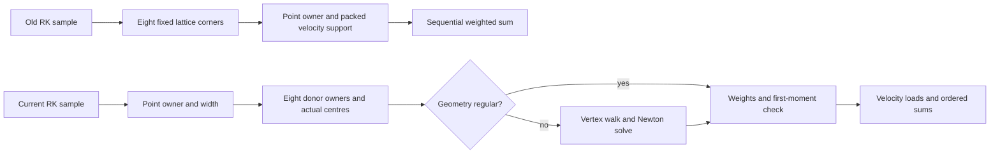

# Adaptive mass: old/current code and work map

Comparison: **`cd38e8b4` (September 6, first coarse-first) → `28c95c47`
(September 10)**. Both support coarse-first, making this the closest old-code
control for the reported scene. The earlier September 5 `e43ea418` production
control independently reproduces the roughly 2× whole-advance regression.
See [historical timings](long-dam-performance-ab-2026-09-10.md).

The principal change is **more work per interpolation query over largely the
same stored topology**, not replacement of the solver's major data structures.
The actual old face functions run in 26.7 ms on a current frame where the
current functions take 78.5 ms. A purported regular fast pass still takes
71.1 ms before its adaptive fallback. The counters explain why: that fast
pass retains almost all the geometry discovery and native face work.

**Cutover status:** the working tree now restores the September 6 face,
conservative transport and sharpening hot paths. References to “current” below
mean the investigation baseline `28c95c47`, not the restored working tree.
The complete evolving-scene run recovers a 63.96 ms GPU median. See the
[production cutover receipt](long-dam-performance-ab-2026-09-10.md#production-cutover-september-6-transport-restored)
for measurements, retained surrounding services and failed/unverified checks.

## 1. What stayed the same in storage

Git blob comparison of the 133 files currently under
`lib/methods/adaptive-mass` finds 82 identical files, 17 modified at the same
path, and 34 added or moved paths. This is a path inventory, not a claim that
all 34 are new algorithms; feature colocation accounts for many of them.
The complete blob inventory is in
[adaptive-mass-file-map.json](../artifacts/long-dam-ab-2026-09-10/adaptive-mass-file-map.json).

| Data structure | Old and current relationship | What it provides |
| --- | --- | --- |
| Hot topology image, HTP1 | Layout **and helper module identical** | Cell records, row records, signed terms, cell-to-row incidence; 8 words/cell, 16/row, 2/term and 2/incidence |
| Interned boundary image/operators, IBO | Layout and helper modules identical | Accepted/shadow topology identities and reusable boundary operators |
| Logical owner directory, LOD1 | Layout and lookup module identical | Authored logical-brick ownership; the measured production configuration enables implicit transport lookup with dynamic fallback |
| Sparse world directory, WDR1 | Same coordinate hash representation; allocation algorithm changed | Signed-world ownership and growing/recycled pages |
| Transport execution image, TEI2 | Layout identical; small boundary-helper changes | Two topology slots; 8-word leaf descriptors, 4-word packets/spatial tiles, staged 27-leaf lookup window |
| Transport packet authority, AEI | Layout and shader module identical | Compact trace/scatter/gather packet domains, including coarse packing |
| Effective transport velocity plane | Layout and shader module identical | Cell-indexed extended velocity consumed by transport |
| Face velocity support | Same four-float cell cache | Three velocity components plus packed width/validity/wetness data; the **sampling algorithm** changed |
| Mass departure stencil | Same eight donor slots and weight cache | Backward departure reused by conservative gather; no larger donor stencil was introduced |
| Canonical pressure membership, persistent pressure cache, pressure execution image | Layout and helper modules identical | Accepted pressure cells/rows, cached coefficients and execution lists; operator arithmetic changed in the resident shader |
| Final scalar masks and frame control | Layout and helper modules identical | Generation-stamped scalar facts and stage scheduling |

In the matched long-dam stage receipts, both revisions allocate 392,014 template
cells, 1,306,776 template rows and a 21,952,784-byte mass departure cache.
Reported resident allocation is **288,660,032 → 288,660,160 bytes: +128 bytes**.
Accepted *live* cells/rows grow as the different algorithms evolve the scene;
that is distinct from allocated template capacity.

Source anchors:
[hot topology](../lib/methods/adaptive-mass/sparse-cm12-hot-topology.ts),
[TEI layout](../lib/methods/adaptive-mass/sparse-cm12-transport-execution-image.ts),
[LOD lookup](../lib/methods/adaptive-mass/sparse-cm12-logical-owner-directory.wgsl.ts),
[resident construction](../lib/methods/adaptive-mass/webgpu-sparse-cm12-resident.ts).

## 2. Stage-by-stage algorithm changes and their reasons

The reasons below come from source comments, changes and the recorded
correctness investigations. They explain intent and specific demonstrated
bugs; they do **not** imply every current implementation choice is necessary
or that the full current numerical gate passes.

| Stage | Old shader algorithm | Current shader algorithm | Why it changed / cost implication |
| --- | --- | --- | --- |
| Velocity extension | Eight packet sweeps. Accumulate valid neighbours using absolute gradient coefficients. | Same packet machinery and sweep count. Opposite-side physical subface area/distance supplies weights; six directional terms are reduced in paired order. | A mixed pressure row is not a clique: same-side fine siblings are not physical neighbours. Adds geometric weighting and ordered reduction, without a new velocity data structure. |
| Face dispatch | Separate immutable interior tiles, seam/sparse-air packets and accepted dynamic suffix. | One compact accepted-row dispatch. | Avoid rejected template lanes on coarse leaves. This is already a reduction in dispatch work, not the principal regression. |
| Face support decision | Two point queries on opposite sides of the row centre. | Traverse all incident terms to determine extended support, wetness and width. | A mixed face centre can select only one child. Current support includes all children. This adds incidence work before tracing. |
| RK velocity interpolation | Fixed eight-corner lattice loop. Each point fetches the packed support cache through an owner. Ordinary rows use unit spacing; explicit coarse-region rows use their fixed spacing. | Resolve point owner and physical width; locate the dual cell formed by actual donor centres; check regularity; walk/invert mixed cells; validate the first moment. | Old owner substitution can preserve constants yet fail affine fields and create a coarse-cell dead zone. The regular case still performs geometry discovery for every query. |
| Face terminal value | Another collocated velocity interpolation. | Native staggered interpolation where supported: look up an owner, scan incidence for the correct face identity, check width/wetness; unsupported corners use collocated interpolation. | Avoid the collocate/resample `[1/4, 1/2, 1/4]` filter even at zero timestep. Native values use existing row storage; no precompiled sampling table was added. |
| Characteristic arithmetic | Absolute positions; sequential accumulation of interpolated terms. | Local displacement relative to an exact cell/face centre; ordered pair reductions and distance-based regular weights. RK2 and the 1–16 substep bound remain. | Large absolute coordinates and orientation-dependent sums gave reflected queries different low bits. Extra arrays/arithmetic occur even on regular grids. |
| Conservative mass/gamma/momentum | Backward trace → beta accumulation → forward deficit return → conservative gather, storing eight departure donors. | Same passes/cache/fields. Both trace directions use the new geometry. Main packet path uses ordered reductions; live conservation/gamma controls wrap coefficients. | The geometric repair propagates through every transport consumer. There is no newly added entire conservative transport pass explaining the increase. |
| Transport failure handling | Unsupported deficits could return to their own donor; negative outputs were clamped. | Unsupported **nonzero** mass and invalid conserved values latch a failure; exactly empty air may leave support. | Expose invalid geometry/support instead of masking it with self-return or mass-altering clamps. Adds checks; more complete frontier support can also increase live work. |
| Gamma diffusion | One immutable row scatter/finalize pass; normalize to the negative-side volume and multiply back. | Same default one pass. Form a nonnegative integrated high-gamma-to-low-gamma receipt, then assign integer sign. Optional additional rounds commit snapshots. | Remove face-orientation-dependent rounding. New controls do not add default rounds in the matched run. |
| Sharpening | Centred finite-difference gradient of a cheap lattice density interpolant; density and six gradient probes per trace sample. | Same centred-gradient concept, now sampling geometric interpolation. Mixed-row normal derivatives align the neighbour sample tangentially. Recent shortcuts reuse initial density/interior neighbours and stop unnecessary traces. | Affine normal derivatives at 2:1 seams previously included tangential variation. A roughly seven-sample construction now invokes much more expensive scalar sampling. Both revisions already used centred differences; the old comment claiming an analytic derivative was stale. |
| Capacity repair | Eight rounds; divide excess among counted incident neighbours. | Same default eight rounds; split by opposite-side physical subface area, with exact paired integer receipts and retained rounding residue. | Equal neighbour votes over-weight a face split into several fine children and include nonphysical adjacency. More area/coefficient work per relay; not more default iterations. |
| Pressure classification/operator | Width-insensitive density phi in some mixed cuts; diagonal-plus-off-diagonal application with an arithmetic interior shortcut. | Physical-width phi and signed mixed-surface gradient ratio; evaluate face pressure differences in `GᵀWG`; pair directional RHS/operator sums. | Prevent rung-dependent waterline shifts, mixed-cut tangential errors and hydrostatic cancellation. The pressure infrastructure and iteration policy survive; mature long-dam pressure work remains comparatively similar. |
| Adaptivity/frontier | Initial coarse-first surface/velocity criterion and incoming sweep prediction; less complete sparse support. | Common-width density/normal restriction; relative incoming motion; complete swept face/edge support; unique allocation where requests are proven unique; demotion curvature proof at the proposed rung. | Keep planes planar at mixed widths, retain diagonal/wall-tangential support and avoid immediate coarsen/refine reversal. Can change live row counts and topology transactions. |
| Topology transactions and editing | Accepted/shadow transfer, IBO/TEI compilation and pressure repair already exist. | Same resident transaction chain, plus explicit new-air coverage for generation transfer, frozen topology/frontier handling, live region/solid edit operations and stronger coverage/failure checks. | Support live changes without inventing mass or losing source coverage. Most edit-specific work is conditional; its existence in the source is not evidence that it runs in an untouched long dam. |
| Presentation and surface proof | Native sparse pages, density restrictions, column-related reconstruction paths and surface proofs. | Compiled TEI-backed presentation ownership, canonical coarse coordinates, continuous density interpolation and stronger virtual-coarse curvature proof. Common-height code remains present but is **compile-time disabled**. | Reduce grid imprint and invalid demotions. Additional proof/cache work explains a separate presentation cost; disabled height/removed retained-density experiments must not be counted as active stages. |
| Symmetry repair / inspection | Explicit scalar, velocity and activity D4 repair passes; inline pressure inspection code. | D4 repair passes removed. Symmetry handled in the operators; pressure inspection moved into a feature. Failure observation uses existing presentation submission. | Removes corrective passes, while increasing numerical care inside hot shaders. Moving files or adding optional inspection is not itself per-frame physics work. |

The standard frame still flows through extension → face preparation →
conservative transport → diffusion/sharpening/capacity → pressure →
activity/topology transfer → sparse presentation. Current stage labels split
capacity repair and scalar publication from sharpening; historical timing
comparisons must group these back together.

## 3. The face call graph exposes the important change



The current function's **regular branch is not the old function**. Skipping
Newton removes only one section after donor discovery; it does not remove
owner/centre queries, geometry comparison, temporary stencil storage,
first-moment evaluation, or ordered reduction. Native terminal sampling is
another independent source of work.

Current source entry points in
[the resident WGSL generator](../lib/methods/adaptive-mass/webgpu-sparse-cm12-resident.wgsl.ts):
`effectiveTransportStencilAtSpansMode`, its generated
`relativeTransportStencilAtSpansMode`, `sampleRelativeFaceVelocity`,
`sampleRelativeNativeTransportFace`, `traceMassStencil`, `sharpeningStats`,
`sampleSharpeningField`, `cm12PhysicalSubfaceArea`, `pressureRowGradient`,
`applyOperator`, and `publishSparseCM12SurfaceRepresentabilityReceipts`.
The [exact old excerpts](../artifacts/long-dam-ab-2026-09-10/old-adaptive-algorithms-sep06.wgsl)
retain original line numbers and are available for direct comparison.

## 4. Same-input instrumentation: why our attempts did not work

### Timing replay

At current step 24, run the original September 6 face helpers, current face
helpers and the attempted split regular/fallback kernels against the **same
immutable source velocities, scalars and topology**. Dispatch all over the
same accepted-row list. Snapshot both face arrays after each pass, outside the
GPU timestamps. Repeat each three times and restore current output last.

The old six helper functions are extracted verbatim from `cd38e8b4`, renamed
to avoid symbol conflicts, and linked to the current topology services and
face-stage input. This is an old **face algorithm** replay, not a complete
historical binary or old topology evolution. Its changed outputs are an
intentional diagnostic ablation, not a proposed production replacement.

| Pass | Mean GPU time | Destination comparison with current |
| --- | ---: | --- |
| Actual September 6 face functions | **26.717 ms** | 238,440 differing words |
| Current face functions | **78.512 ms** | Exact repeated control |
| Attempted regular pass | **71.128 ms** | 8,791 fallback markers; all other words exact |
| Adaptive fallback for those rows | **10.158 ms** | Complete output restored to exact current bits |
| Attempted regular + fallback | **81.286 ms** | Exact current output, slower overall |

The previous adjacent-dispatch measurement was about 79.4 ms for the split
pair versus 78.8 ms current; separating passes and snapshots changes that
schedule slightly. Both measurements reject a speedup. Do not treat their
small difference as a new algorithmic effect.

### Work replay, separately instrumented

A separate run counts source-level operations per row, flushes counters after
the row, and copies the counters after each replay. These times are discarded.
All three repeated counter snapshots for each variant are identical. The
counting and timing runs evolve independently before step 24; comparisons
within each replay are exact-state comparisons, not cross-process field claims.

| Work in the counted step | Old face functions | Current | Attempted regular pass | Fallback |
| --- | ---: | ---: | ---: | ---: |
| Supported rows traced | 250,273 | 250,299 | 250,299 | 8,791 |
| RK2 substeps | 1,215,674 | 1,217,214 | 1,212,706 | 25,242 |
| Geometric interpolation queries | 0 | 2,754,581 | 2,734,319 | 72,802 |
| Regular dual-cell visits | 0 | 2,715,414 | 2,707,933 | 33,635 |
| Mixed dual-cell visits | 0 | 53,873 | 26,386 | 53,873 |
| Newton iterations | 0 | 264,274 | **0** | 264,274 |
| `cellCenter` helper calls | **0** | **24,612,965** | **24,315,879** | 765,402 |
| Compact owner helper calls | 41,378,300 | 37,964,068 | 37,879,915 | 440,103 |
| First-moment evaluations | 0 | 2,754,581 | 2,707,933 | 72,802 |
| Native donor queries | 0 | 799,860 | 787,798 | 28,656 |
| Native incidence iterations | 0 | 2,400,725 | 2,378,313 | 81,234 |

Important qualifications: helper-call counts are **not DRAM transactions or
compiled GPU instruction counts**. In particular, instrumentation of
`cellWidths` can prevent compiler elimination of an unused return component;
its raw count is retained in JSON but is not presented as measured memory
traffic. No register occupancy or spill claim is established by these runs.

What the measurements establish:

1. **Substep count is essentially unchanged:** current/old is 1.00127 on the
   same input. The roughly 2.94× face-time difference is inside the work per
   sample and the new terminal sampling, not a 3× longer trajectory.
2. **The attempted regular pass retained 98.8% of current `cellCenter` calls,
   98.3% of first-moment evaluations and 98.5% of native queries.** Eliminating
   all Newton iterations from that pass did not make it resemble the old
   sampler's work. This is the directly observed reason to reject our earlier
   “regular means cheap” assumption.
3. **Only 3.51% of supported rows require fallback**, but those rows include
   all mixed visits and Newton work. Their recomputation still costs 10.2 ms.
   A small row fraction does not imply a negligible fallback pass.
4. The attempt continues tracing after a mixed sample marks a row for fallback.
   It records 26,386 mixed rejections across 8,791 rows, then the fallback traces
   those rows again. This is avoidable duplicated work in the experiment; it
   does not explain why the regular pass is already 71 ms.
5. **There is no evidence here of an explosion in owner lookup count.** The
   old code actually makes more compact-owner calls. The owner cache trial
   targeted an existing cost while retaining the newly introduced work; it
   preserved bits but made the kernel 5.32% slower. Register/control overhead
   remains a hypothesis, not a hardware-profiler finding.

Earlier same-state component ablations independently put current face cost at
80.1 ms, about 58.9 ms when removing native terminal sampling, about 59.0 ms
when replacing geometric interpolation with a lattice approximation, and
39.4 ms with both removed. Those ablations change values and are not identical
to the verbatim old helper replay. They nevertheless agree that both additions
matter and that Newton alone is not the explanation.

## 5. What the old code lets us test next

Use the old implementation as an executable lower-work reference. The next
comparison should separate these additions explicitly, rather than changing
all of them behind a “fast path” label:

- Fixed lattice lookup versus discovering actual donor geometry.
- Relative coordinates/ordered sums versus absolute coordinates/sequential sums.
- Collocated terminal value versus incidence-first native terminal sampling.
- Cheap regular geometry checks versus the general first-moment/locator checks.

For every selective restoration, state its validity condition. In particular,
“regular” alone does not prove the old unit-spaced face lattice has the correct
physical spacing on a coarse leaf. Preserve demonstrated affine reproduction,
zero-time native face identity, solid/mixed-boundary support and reflection
behavior, and measure complete output. Exact current bits are a strong local
screen; acceptance also requires the relevant physical tests and unchanged
full Dawn gate. The existing current numerical failures must be distinguished
from introduced failures.

No optimization from this investigation has been promoted to production.
The full post-refactor gate was not run for rejected diagnostic kernels.
The experiments remain isolated; other rendering/editing work is untouched.

## Evidence and reproduction

- [Code and original defect rationale](adaptive-mass-mechanism-plan-2026-09-07.md): affine dead zones and pressure-connectivity misuse.
- [Implemented geometry/physical-face repairs](adaptive-mass-geometric-transport-validation-2026-09-07.md): exact moments, ghost geometry, physical area, and recorded remaining failures.
- [Earlier optimization failures](sparse-cm12-face-sharpening-performance-2026-09-10.md): unsafe coincident native donor identity and midpoint weight differences.
- [Timing receipts](../artifacts/long-dam-ab-2026-09-10/old-current-split-timings.json), [work receipts](../artifacts/long-dam-ab-2026-09-10/old-current-split-work.json), and [validated summary](../artifacts/long-dam-ab-2026-09-10/face-inspection-summary.json).

`old-current-split-timings.patch` and `old-current-split-work.patch` each apply
to `28c95c47`; they are separate timing/counting variants. Use the archived
`probe-face-inspection.ts` as `tools/probe-long-dam-history.ts`, shared dependencies,
and the required stage-cost baseline file, then run in that isolated worktree:

```sh
WEBGPU_NODE_MODULE=/absolute/path/to/node_modules/webgpu/index.js \
FLUID_WEBGPU_BACKEND=metal node --import tsx tools/probe-long-dam-history.ts \
  --scene=long-dam --brick-fine=8 --presentation-page=8 --time-step=paper \
  --warmup=23 --frames=1 --final-qa=0 --quiet=1 --out=/absolute/path/result.json
```

GPU runs require the repository lease and an unloaded browser viewport.
CPU-only validation and summarization:

```sh
python3 tools/summarize-sparse-cm12-face-inspection.py \
  artifacts/long-dam-ab-2026-09-10 \
  --out artifacts/long-dam-ab-2026-09-10/face-inspection-summary.json
```
