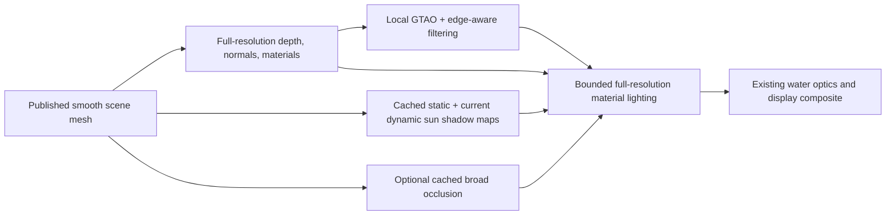

# Halving smooth hero-garden-hose-x10 rendering

Exploration, 2026-10-04. Target requested: **1600×920, smooth**.

The most credible route is to replace both cone-shadow and cone-AO evaluation,
including their full-resolution fallback, and simplify the remaining deferred
lighting path. My first prototype would pair cached raster sun shadows with
GTAO for local contact and a bounded, persistent surface-occlusion cache for
broader/offscreen occlusion. Keep full-resolution geometry and material shading.
A smooth-surface cache of the existing cone results is a second candidate if
matching the present art direction proves harder than meeting the budget.

**2× is not demonstrated.** This exploration supplies measured constraints,
rejects a few insufficient alternatives, and defines the implementation experiment.
At the end of the initial exploration no production renderer, quality default, or timing ceiling had changed. The opt-in implementation below was added subsequently at the user’s request.

## Scope and measurement

Apple M1 Max, Dawn/Metal. Production renderer factory, smooth dual marching
cubes, environment refinement depth 0, current default lighting (AO and shadows
on, GI off), half-width/half-height cone lighting. Actual render attachments are
1600×920; the app's outer resolutionScale of 0.72 is not applied a second time.
One world build, fully published mesh, two cameras, two arm orders (forward and
reverse), twelve warmups and twelve samples per arm. Static camera and scene.
The low view uses elevation 0.2 radians and 1.3× the preset camera distance.

Times below are median **complete renderer GPU spans**, from earliest pass
begin to latest pass end. Individual render-pass timestamp windows overlap on
Metal and must not be added. Separate uninstrumented CPU-encode/submit/fence
samples are retained in the raw results. Timestamps are visibly quantized in
65.536 µs increments; differences below that scale are not meaningful.

This is the **opaque scenery renderer**, without water surface extraction,
water optics, final display composite, or a running Uniform solver. The scene
catalog is wet, but this harness does not instantiate its water renderer. These
are not whole-app frame times, and an end-to-end 2× claim requires a wet replay.
For unchanged additional render cost W, the required scenery budget becomes
`(oldScenery - W) / 2`, stricter than simply halving scenery time.

The mesh publication receipt reported 858,121 triangles and no overflow. A
separate inspection frame retained the otherwise-discarded identity planes and
proved that actual mesh pixels were drawn, with no traced-primary pixels. That
inspection setting was turned off before timings. Startup/build/compilation
are excluded. Initial attempts exposed obsolete assumptions in the older probe
(startup under 500 ms, persistent debug planes, no unused shader compilation);
this new exploratory harness records startup separately and checks actual pixels.

## Results

Each cell is first / reverse-order repetition, milliseconds.

| Configuration | Hero | Low view | Interpretation |
|---|---:|---:|---|
| Current half-rate lighting | 7.27 / 7.14 | 8.45 / 8.52 | Reference |
| AO disabled | 5.96 / 5.96 | 7.27 / 7.21 | AO is material, but removing it cannot reach 2× |
| Shadows disabled | 4.59 / 4.59 | 5.90 / 5.83 | Shadows are the larger opportunity |
| Both disabled, reduced pipeline retained | 3.34 / 2.49 | 3.74 / 3.74 | Diagnostic cost floor; hero floor is noisy |
| Visibility mode off, full-rate pipeline | 3.74 / 3.41 | 4.59 / 4.59 | A different shader path; not the same floor |
| Quarter-width/height lighting | 5.37 / 5.37 | 7.01 / 7.01 | About 1.34× / 1.21× |
| Eighth-width/height lighting | 5.18 / 5.24 | 7.21 / 7.01 | Plateau; little or no additional gain |
| Quarter-rate bilateral radiance | 5.24 / 5.18 | 7.60 / 7.60 | Worse quality; also changes output depth alpha |

The target scenery times are approximately **3.6 ms hero / 4.25 ms low**.
The effects-disabled reduced path leaves only **0.3–1.1 ms hero / 0.5 ms low**
for replacement effects if the rest of that pipeline stays as measured. This is
a budgeting bound, not evidence that a new technique fits. The hero floor's
0.85 ms spread must be resolved before using its fastest value as a commitment.
For the low view, if the unchanged water/other render stages cost more than
about **1.0 ms**, even free replacement AO/shadows on top of the measured
3.74 ms floor cannot halve the complete render frame. That is why the wet replay
and a simpler base shading path belong in the same experiment.

The full-rate visibility-off path is slower despite doing less visibility work:
removing a pass alone does not establish the cost of a replacement shader.

### Why reducing cone resolution hits a wall

A representative hero cone fan-out pass falls from ~3.08 ms at half rate to
~0.92 ms at quarter and ~0.33 ms at eighth. The complete frame stops improving
near 5.2 ms. The shader still performs full-resolution reconstruction, material
lighting, receiver searches (up to 24 additional candidates), and fresh cone
lighting where a compatible reduced receiver is unavailable. This code and the
plateau support investigating reconstruction/fallback as well as traversal;
these measurements do not separately attribute every remaining millisecond.

### Quality

Compared with the current half-rate image, using the capture writer's neutral
Reinhard display grade:

| Candidate | Mean display-channel error /255, hero / low | Pixels with any channel >8/255 error, hero / low |
|---|---:|---:|
| Quarter rate, full-resolution relight | 0.67 / 0.92 | 1.51% / 2.37% |
| Eighth rate, full-resolution relight | 1.35 / 1.79 | 3.92% / 5.77% |
| Quarter bilateral radiance | 3.46 / 3.68 | 13.10% / 15.10% |

Quarter/eighth full-resolution relight preserve the exported linear-depth
channel bit-for-bit. Bilateral radiance changes it in 1,286,307 hero pixels and
1,221,438 low-view pixels. This is the radiance target's depth alpha, not proof
that mesh geometry or hardware depth moved. It is still a serious integration
problem for consumers of that target, including water optics. Reject this arm
as a drop-in replacement.

Visual inspection of hero baseline/quarter and low quarter captures suggests
quarter rate keeps the overall appearance well in stills, with differences in
small shadow/contact details. These are static comparisons against the current
production approximation, not a ray-traced reference or a motion-quality gate.
Quarter rate is a useful optional intermediate setting, not the 2× solution.

Local captures: [hero baseline](../../artifacts/hero-render-halving-2026-10-04/hero-baseline.png),
[hero quarter-rate](../../artifacts/hero-render-halving-2026-10-04/hero-quarter.png),
[low baseline](../../artifacts/hero-render-halving-2026-10-04/low-baseline.png),
[low quarter-rate](../../artifacts/hero-render-halving-2026-10-04/low-quarter.png).

## Recommended architectural experiment




### 1. Raster sun shadows, with separate static and dynamic updates

Reuse the existing smooth mesh geometry as light-space shadow casters. Start
with 2–3 stable cascades or a fixed world-space map covering the hero set plus
a lower-resolution outer map. Use texel-snapped projections, cascade blending,
normal/slope bias and modest PCF; introduce variable penumbrae only if fixed
filtering cannot preserve the present soft garden shadows.

Static geometry and a fixed sun should not rerasterize for every displayed
frame. Cache by geometry/light generation and light-space coverage. Camera
movement can reuse maps only while that coverage remains valid; newly exposed
regions and changing cascade coverage must update. Dynamic rigid bodies need a
separate current-frame depth contribution. Terrain edits and removed trees
invalidate affected shadow regions, including receivers downstream along the
light direction. Sun movement invalidates every affected static map.

Do not use the camera-visible triangle list for shadows: an offscreen tree can
shadow the pond. Add light-frustum caster culling against the full published
mesh. Include the analytic far terrain beyond the stored rings when it can cast
into a visible receiver; an all-mesh assumption would drop those occluders.
Water shadowing is currently off by default. If enabled, retain its optical
transmittance treatment rather than putting transparent water in an opaque map.

### 2. Separate local AO from broader occlusion

Compute GTAO from existing full-resolution depth and normals using a depth mip
pyramid, half-resolution evaluation and edge-aware reconstruction. Preserve the
existing material response and multibounce compensation when applying AO to
ambient/sky illumination. Do not multiply AO into direct sunlight indiscriminately.

A depth-buffer-only effect cannot reproduce hidden/offscreen blockers. First
measure the visual loss around the tree canopy, pond rim, under mushrooms and
at the frame boundary. If required, add a sparse persistent surface cache for
broader occlusion, evaluated on geometry publication or newly exposed surfaces.
Define separate distance bands or an explicit combined estimator; multiplying
two full-radius AO terms would double-darken the scene.

Use stable spatial sampling for the first prototype. Temporal accumulation needs
camera/object reprojection, depth/normal rejection, disocclusion handling and
edit invalidation. It is a second step, not an assumed free quality improvement.

### 3. Make the new deferred path bounded

The benefit requires removing the cone worker **and** full-resolution cone
fallback from this selected lighting backend. Geometry edges still need correct
depth and material shading, but visibility should come from the shadow maps and
AO reconstruction, with bounded edge treatment. Retain the existing cone backend
as an explicit comparison mode.

The split geometry buffer currently uses rgba32float normal/distance plus
rg32uint identity: 24 bytes/pixel resident, 48 bytes/pixel for one write/read pair
(~70.7 MB per 1600×920 frame, before other consumers). A compact depth + packed
normal/material layout is worth a separate prototype if the new effects miss
their budget. Preserve exact material identity, geometric vs shading normals,
receiver bias and the exported water-compositor depth. This is an opportunity,
not evidence of a bandwidth bottleneck. The existing renderer already discards
unused inspection attachments; count no new saving for that optimization.

A geometry-side alternative is to publish an indexed smooth mesh plus chunk
bounds once per geometry revision, shared by primary and shadow passes. The
current path culls individual packed triangle records and invokes a four-vertex
strip per record (a triangle duplicates its third vertex). An indexed stream
could reuse shared vertices and avoid repeated packed-record decode; chunk
culling could amortize visibility work. Preserve the exact reconstructed
positions/normals and retain conservative per-light caster coverage. Current
culling is already only ~0.1–0.2 ms in the hero sample, so it cannot explain the
2× target. Any gain in vertex/raster work must be measured; render-pass timestamp
windows here cannot isolate it. This fits naturally with building a reusable
raster shadow-caster representation.

Working design budget, **unmeasured**, for hero: base geometry/material work
≤2.5–2.7 ms; AO including reconstruction ≤0.4–0.5 ms; amortized static sun-shadow
work and sampling ≤0.2–0.3 ms; remaining integration work ≤0.2 ms. Total
3.3–3.7 ms. The low view is tighter and may require reducing the base cost too.
Track shadow-refresh and edit spikes separately; good static timing alone is
insufficient.

## Alternative: cache the present lighting on smooth surfaces

A persistent surface/surfel cache could retain much more of the current cone
appearance, including offscreen AO. Key samples by stable surface identity,
world position and normal; interpolate only within compatible surface patches.
Keep static-solid AO separate from light-dependent shadow data and current
rigid/fluid visibility. Refresh bounded demand on misses and invalidate against
scene/light generations.

The existing lattice cache is deliberately restricted to flat voxel normals;
smooth triangles create many different planes/normals and cannot simply enable
that flag. The voxel sunlight cache also explicitly rejects reconstructed
receivers. A surface cache needs a new stable parameterization, memory budget,
collision policy and dirty-region policy. Measure cold view/orbit/edit behavior,
not just warm stationary reuse. This is higher visual-continuity potential with
more cache complexity; raster shadows + local GTAO has the more predictable
per-pixel cost.

## Acceptance and next implementation step

Build the shadow-map and AO backend behind an opt-in renderer flag, then use
this probe for A/B comparison. Keep resolution, camera, mesh, materials, sun and
exposure identical. Acceptance must include:

- Both hero and low views: median GPU scenery time ≤50% of their paired baseline;
  report p95, cold-cache frames and edit/update frames as well.
- Same geometry/depth, no missing shadows or detached contact. At minimum match
  the measured quarter-rate still-image error envelope as an initial screen;
  visual review and moving-camera clips remain necessary.
- Camera orbit/disocclusion, moving body, sun rotation, tree removal and terrain
  edit with no stale illumination or trails. Keep the low-view horizon covered.
- A paused wet Uniform frame and running wet scene: separately report solver,
  scenery, extraction, optics/composite and whole-frame GPU interval. For a full
  render-frame 2× claim, include every rendering stage in the denominator.
- Run the repository clean-repo gate without changing ceilings or Uniform lanes.

## Evidence and reproduction

Saved compact evidence: [summary](hero-render-halving-2026-10-04/summary.json),
[configuration/source hashes](hero-render-halving-2026-10-04/provenance.json).
Full local evidence: `artifacts/hero-render-halving-2026-10-04/` contains
per-frame GPU readings, uninstrumented wall samples, HDR captures and PNGs.
The workspace contained pre-existing changes; measurements describe this working
copy, not a pristine commit.

```sh
WEBGPU_NODE_MODULE=$PWD/node_modules/webgpu/index.js node --import tsx tools/run-webgpu-exclusive.ts --import tsx tools/explore-hero-render-budget.ts
node --import tsx tools/analyze-hero-render-budget.ts
```

The GPU wrapper refuses a busy repository lease. Do not run beside Dawn/browser
work. `FLUID_EXPLORE_OUT`, `FLUID_EXPLORE_ARMS`, `FLUID_EXPLORE_VIEWS` and
`FLUID_EXPLORE_CYCLES` select output/arms/views/sample count.

## Primary references

- [Intel XeGTAO](https://github.com/GameTechDev/XeGTAO): depth hierarchy, spatial
  denoising, temporal integration and limitations of thin/offscreen geometry.
- [Activision GTAO paper](https://www.activision.com/cdn/research/Practical_Real_Time_Strategies_for_Accurate_Indirect_Occlusion_NEW%20VERSION_COLOR.pdf):
  AO formulation and separation from near-field illumination. Published timings
  on other hardware are not predictions for this renderer.
- [Microsoft cascaded shadow maps](https://learn.microsoft.com/en-us/windows/win32/dxtecharts/cascaded-shadow-maps):
  cascade coverage, filtering, stability and bias considerations.
- [Epic virtual shadow maps](https://dev.epicgames.com/documentation/en-us/unreal-engine/virtual-shadow-maps-in-unreal-engine):
  static/dynamic cache separation and invalidation tradeoffs. A full virtual-map
  implementation is unnecessary for the first garden prototype.

## Validation outcome

The experiment completed all 32 arms (384 GPU-timed frames and 384 separate
wall-time samples) without GPU validation errors. Image analysis completed;
the relevant recorded renderer source hashes were unchanged at verification.
`npm run check:types` passed, including a second check after the experiment.
`npm run test:unit` passed: 863 passed, 56 skipped, zero failed.

The broad `npm run test:dawn` run did **not** pass. Its SVO geometry,
reconstructed-receiver and mesh tests passed, but
`uniform-detail-policy-dawn.test.ts` and
`uniform-dynamic-coarsening-dawn.test.ts` failed with
`UNIFORM_MIXED_THETA_MIN is not defined` in the concurrently edited
`uniform-pressure-band.ts`. That import was present again on later inspection;
the failed files were not rerun. The broad run was terminated during the
unrelated Uniform geometric-boundary test after these failures, so subsequent
files are unverified. Only this run's processes were stopped, and its lease
was released after confirming the owner had exited. No solver changes or test
threshold changes were made by this exploration. This is not a clean-repo-gate
pass. Full logs are saved with the render artifacts.


## Opt-in production implementation

Select **Render → Lighting visibility → Visibility source → RASTER + AO**.
CONES remains the default, including for URLs without `svoCones`.
The preview selects Mesh primary visibility and rebuilds the renderer when
switching backends. Its URL setting is `svoCones=raster-ao`.

[Open the smooth x10 preview](http://localhost:3000/?scene=hero-garden-hose-x10&scene.surfaceStyle=%22smooth%22&svoPrimary=mesh&svoCones=raster-ao).

Implemented in `lib/svo/features/lighting-visibility/svo-raster-ao.ts` and wired
through the production factory, feature controls, URL codec and frame timings:

- Two fixed world-space 2048² sun maps, with a near/outer blend. Casters use the
  complete published mesh arena, independently of camera culling. The analytic
  backdrop contributes depth on cache updates.
- GPU-side mesh generation checks invalidate cached depth before shading. Sun,
  scene and coverage publication changes also invalidate it. Camera-only motion
  leaves the cache intact. Moving rigid-body shadow tests and optional water
  transmittance remain live.
- A 12-tap blocker search and 24-tap soft-shadow filter, evaluated at half width
  and height together with six-direction, six-step horizon contact AO. This is
  a local screen-space estimator, not a complete GTAO implementation or broad
  offscreen-occlusion cache.
- A fixed four-tap depth/normal-guided resolve feeds full-resolution material
  shading. Unmatched receivers become unoccluded; there is no cone fallback or
  expanding receiver search in this backend. Small silhouettes can consequently
  lose some occlusion.
- Sun slot zero uses cached raster visibility. Additional lights use the existing
  exact shadow reference. GI is absent in the preview. AO radius/strength,
  shadow strength/bias and sun softness remain adjustable.

The extra shadow/AO textures occupy about **36.2 MiB at 1600×920**. Shadow-map
updates are substantially more expensive than cache-hit frames. The measurements
below cover steady scenery rendering; they exclude water rendering, simulation,
startup, edits and moving-sun update cost.

### Current measurement

Apple M1 Max / Dawn Metal, 1600×920 smooth, same scene and two camera views as
above. Twelve warmups and twelve complete GPU-span samples per repetition,
plus separate uninstrumented encode/submit/fence samples. Two repetitions per
view. Baseline and preview are separate exclusive GPU runs, not interleaved
arms; treat the ratio as an initial estimate rather than a final acceptance gate.

| View | Default cones, ms | Raster + AO, ms | Approximate speedup |
|---|---:|---:|---:|
| Hero | 7.21 / 7.08 | 3.34 / 3.67 | about 2× |
| Low | 8.39 / 8.45 | 4.59 / 4.59 | 1.8× |

**Complete-frame 2× remains unproven.** The hero scenery pass is around half
the baseline time; the low view is still short of 2×, and the complete wet frame
is unmeasured. Full-resolution soft-shadow filtering was rejected: its cost consumed
the gain. Moving the filter to the bounded half-resolution visibility pass is
part of this implementation, not a planned follow-up. The new shader also
compiles cone traversal out of its secondary-light reference closure, avoiding
the occupancy cost of a cone branch this mode never requests.

The new images differ appreciably from cones. Mean display-channel difference
is 5.75/255 (hero) and 5.35/255 (low); 22.15% and 19.97% of pixels have a channel
difference above 8/255. Cast shadows are more defined and generally darker;
canopy interiors lose broad occlusion. These numbers measure a changed appearance,
not error against ground truth. **Exported depth alpha matches the baseline
bit-for-bit in both views** (zero mismatched pixels).

| View | Default | Preview |
|---|---|---|
| Hero | [reference](../../artifacts/hero-raster-ao-preview/hero-baseline.png) | [raster + AO](../../artifacts/hero-raster-ao-preview/hero-raster-ao.png) |
| Low | [reference](../../artifacts/hero-raster-ao-preview/low-baseline.png) | [raster + AO](../../artifacts/hero-raster-ao-preview/low-raster-ao.png) |

Local raw captures, spans and comparison metrics are in
`artifacts/hero-raster-ao-preview/` and `artifacts/hero-raster-ao-reference/`.
The smaller comparison receipt is saved beside this report as
`hero-render-halving-2026-10-04/raster-ao-summary.json`.

Reproduce (the repository WebGPU lease must be free):

```bash
WEBGPU_NODE_MODULE=$PWD/node_modules/webgpu/index.js \
  FLUID_EXPLORE_RASTER_AO=1 FLUID_EXPLORE_ARMS=raster-ao \
  FLUID_EXPLORE_CYCLES=12 FLUID_EXPLORE_OUT=artifacts/hero-raster-ao-preview \
  node --import tsx tools/run-webgpu-exclusive.ts --expose-gc --import tsx tools/explore-hero-render-budget.ts
npm run test:dawn -- svo-raster-ao
```

The production GPU regression checks cache reuse under camera movement, sun
invalidation, independent AO/shadow contributions and depth invariance under
effect toggles. It compiles the optional water-shadow closure too. This is not
yet an end-to-end wet-frame performance or motion-quality acceptance test.


Validation of the implementation:

- `npm run check:types` passed.
- `npm run test:unit` passed: 864 passed, 57 GPU-gated tests skipped.
- `npm run test:dawn -- svo-raster-ao` passed, including the independent effect
  checks and optional water-shadow closure. The final shader specialization also
  compiled and rendered both 1600×920 views without GPU validation errors.
- The full `npm run test:dawn` run finished **46/52 files passed**; six parse failures occurred in the
  concurrently edited `lib/methods/uniform/uniform-mixed-surface.ts` (unterminated
  string, lines 512/517 at the time). These affected mixed live edits, rigid
  bodies, solid parity, pond rest, pressure local visits and Uniform volume.
  The module parsed successfully again afterward, but those failed lanes were
  not rerun as part of this renderer change. The repository-wide gate is not
  claimed green.
