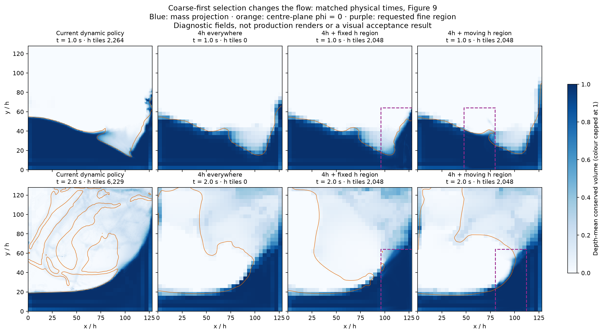

# Uniform Geometric: a coarse-first route to real time

Investigation, 3 October 2026. Source HEAD `4cbcafdd`, plus unrelated live SVO/scenery edits. Exact Uniform source fingerprints and resolved parameters accompany each capture. No production solver defaults, numerical assertions or timing ceilings were changed.

The controlling next step is the [implementation handoff](uniform-4h-first-implementation-handoff-2026-10-03.md): one fully dynamic 4h-first architecture with opt-in h detail, **no fast paths or dense fallback**, integrated as the production/UI default. This supersedes earlier alternative-execution suggestions; the experimental measurements below remain unchanged.

## Recommendation

Build a complete, inexpensive **4h simulation with optional h simulation regions**. The h regions own transport, velocity, surface and pressure where selected. Elsewhere, 4h is the actual simulation, including its free surface. A surface crossing alone must not force refinement.

The useful abstraction is a **coarse base with replaceable fine regions**, with a separate request policy. Proximity, interaction, deformation, impact and visual importance generate requests; they should not be entangled with address generation, ownership transfer or pressure assembly. This follows Peter's clarification during the investigation.

This is a credible direction, with a measured selection prototype, but **60 fps across all scenes is not established**. The current all-coarse endpoint is still too expensive, and coarse/fine coupling and coarse contact accuracy need work. Use 60 Hz and an 8–10 ms simulation budget as a provisional engineering target; the latter is an allocation assumption, not a measured rendering budget or a user-approved quality threshold.

## What was actually tested

The production solver ran on Dawn/Metal, Apple M1 Max, with dt = 1/60 s. GPU jobs held the repository lease. Compilation and quality readbacks are outside the timing interval. No browser rendering was measured. All numerical work and acceptance thresholds remain at their defaults unless explicitly named below.

All 23 successful captures have the same Uniform/scenes source fingerprint, unchanged across each run, and no WebGPU validation errors. The first `fig9-baseline-trace` predates a probe metadata correction: its legacy derived `surfaceTolerance=0.5` and reserve label did not select that retired control in the solver. The effective production surface policy was zero, as in the subsequent baseline runs. The probe's default metadata is now corrected to zero.

The probe now supports:

- A fixed h box over a 4h background. The principal box covers the far quarter of x, lower half of y, all of z: **12.5% of the physical domain**.
- A moving h box, exercising both refinement and coarsening through the existing GPU builder and remapper.
- Exact omission of empty fine-pressure work in a certified fixed all-4h scene.
- A frozen h/2h/4h interpolation census and a separate fine-pressure residual-exit experiment.

These are diagnostic options in [the stage probe](../../tools/probe-uniform-stage-scaling-dawn.ts), not exposed production features. The focus mode rejects enabled inflow and moving rigid bodies because their priority requests are not implemented in this prototype. It retains the production solid exclusions. Selection runs before the residency census; selecting dry fine tiles only at the layout builder correctly triggered the absent-page audit in the initial prototype. That ordering was repaired without disabling the audit.

The prototype constructs the requested box mask on the CPU and uploads it each step; the existing GPU census, builder, remap and simulation consume it. That cost is included in wall throughput. It has no GPU energy selector, sparse fine allocation or persistent topology cache yet.

The first harness attempt accidentally selected an all-h initial region and hit the band capacity limit. It was corrected, with an explicit coarse-background assertion. Both debugging captures are retained and excluded from performance claims.

### Repeated throughput evidence

Figure 9 (`cm12-figure-9`, 128×128×64), eight warmup advances then 120 timed advances, two frames in flight, no timestamps or per-frame field reads. Order: current, focus, coarse, coarse, focus, current.

| Ownership policy | Run A, ms/advance | Run B, ms/advance |
| --- | ---: | ---: |
| Current dynamic policy | 42.45 | 42.19 |
| 4h background + fixed h region | 20.26 | 19.27 |
| Fixed all-4h, regions mode | 12.30 | 12.84 |

The focus prototype costs about **53% less wall time**, approximately **2.14× throughput**, in this experiment. It changes the numerical solution and therefore is not an accepted equivalent optimization. The fixed region has 2,048 fine tiles, versus 6,112 at the end of the current throughput run. It can spend fine work on dry space and miss important liquid elsewhere; this is deliberately a mechanism test, not a good automatic selector.

A second local sequence isolates empty-band launch removal: elided **11.19**, ordinary all-coarse **12.68**, elided **11.33 ms/advance**. All five sampled canonical mass/phi field captures, including complete depth projections and centre-plane phi slices, equal the ordinary all-coarse run exactly. This does not establish equality of every unrecorded field. The approximately **1.42 ms** saving is a concrete consequence of making fine execution optional.

### Other scenes and matched-time quality

These are separate, once-per-arm, fenced **GPU stage captures**, not the pipelined wall measurements above. Do not combine the two timing modalities or compare them directly to historical benchmarks.

| Scene and duration | Current, GPU mean / p90 ms | Coarse-first candidate, GPU mean / p90 ms |
| --- | ---: | ---: |
| 128³ dam, 120 steps / 2 s | 53.47 / 77.59 | Fixed h region: 30.19 / 34.80 |
| 256³ drop, 60 steps / 1 s | 47.20 / 53.08 | All-4h: 27.84 / 31.46 |
| Resting cut-cell pond, 60 steps / 1 s | 37.13 / 42.01 | Coarse preference, tiny dry h request: 36.32 / 42.80 |

The 128³ all-coarse arm completed at 15.10 GPU ms/advance. These shorter screenings establish promising work reduction and remaining cost, not a robust all-scene speedup. The captures show timing variability, especially in small stages; repeated uninstrumented measurements carry the comparative throughput claim.

The quality results matter as much as timing:

- Figure 9, fixed region at 2 s: mass drift from the first sampled step is −0.019%, but centre of mass differs from current by **(+3.17h, +2.71h, −0.11h)**. Less mass loss is not proof of better flow.
- Figure 9, moving region: 120 steps complete with −0.057% mass drift. The region crosses the domain while h ownership stays at 2,048 tiles. This exercises transitions, not their physical equivalence or long-term stability.
- 128³ dam, fixed region at 2 s: −0.074% mass drift versus −0.200% current. Centre of mass differs materially; an x-biased request also breaks the symmetry of resolution in the x/z-symmetric scene. A physical automatic selector must respect symmetries unless the user's focus intentionally breaks them.
- 256³ drop: before impact, centre-of-mass height at 0.5 s is 131.84h current versus 131.67h coarse. After impact at 1 s it is 9.36h versus 8.90h. Excess is 8.85% current versus 1.47% coarse. Those aggregate measurements do not establish equivalent splash detail.
- Current fine-band residuals reach 47.58 s⁻¹ in the dam and 20.21 s⁻¹ in the drop. The frame checks root pressure acceptance but does not enforce a final band residual tolerance. Successful frame receipts alone are insufficient evidence for the final fine velocity's incompressibility.
- **The pond experiment is a rejection.** With inflow disabled and the same 0.001 root tolerance, coarse preference changes only a few dozen fine tiles because wet-solid protection still dominates: 1,525 current versus 1,501 initially in the candidate. Yet peak speed rises from **0.020 to 3.25 m/s**, and mass in positive centre-phi regions at 1 s rises from **0.31% to 7.37%**. It gains no convincing time. This directly demonstrates that a calmer scene cannot simply be assigned coarse ownership with today's operators. A well-balanced coarse free surface/contact treatment is part of the foundation, not a later refinement-policy improvement. This is an exploratory comparison, not a run of the dedicated still-pond oracle.



The orange contours are centre-plane phi; blue is depth-mean conserved volume. They describe different projections of the same 3D state, so their outlines need not coincide. This is a diagnostic comparison, not a production render or visual approval.

Compact numeric evidence: [benchmark JSON](uniform-coarse-first-2026-10-03/evidence.json). Raw captures and per-run logs: `artifacts/uniform-breakthrough-2026-10-03/`. [Analysis script](../../tools/analyze-uniform-coarse-first.py).

### Secondary experiments

The frozen representation census checks all 125 vertices of a fine tile, including far-from-interface values, and rejects sampled sign changes. At a 0.125h maximum phi error, replacing eligible tiles with 2h owners in the evolved 128³ dam predicts only **0.1–1.2% fewer owners** at sampled steps 30–120; requiring one tile of protection around rejected tiles removes that saving. The initial planar state has much more headroom. This is a deliberately strict field-reproduction screen, not a surface-displacement bound, a perceptual error metric, or proof that visual LOD cannot work. It reinforces the choice to build a coarse model first instead of treating the complete fine result as the representation that must always be reproduced.

The fine-pressure exit experiment sets its existing residual target to 5 s⁻¹ instead of the fixed four-cycle target-zero mode. Figure 9 ends with two cycles, versus four current, but changes its trajectory. Its single instrumented run had broad timing inflation across unrelated stages, so it does **not** support a reliable speedup or regression claim. All launches are still encoded even when the exit closes their work; this cannot deliver the larger architectural saving by itself. No default was changed.

The remaining work is distributed, so removing one pressure stage will not achieve the target. In the all-4h 256³ drop capture, root V-cycles take 4.37 ms, velocity extension/hierarchy 3.64 ms, global surface-volume correction 2.18 ms and topology/RHS construction 2.16 ms. The empty fine solve still costs 1.61 ms. These are instrumented stage means, not independently measured savings.

The resting pond has a different bottleneck: forces take 11.66 of its 37.13 GPU ms. Repeated normal/curvature evaluation is therefore worth revisiting, with frozen-input and resting-water tests. A prior [force-cache experiment](../../artifacts/uniform-settling-ab/force-cache-cost-unpromoted.md) was explicitly rejected after failing the pond gate; its historical speedup is not an accepted production result. The probe's optional `--coarse-cadence` switch selects the existing coupled travel/cached-curvature mode, so it would not isolate redistance cadence alone. That option was not part of these captures.

## Why the current method is still h-first

Code inspection confirms the distinction between coarse **ownership** and coarse **infrastructure**:

1. `initializeMixedFrame` reserves fine capacity before installing the layout. All-coarse selection leaves native fine textures, scratch, band reservations and metadata allocated. **Both 256³ captures reserve 4,092,282,712 bytes**, even with zero h owners. Figure 9 similarly reserves 259,705,648 bytes in both modes.
2. Fine and coarse tiers share a substantial frame skeleton. Even an empty h pressure band encodes its complete cycle envelope, with zero-work gates. Removing those launches gives the measured saving above.
3. Dynamic classification starts from interface requirements and traces a support closure. Production surface tolerance is zero. A free surface therefore drives h work throughout transport, momentum, geometry and pressure.
4. Wet cut cells and their neighbourhood are promoted to h. A quiet shallow pond cannot automatically become a cheap coarse simulation simply because its energy is small.
5. Owner indices are packed by fine count and rank. Changing membership can renumber otherwise unchanged owners. That inhibits persistent owner-indexed adjacency and solver caches.
6. Pressure is a global 4h solve followed by an h correction with prescribed coarse boundary flux. The h solve uses the actual fine interface, but it cannot independently change flow through those Neumann boundaries and feed that correction back into the same global solve.

Relevant sources: [frame sequencing](../../lib/methods/uniform/uniform-mixed-frame.ts), [dynamic classifier](../../lib/methods/uniform/uniform-mixed-dynamic.ts), [layout builder](../../lib/methods/uniform/uniform-mixed-layout-builder.ts), [pressure band](../../lib/methods/uniform/uniform-pressure-band.ts), [remap and transfers](../../lib/methods/uniform/uniform-mixed-remap.ts), [host initialization](../../lib/methods/uniform/webgpu-uniform-reference.ts).

## The infrastructure to build

### Full-fidelity performance is an architectural requirement

Peter's follow-up adds the decisive constraint: controls must reach today's fidelity without making the corresponding full-detail scene significantly slower. The earlier focus measurements establish a cheaper, changed solution; they do **not** answer this endpoint question. Near-parity is a design hypothesis to prove before committing to the storage rewrite.

The subsequent [full-fidelity addressing experiment](uniform-full-fidelity-addressing-2026-10-03.md) tests this directly at the representation layer. A generic per-access atlas adds measurable cost to a frozen all-h frame even with identical inputs, outputs and accepted work. In the longer Figure 9 comparison, the native dense specialization preserves exact final fields and throughput, whereas adapted shaders change the dynamic trajectory as well as cost. The native specialization is a diagnostic control only: Peter subsequently ruled out fast paths. Investigate amortized addressing inside one dynamic patch model; the tested generic wrapper is not suitable as its universal field interface. The planned model still needs to prove compact-base cost, dynamic lifecycle cost and full-coverage parity.

There are two distinct comparisons. First, replay today's h/4h ownership masks with the same physical resolution, timestep, numerical operators and tolerances through the new representation. This tests infrastructure overhead at the fidelity actually delivered today. Second, test the maximum-h setting against an equivalent current fixed-h run, wherever that reference fits its pressure-band capacity. Refining all dry space is not a prerequisite for reproducing today's fidelity. Do not weaken capacity assertions to manufacture the second comparison; report unsupported reference cases explicitly.

At high occupancy the same dynamic patch representation must execute h work efficiently. There is no dense or legacy execution alternative:

- Covered coarse cells serve restriction and the pressure hierarchy. Do not independently advect, sharpen and apply forces to a complete coarse simulation underneath the complete fine simulation.
- Amortize addressing per workgroup or sample footprint within the universal patch kernels. Schedule neighbouring fine work coherently. Neither an occupancy threshold nor a Full-detail control may select a different representation, kernel fast path or lower physical resolution.
- As h coverage fills the domain, true h/4h seams disappear. Artificial boundaries between same-resolution patches must not retain the full numerical cost of refinement interfaces.
- Static membership should stop allocation/remapping and topology rebuilds. Prewarm transitions and use hysteresis; measure their transient cost separately from the settled endpoint.
- Reuse the global coarse pressure hierarchy already present in today's solver. A second independent coarse solve is not automatically required by coarse-first storage. Composite pressure changes remain a separate numerical experiment, with their own quality and runtime accounting.

Patch halos can defeat this goal even when arithmetic counts look favourable. A cubic patch with interior width P and a g-cell halo stores `(1+2g/P)^3` times its interior cells. At g=1, 16³ patches have about 42% extra halo cells and 32³ patches about 20%. These are storage-footprint ratios, not predicted runtime regressions; actual stencils and today's existing support costs determine the comparison. Shared same-resolution addressing and local stencil staging must be evaluated before choosing the universal patch ABI; a dense path is excluded.

A useful accounting identity at matched full-detail work is:

`new time = current time + new addressing/halo/scheduling/coupling cost − removed current overhead`.

The focus prototype does not determine those differences; the follow-up addressing experiment measures only one part of them. Set a small explicit regression budget before promotion—for example 5% as a proposed engineering target, not an approved threshold or a relaxation of existing gates. Measure repeated uninstrumented throughput, p90 frame cost, allocation and transition spikes. A renderer/publication regression also counts against the final scene-frame budget.

Test the curve, not just the endpoints: 0%, 12.5%, 25%, 50%, 75% and maximum h coverage, with compact, fragmented and moving selections. Equal fine fractions can have very different interface costs. All these occupancies must use the same dynamic implementation. Full-detail performance cannot be rescued by switching to another engine or storage path.

Finally, distinguish **resolution fidelity** from **trajectory history**. Full detail selected from initialization should reproduce the reference to the chosen numerical/physical tolerances. Turning it on after a coarse interval cannot recreate discarded thin sheets, vortices or impact history. Dynamic controls need predictive promotion and an explicit quality policy; they cannot promise retroactive equivalence to an always-fine trajectory.

### 1. A native coarse base that stands on its own

Store and process the 4h field on its own compact lattice. Pack coarse owners into normal workgroups rather than presenting every coarse cell as a special case of an h tile. Its empty-detail configuration must allocate no global h simulation fields and encode no fine solve, fine remap or hanging-interface work.

Preserve physical units when rebasing the lattice. Simply running today's method at one-quarter resolution also moves its global pressure grid to a further 4× coarser spacing and changes other algorithms. The earlier [equal-owner comparison](../benchmarks/uniform-dam-resolution-2026-09-30.md) already demonstrated that trap: equal cell counts did not produce equal physics. The new base pressure must solve at the intended physical coarse spacing, with tolerances expressed consistently.

Native coarse contact is a prerequisite for broad coverage. Keep fine solid geometry where necessary, but integrate open volumes, face apertures, contact forces and source volumes into coarse operators. Hydrostatic pressure and gravity must cancel under the same discrete geometry. Using h near every wet solid forever would preserve the principal fine-work floor in shallow and highly detailed scenes.

### 2. Fine patches with stable identity and one owner of mass

Use stable patch/page IDs, independent of execution-list order. Start by comparing 16³ and 32³ h interiors; select the size using measured halo and seam cost. These are experiment sizes, not a chosen ABI. A patch is not a second copy of water:

- Coarse cells outside patches are authoritative.
- Fine cells inside patches are authoritative.
- Covered coarse cells are synchronized restrictions used for global coupling and queries; never add their mass a second time.
- Promotion reconstructs from the coarse state conservatively. It cannot recover detail already discarded.
- Retirement restricts extensive liquid volume and appropriate momentum/face flux quantities. Record energy change; mass conservation alone does not establish impulse-free remapping.
- Stable IDs carry generations; no recycled page may be read by an older in-flight frame.

A dense coarse texture plus a fine atlas retains cheap arithmetic addressing for the base and inside each patch. Resolve neighbouring patch IDs once per tile/halo build rather than adding a page-table lookup to every interpolation tap. The renderer must consume this representation directly or through changed-page publication; full h-domain publication would reintroduce the cost floor.

### 3. Coarse/fine coupling that allows detailed regions to affect the world

Keep the current conservative mixed operator as an initial reference while separating storage and policy. For the longer-term transport replacement, use a shared interface transfer accounting: coarse/fine exchanges must refer to the same transported mass. A face-flux formulation can replace coarse interface fluxes with summed fine fluxes (“refluxing”). The present box-overlap operator does not expose those fluxes; adding a flux register alone would not make it a flux method.

For pressure, prefer a composite multilevel defect correction: h residuals restrict into the coarse correction and coarse corrections prolong into h. This makes the base the global communication layer while h supplies local accuracy. Solid separating constraints require active-set/projected treatment; do not assume the whole problem is an unconstrained SPD system suitable for plain CG.

Measure the final composite residual and interface flux consistency. An h region containing a jet or impact must be able to alter the surrounding flow. Avoid treating its boundary as a permanently imposed coarse answer. This can be tested on manufactured pressure/flux problems before any splash trajectory.

### 4. Requests and budgets separate from numerical support

Use a request record such as `{bounds, targetSpacing, priority, expiry, reason}`. A camera/controller, an energy/error estimator and mandatory contact/source rules should all use the same interface. Requests choose where detail is valuable; a separate closure builder provides the interpolation, characteristic, collision and solver support needed to execute them.

Budget **the closed patches**, not the requested interior. Fine cells covering fraction f of a fixed h domain give approximately `Ncoarse × (1 + 63f)` leaf cells before halos. At f = 1/8, that is 8.875× the all-coarse count. Halos, seams and transfers add further cost. A tiny fragmented set can cost more than a coherent larger patch.

Use early promotion and delayed retirement, distinct thresholds, minimum lifetimes and a bounded churn budget. Predict incoming impacts before contact and prefetch detail in the direction of camera motion. A resource budget cannot simultaneously guarantee fixed h accuracy in an arbitrarily complicated scene; define what quality degrades when demand exceeds it. Existing physical assertions remain unchanged.

### 5. Temporal coherence in this representation

The previous “did this Eulerian tile change?” approach largely failed in moving dams. Stable patches allow more useful reuse:

- Cache topology, neighbour connectivity, static cut geometry and regular interpolation structure. Rebuild only affected patches and their actual stencil neighbourhood.
- Reuse pressure iterates or subspaces, but recompute the current residual and invalidate changed boundary/active-set data. Root warm starting already exists; it is not a new breakthrough by itself.
- Update geometry and redistance according to distortion/error, rather than merely elapsed frames or translation distance. A fast translating drop and a highly straining impact are different cases.
- Allow sleeping fine regions only with a force/flux/error certificate. A coarse pressure change, incoming wave, source, moving body or altered contact must wake them.
- Explore different time rates only after conservative space coupling works. Accumulate interface exchanges over the shared physical interval and synchronize pressure. Naively running h every second frame risks exactly the lagged-flow errors the new regions are intended to fix.

Speed or kinetic energy alone is a poor accuracy estimator: uniform translation can be fast and smooth; a thin stationary sheet or a small capillary feature can be slow and need resolution. Use local velocity variation/strain, thickness, curvature, acceleration, impact proximity and projection error alongside user importance. Avoid letting numerical repair-generated motion permanently demand more h resolution.

## Wider options and their place

| Direction | Assessment |
| --- | --- |
| Stage-specific narrow bands | Keep high-order surface samples where useful without making every surface sample require fine volumetric flow. Coupling and thin-feature preservation are the hard parts. Do not repeat the earlier disconnected-overlay experiment. |
| Bounded, capacity-preserving transport | A high-value architectural experiment: reducing artificial overfill could remove repair/sharpening work and make calm-region certificates meaningful. Test on frozen states before a coupled trajectory. |
| 2h intermediate tier | Potentially useful for smoother resolution transitions, but not the first dependency of a 4h-base/h-patch design. The frozen census is a geometric screen only. |
| Affine or moving-frame regions | Promising for coherent translation and smooth bulk flow; can reduce both representation cost and departure distance. Requires conservative exchanges between frames/regions. |
| Heightfield/column regions | A later representation for large, shallow, single-valued calm water, with conversion to 3D at jets, overhangs and impacts. More promising for huge ponds than keeping every floor contact at h. |
| Ballistic subgrid droplets | Can preserve small airborne mass without a full h volume around each drop. Must carry mass/momentum and return them on impact; this is a model change, not decorative particles. |
| Surface-only or particle solver replacement | Real alternatives, but much larger method changes with different vorticity, topology and solid-coupling costs. Keep as comparison tracks rather than prerequisites. |
| Filtering/f16, kernel fusion, dispatch trimming | Useful supporting work, especially the coarse execution floor. Prior measurements show register pressure can cancel fewer loads or launches. Measure whole producer/consumer cost. |
| 30 Hz physics with 60 Hz presentation | A separate product tradeoff. It can help display rate, but does not establish 60 Hz simulation and needs temporal reconstruction around contacts/topology changes. |

The transport caveat is important. The [existing frozen-operator investigation](../benchmarks/uniform-transport-operator-2026-09-29.md) found donor conservation but persistent receiver-capacity defects. Moving each box face with its normal velocity only matches divergence to first order: for incompressible affine strain `(u,v)=(a x,-a y)`, Euler face tracing changes box area by `(1-a dt)(1+a dt)=1-a²dt²`. Independently traced axis-aligned boxes also need not tile under shear. Shared-face geometry/flux consistency and finite-step incompressibility must be established, not assumed.

An ordinary geometric VOF replacement can be expensive at this method's large CFL. [Basilisk's implementation](https://basilisk.fr/src/vof.h) imposes CFL ≤ 0.5 and avoids reconstruction in full/empty donors. A CFL-10 trajectory would require at least 20 such substeps if implemented with that bound. Investigate large-CFL conservative remap or selective surface transport, including total substep cost.

[Ando and Batty (2020)](https://doi.org/10.1145/3386569.3392460) establish that adaptive free surfaces require careful pressure/interface interpolation; their work supports surface adaptivity as a serious numerical design, not just a sizing-function change. [Goldade et al. (2020)](https://cs.uwaterloo.ca/~c2batty/papers/Goldade2020/) provide a useful alternative coarse basis: incompressible affine fields over coalesced regions. [Chentanez and Müller (2011)](https://matthias-research.github.io/pages/publications/tallCells.pdf) and their [2010 heightfield work](https://matthias-research.github.io/pages/publications/hfFluid.pdf) motivate changing representation for large quiet bodies. [Surface-only liquids](https://visualcomputing.ist.ac.at/publications/2016/SurfaceOnlyL/) demonstrate the more radical boundary-only direction. These are design precedents, not evidence that their reported performance transfers to this WebGPU implementation.

## Sequence and decision gates

The [implementation handoff](uniform-4h-first-implementation-handoff-2026-10-03.md) is the controlling delivery sequence; stronger composite pressure coupling below is deferred beyond the first testable default. Establish the **full-detail cost contract** above within that implementation. Benchmark a representative fine-kernel set in the proposed addressing/storage scheme, then a matched complete frame. Prove both the cheap coarse endpoint and near-parity at today's fidelity before expanding the patch system. Separate storage/dispatch changes from stronger pressure coupling so their costs and accuracy effects remain attributable.

1. **Establish the base.** A compact 4h-only run with no h allocation or fine dispatches. Validate resting water at fractional waterlines, thin coarse films, moving fronts and coarse solid contact. Measure memory, dispatches, p90 time and canonical field properties. Aim for a 3–5 ms base as a budget target, not a prediction.
2. **One static h patch.** Introduce actual h transport and pressure with conservative transfers. Validate uniform flow crossing the patch, hydrostatics, affine pressure, surface tension/contact at seams and incoming/outgoing waves. Sweep patch size and measure marginal cost including halo work.
3. **Move, add and retire patches.** Repeated coarse→fine→coarse cycles on frozen states, then moving-flow runs. Track extensive mass, face flux, momentum and energy jumps. No allocation/compilation spikes on the frame path. The current focus probe supplies a comparison, not this acceptance proof.
4. **Couple pressure both ways.** Manufactured composite residual/flux checks, then dam impacts straddling patch boundaries. Keep total residual acceptance and existing physical gates.
5. **Add selection policies.** Start with user regions and camera proximity; add deformation/impact/error requests through the same API. Measure closed fine fraction, churn, quality and p90 over complete impacts and settling, not only early cheap frames.
6. **Validate the scene matrix and renderer.** Dams, drops, sheets, resting shallow cut-cell ponds, inflow, rigid bodies and live solid edits. Include rendering and publication before making a frame-rate claim. All-scene success needs both the fast base and bounded fine work.

The next implementation milestone should therefore be **a compact, physically sound coarse base with one conservatively coupled fine patch**, rather than a more elaborate refinement heuristic. The selector becomes genuinely tunable once that numerical and storage contract exists.

## Reproduction and validation

```sh
node --import tsx tools/probe-uniform-stage-scaling-dawn.ts --scene=cm12-figure-9 --frames=120 --throughput --out=/tmp/current.json
node --import tsx tools/probe-uniform-stage-scaling-dawn.ts --scene=cm12-figure-9 --case=focus --frames=120 --throughput --out=/tmp/focus.json
node --import tsx tools/probe-uniform-stage-scaling-dawn.ts --scene=cm12-figure-9 --case=focus --focus-box=0.125,0,0,0.375,0.5,1 --focus-travel=0.5 --frames=120 --quality-every=30 --out=/tmp/moving.json
node --import tsx tools/probe-uniform-stage-scaling-dawn.ts --scene=cm12-figure-9 --case=coarse --coarsening=regions --elide-empty-band --frames=120 --quality-every=30 --out=/tmp/empty-band.json
```

All runs must be serial under the WebGPU lease. The analysis script needs matplotlib and consumes the raw artifact directory. Numerical tests of the diagnostic census cover affine interpolation and thin features erased at one candidate resolution but retained at another.

Validation completed on 3 October 2026:

- `npm run check:types`: passed.
- `npm run test:unit`: 849 passed, 50 skipped, zero failures. This includes the three new frozen-census tests.
- `npm run test:dawn`: all 47 Dawn files passed, serially under the WebGPU lease, including the production resting-pond gate.
- `git diff --check`: passed.

Gate logs are saved alongside the raw captures as `types-gate.log`, `unit-gate.log` and `dawn-gate.log`. These gates validate the repository and diagnostic additions; they do not certify the experimental focus policy as production-ready. Only research tools, census tests and this evidence/report are changed by this investigation; unrelated concurrent edits are left intact.
