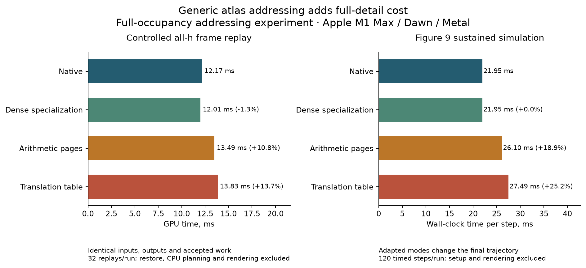

# Uniform coarse-first: full-fidelity addressing experiment

3 October 2026. Follow-up to the [coarse-first investigation](uniform-coarse-first-2026-10-03.md). The requirement is that dynamic detail controls reach today's fidelity without a substantial full-detail performance regression.

## Decision after the architecture clarification

**Use one fully dynamic 4h-first architecture with opt-in h detail, at every occupancy.** Peter explicitly ruled out fast paths after these measurements. The native/dense specialization below remains a diagnostic control; it is not the proposed production endpoint. The controlling [implementation handoff](uniform-4h-first-implementation-handoff-2026-10-03.md) replaces the earlier suggestion to switch to native dense execution.

The experiment rejects the tested generic per-access atlas as the universal field interface: it adds measurable cost before sparse allocation, halos or residency changes. The implementation must amortize addressing within its single dynamic patch model and prove full-detail performance there. Near-parity for that model is still unproven.

Coarse cells own the simulation where no h detail is requested. Fine regions own their transport, velocity, surface and pressure correction. Covered coarse data serves restriction/global pressure rather than a second independent transport simulation. Allocation, promotion, retirement and publication remain dynamic even when detail fills the domain.

No production numerical operator, pressure acceptance threshold or timing ceiling was changed. The new code is research tooling and tests. A compact 4h base, sparse h allocator, dynamic lifecycle and new default UI are not implemented by this experiment.



The two panels measure different workloads and clocks. The dense control's small apparent replay advantage is within observed native-run variation. Longer adapted runs also change numerical trajectory; only the frozen frame has matched inputs, outputs and accepted work across every mode.

## Scope and controls

The [adapter](../../tools/uniform-atlas-address-experiment.ts) changes physical texture placement while retaining the production solver. It has three modes, plus an unmodified native baseline:

- **Dense:** preserve exact production shader source and native texture placement. This tests the settled dense specialization, with no migration into it.
- **Arithmetic (`affine`):** reverse whole pages along each axis, preserving coordinates within each page. Integer arithmetic translates logical texels. This structured permutation cannot represent arbitrary slot allocation.
- **Table:** use a uniform GPU directory of per-page integer translations for the same placement. It can express noncontiguous placement, but these captures exercise only the fixed mirror permutation.

Every physical page is allocated. There are no missing pages, ghost layers, allocation transitions or new coarse/fine operators. Frame comparisons use 32³ pages; GPU address fixtures also exercise 16³ pages. The outer vertex planes retain native addresses. Interior placement is a bijection, including vertices on internal page boundaries. All native h-sized 3D fields and scratch textures are adapted; smaller hierarchy textures remain native. The generic helper checks dimensions to distinguish them.

The table adapter extends explicit bind layouts with a uniform directory binding. Extra bindings and per-access dimension checks are included in its cost. This is deliberately a generic feasibility probe, not the best possible implementation with patch-local or cached neighbour addresses.

Whole-field host uploads are repacked and readbacks decoded to logical coordinates outside timing. Corresponding textures have matching physical placement, so full-field GPU copies remain valid. Unsupported partial uploads and filtered sampling fail explicitly. CPU tests check bijection, boundary planes, packing and dense specialization; GPU tests check cross-page stencils and storage loads at both page sizes.

Hardware was Apple M1 Max, Dawn/Metal, macOS 26.6.2. Jobs ran serially under the repository WebGPU lease, without a browser GPU session. Uniform/scenes and experiment-source fingerprints remained stable within each comparison family. Raw logs and arrays are under ignored `artifacts/uniform-full-fidelity-2026-10-03/`; the checked-in [evidence](uniform-coarse-first-2026-10-03/full-fidelity-evidence.json) retains timings, fingerprints, hashes, work counts and quality summaries.

## Controlled all-h frame replay

The [frozen-frame probe](../../tools/probe-uniform-frozen-frame-dawn.ts) captures one accepted first frame of the 64³ mini dam with the whole domain at h, timestep 1/60 s. It restores the same initial GPU state before every replay, including mutable buffers and scratch textures, and reproduces all parameter writes in order. Fresh command buffers are encoded for every replay because WebGPU command buffers are single-use.

The checkpoint contains 217 buffers and 123 textures, accounting for 78.71 MB of field/buffer data. The captured frame has three original submissions, 26 parameter writes and 29 replay command buffers. It has 4,096 fine tiles, zero coarse tiles, one executed root pressure cycle and four band cycles over 2,288 band tiles. This is a complete accepted solver frame, not an isolated texture-load microbenchmark.

There are four warmups and 32 measured replays per run. Input hashes are compared across modes; each mode must exactly reproduce its own originally accepted volume, velocity, phi and ownership after replay. The analyzer also compares accepted work and outputs against native.

| Execution mode | Mean GPU time, ms | Per-run p90, ms | Versus native mean |
|---|---:|---:|---:|
| Native A / B | 12.30 / 12.05 | 12.66 / 12.33 | reference: 12.17 ms |
| Dense specialization | 12.01 | 12.29 | −1.3% |
| Arithmetic page placement | 13.49 | 13.72 | +10.8% |
| Translation table | 13.83 | 14.14 | +13.7% |

Every mode has identical initial hashes, final hashes and accepted work. Every replay exactly matches its original accepted frame. This is the strongest matched-work evidence in the study: even without sparse allocation or halos, the generic translated paths exceed the proposed 5% endpoint budget. Table adds about 2.5% over arithmetic in this frame.

The native-to-adapted difference includes address instructions, shader compilation effects and changed physical locality; it does not isolate the price of integer arithmetic alone. Table-versus-arithmetic preserves physical placement but also changes generated shaders/bindings, so its delta is the implemented directory path's total cost, not a standalone uniform-load latency.

Native A/B differ by about 2%; dense's small apparent advantage is within that observed variation and is not claimed as a speedup. These are two native runs and one run per adapted mode, each with 32 samples of the same frame—not a many-scene confidence interval. The order was native → arithmetic → table → dense → native.

Timing uses the repository's GPU completion-frontier recorder. Independent marker timestamps initially produced an implausibly short result because unrelated markers can complete ahead of the work on Metal; that capture is retained with `invalidMeasurement` and excluded from all summaries. The corrected recorder anchors completion to instrumented passes. A GPU fixture also verifies that replay restores mutated state and honours typed `writeBuffer` offsets and lengths.

These are instrumented GPU execution times, including replayed parameter-copy commands within the measured frame interval. Rebuilt command buffers are submitted together; original CPU/submission gaps are not replayed. They exclude checkpoint restoration, CPU solver planning, renderer/publication integration and page churn. Restoration also changes cache conditions. Compare the arms within this benchmark; do not substitute these times for sustained interactive frame rate.

### Why the replay uses the first frame

The existing native mini-dam reference explicitly forced to all h rejects pressure on frame 3, both with fixed-region coarsening and with the dynamic path constrained to full h:

```text
pressure rejected a non-improving cycle
(candidate 19044.76953125, accepted 16.2364559173584)
```

Projection is withheld. The first two frames are accepted. We did not relax acceptance or reinterpret that run as a successful trajectory. The first-frame replay isolates the addressing question without concealing this reference limitation. It does not establish a stable long all-h mini-dam trajectory or imply that all full-detail scenes fail.

## Sustained production-policy trajectory

Figure 9 uses its production dynamic h/4h policy on a 128×128×64 lattice: eight warmup steps followed by 120 timed steps, timestep 1/60 s, two frames in flight. Final state is at 128/60 s. These measurements use uninstrumented wall-clock throughput, excluding setup, readback and rendering.

The order was native → arithmetic → table → table → arithmetic → native, followed by the dense control.

| Execution mode | Run A, ms/step | Run B, ms/step | Mean | Versus native mean |
|---|---:|---:|---:|---:|
| Native | 21.89 | 22.00 | 21.95 | reference |
| Dense specialization | 21.95 | — | 21.95 | +0.003% |
| Arithmetic page placement | 26.23 | 25.97 | 26.10 | +18.9% |
| Translation table | 27.65 | 27.32 | 27.49 | +25.2% |

Native A, native B and dense produce **identical full final hashes** for volume, velocity, vertex phi and ownership. Arithmetic A/B and table A/B also match each other exactly. The latter group differs from native, including final ownership: 5,932 fine tiles versus 6,112, and 3,351 band tiles versus 3,372.

Consequently, the 18.9% and 25.2% figures are **coupled trajectory cost differences, not isolated addressing overhead at identical numerical work**. These transformed paths are not accepted as fidelity-equivalent optimizations. Table versus arithmetic is a stronger matched-output comparison: the table path adds about 5.3% over arithmetic with identical final fields and recorded work counts.

The native/dense equality validates the no-op control. It does not establish that the requested single dynamic architecture can achieve parity. No production native/dense alternative is planned; the full-occupancy patch pipeline must meet the cost requirement itself.

All arms retain the legacy allocation: reported solver allocation is 259.71 MB. No memory saving from sparse storage is demonstrated. Cold shader/setup time was also substantial, roughly 94 s native and 244–250 s for adapted variants in these captures; setup is excluded from the throughput table. Dynamic execution variants would need prewarming or a separate compilation-latency budget.

Do not compare this table's 21.95 ms directly with the earlier investigation's roughly 42 ms Figure 9 measurement. Those were different measurement sessions; only the paired arms here support these ratios.

## Numerical sensitivity and identity control

A short nine-step mini-dam run with the normal dynamic policy isolates the first divergence. Native repeated runs are bit-identical. Arithmetic placement, table placement and an **identity table with zero offsets** are also bit-identical to one another. Identity retains shader adaptation but does not relocate any texels.

At step 1, adapted and native volume/ownership match; velocity and phi differ. Centre-plane phi differs by at most 5.22e−8 m, with matching recorded mass, centre of mass and projection summary. By step 9, centre-plane phi differs by 3.94e−4 m and the largest centre-of-mass coordinate difference is 2.87e−4 h. The identity result points to shader adaptation/code generation rather than physical page permutation as the initial cause. It does not isolate a particular floating-point transformation or prove that every later difference is harmless.

The longer Figure 9 run accumulates observable differences. Owner-aware quality at 128 steps is:

| Quantity | Native / dense | Arithmetic / table |
|---|---:|---:|
| Liquid mass, h³ cell units | 335,367.7592 | 335,414.5836 |
| Centre of mass, h coordinates | (81.2353, 35.2141, 32.0377) | (81.3739, 35.4264, 32.2066) |
| Excess-volume fraction | 1.3009% | 1.3677% |
| Mass in positive-phi cells | 7.6426% | 7.3007% |

The mass difference is about +0.014%; that alone does not certify equal fidelity. Full-texture error norms are retained in the evidence, but mixed-field arrays include non-authoritative/stale texels, so those norms are not substitutes for owner-aware physical metrics. The identity launcher prints its own source hash separately in its raw log; the main trajectory probe fingerprint does not include that small launcher.

## Consequences for the single dynamic implementation

1. **Make the base genuinely compact.** Zero h requests must allocate and execute only a 4h simulation plus required geometry/hierarchy data. Today's dense h fields and scratch remain the principal allocation obstacle. Lowering scene resolution is not an equivalent pressure/geometry implementation.
2. **Keep one owner and one execution model.** Coarse cells outside detail and fine cells inside it own mass/flux. Covered coarse data is restriction/global-coupling state. Full coverage fills the same patch system; no occupancy-triggered representation or kernel switch.
3. **Amortize addressing within that model.** Resolve executing patches, fixed-stencil neighbours and interpolation footprints once where possible, then reuse their addresses. Long departures still need certified support. Do not adopt the tested generic per-tap wrapper or introduce a native-interior bypass.
4. **Measure dynamic lifetime costs.** Promotion, retirement, capacity growth and generation-safe publication must fit the memory/frame budget. Include churn, support overhead, fragmentation and in-flight retirement at intermediate and full coverage.
5. **Integrate rendering and controls early.** Consume coarse/detail resources directly; a dense h publication copy would restore the old floor. Use live detail requests and the normal app default so Peter can test the actual representation.

The [full implementation handoff](uniform-4h-first-implementation-handoff-2026-10-03.md) specifies module boundaries, numerical scope, runtime controls, persistence, ordered milestones and acceptance. Further experiments are bounded implementation decisions, not an open-ended search. The current generic atlas exceeds the proposed 5% matched-work endpoint target; performance of the planned universal patch implementation remains to be established.

## Reproduction and validation

Sustained production-policy comparison:

```sh
node --import tsx tools/probe-uniform-stage-scaling-dawn.ts \
  --scene=cm12-figure-9 --case=adaptive --atlas=table --atlas-edge=32 \
  --frames=120 --throughput --field-hashes \
  --field-dump-dir=/tmp/atlas-fields --out=/tmp/atlas.json
```

Controlled first-frame replay:

```sh
node --import tsx tools/probe-uniform-frozen-frame-dawn.ts \
  --scene=minimal-power-dam-break-64 --fine --atlas=table \
  --atlas-edge=32 --samples=32 --out=/tmp/frozen-atlas.json
```

Use `native`, `affine` or `dense` for the other arms. Run all GPU commands serially. The [analyzer](../../tools/analyze-uniform-full-fidelity.py) requires numpy and the repository's Node/tsx runtime, and consumes `artifacts/uniform-full-fidelity-2026-10-03/`. It recomputes owner-aware quality through the existing CPU census; `--plot` also regenerates the figure with matplotlib.

The [CPU address tests](../../tests/uniform-atlas-address.test.ts) and [Dawn address/replay fixtures](../../tests/uniform-atlas-address-dawn.test.ts) are included in the standard gates:

```sh
npm run check:types
npm run test:unit
npm run test:dawn
```

Validation passed on the final research implementation:

- `npm run check:types`.
- `npm run test:unit`: 852 passed, 52 skipped, zero failures.
- `npm run test:dawn`: 48/48 files passed, 88 tests passed, zero skipped.
- `git diff --check` and Python analyzer compilation; evidence/figure regeneration completed.

Logs are saved in `artifacts/uniform-full-fidelity-2026-10-03/{types,unit,dawn}-gate.log`. These gates validate the current repository and research tools, not the future 4h-first implementation described in the handoff.
