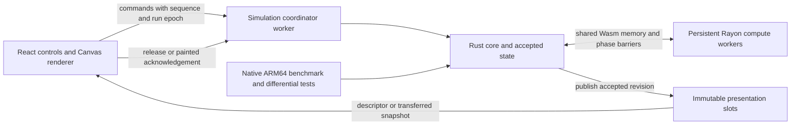

# Rust/Wasm physics engine: Advance Lab first, full 3D next

Research date: 13 September 2026. Status: proposed implementation plan; no solver rewrite has been performed.

## Recommendation

Build one Rust physics engine that runs both as a native ARM64 benchmark executable and as WebAssembly in a dedicated browser worker. **All physics belongs in this module.** The 2D Advance Lab is the first frontend and validation target; the architecture must support the later full 3D solve without replacing the core. Keep React, scene-document editing, input and graphics submission in TypeScript. Move scene-to-state initialization, physical geometry, numerical authority, topology compilation, pressure, transport, adaptivity, rigid coupling, sources, live interventions, tracer state and simulation-derived surface reconstruction into Rust in stages. Use packed arrays, persistent scratch storage, explicit `simd128` kernels where measurement justifies them, and a persistent Rayon worker pool through `wasm-bindgen-rayon`.

Preserve the current lab's production-fidelity numerical mode throughout the rewrite. That includes the extruded 3D pressure graph used by symmetry scenes, the exact f32 recurrence and reduction tree, conservative shared-face transport, transactional topology changes, and documented failure behavior. A faster solver that changes those semantics is an experiment, not a transparent replacement.

The first implementation milestone should be a **dimension-independent packed pressure pipeline running in native Rust and threaded Wasm**, driven by captured real lab inputs and compared against TypeScript. Exercise both a 2D graph and the already retained 3D pressure graph, including its preparation/mapping and generation-change cost rather than timing PCG alone. It is an end-to-end proof of the toolchain, operator layout, numerical fidelity, SIMD and worker scaling before committing to the full port. The interface boundary can also be prepared using the TypeScript solver in a worker as a temporary migration adapter. The final runtime must contain no TypeScript physics execution, including initialization and edits, and must not repeatedly serialize the solver between languages.

There is no evidence yet for a particular Rust speedup or for 60 simulation frames per second. The plan below makes those measurable and separates execution improvements from reductions in numerical work.

## 1. What was inspected

The working directory is `/Users/petersuggate/code/me/fluid`. It contained substantial pre-existing staged and unstaged changes. Research reads the current working files, rather than assuming `HEAD` alone describes them. The accompanying `advance-lab-rust-wasm-source-manifest.json` records hashes of 59 relevant files and the observed Git revision. It is a research fingerprint, not a complete immutable build snapshot. Implementation should first capture a complete source snapshot, including dirty and untracked dependencies.

Locally verified hardware and software:

| Item | Observed value | Planning implication |
| --- | --- | --- |
| CPU | Apple M1 Max | Native comparison target is ARM64; browser Wasm is separately measured |
| CPU cores | 8 performance + 2 efficiency | Tune compute-pool size; do not assume ten equal workers |
| RAM | 32 GiB | Plenty for this lab, but not an excuse to duplicate the embedded graph per worker |
| Reported cache line | 128 bytes | Separate hot worker counters/scratch boundaries to avoid false sharing |
| macOS | 26.6.2, build 25G83 | Record this again for performance baselines |
| Node | 22.22.1 | Existing CPU benchmark environment |
| Rust | 1.96.1, stable | Native and ordinary Wasm are available; threaded build needs its own pinned toolchain |
| Installed target | `wasm32-unknown-unknown` | No initial target installation needed for the ordinary Wasm spike |

Commands used for these observations: `sysctl`, `sw_vers`, `node --version`, `rustc --version`, and `rustup target list --installed`. No browser compatibility or Rust solver performance result is implied by the installed tools.

### Source map

| Responsibility | Current files and key behavior |
| --- | --- |
| Route and application | `app/advance-lab/page.tsx`, `advance-lab/AdvanceLab.tsx`: creates and advances mutable CPU state directly on the browser main thread |
| Playback consistency | `advance-lab/playback.ts`: revision is frame, injections, and accepted topology generation; Play waits until the previous revision was painted |
| Drawing and inspection | `advance-lab/lenses.ts`, `slice-lattice.ts`: Canvas 2D, accepted-cell geometry, PLIC/RDF display, overlays and probes |
| Orchestration | `slice-solver.ts`: 15 named stages, plus rigid/geometry/source preparation and intervention transactions |
| Topology | `slice-topology.ts`, `slice-cell-index.ts`: sparse brick/cell/row/subface identities, incidences, transfer and lookup |
| Numerical kernels | `slice-stage-numerics.ts`: velocity extension, face preparation, pressure membership/operator, PLIC, CFL, low/high flux, feasibility iteration and FCT |
| Pressure fidelity | `slice-pressure-pcg.ts`, `slice-pressure-embedding.ts`, `slice-pressure-authority.ts`: production recurrence, full source pressure graph where required, PCM/PCF/PEI publication |
| Lifecycle | `slice-resolution-policy.ts`, `slice-runtime-authority.ts`, `slice-retirement-authority.ts`, `slice-enforcement-region.ts` |
| Sources and solids | `slice-dynamic-geometry.ts`, `slice-dynamic-remap.ts`, `slice-rigid-dynamics.ts`, `slice-liquid-injection.ts` |
| Derived fields | `slice-tracer-authority.ts`, `slice-scalar-authority.ts`, `slice-presentation-publication.ts`, `slice-rdf-triangulation.ts` |
| Inputs | `production-scene-slice.ts`, `slice-scene-seed.ts`, production scene catalog and source atlas constructors |
| Build and serving | `vite.config.ts`, `worker/index.ts`, `build/sites-vite-plugin.ts`, `tools/package-chatgpt-site.mjs`; actual commands use Vinext/Vite/Cloudflare/Sites |

The `slice-*` files above live in `lib/methods/adaptive-volume/advance-slice/`. There is no existing Rust solver workspace to extend. `shape-lab/pool.ts` demonstrates the repository's module-worker bundling pattern, but its independent tile jobs do not provide shared-memory synchronization for this solver.

## 2. Current behavior and performance implications

### The interface currently serializes simulation and painting

`AdvanceLab.tsx` calls `advanceSlice()` synchronously inside `requestAnimationFrame`, then updates React readings. A later effect reconstructs the shared RDF and draws the selected lens. The timer around `advanceSlice()` measures solver wall time; it excludes that effect's RDF construction and Canvas painting. `FRAME_MS = 46` intentionally throttles advances, and the default physical timestep is `1/30 s`. A future throughput benchmark must bypass this viewing throttle while keeping the physical timestep unchanged.

The paint gate is a correctness feature. It prevents an RDF from one revision being painted over volume from a later revision. Moving computation to workers must replace this with immutable publication ownership, not remove the guarantee.

Scene selection, paused drops, enforcement regions, timestep changes, Reset, Step, Play, probe coordinates, theme, and resize behavior are part of the existing product contract. Region edits modify the run's scene copy; Reset restores the seed. A worker port introduces an in-flight command queue that the synchronous implementation did not need.

### The numerical graph is sparse and irregular

The code already uses `Float32Array` for many fields. The expensive remaining structure includes objects per cell/row/subface, nested incidence arrays, `Map` and `Set`, callback-based sampling, repeated `.find()` calls for the owning row term, and short-lived arrays. A direct translation to Rust structs containing small `Vec`s would preserve much of that cost.

The core design should separate stable identity from physical storage and precompile addresses and coefficients. Regular brick interiors merit specialized loops; mixed-rung seams, cut cells and boundaries still need the general operator. SIMD does not make arbitrary sparse gathers contiguous.

Topology-change costs deserve equal priority with the solve. [`transferSliceTopology`](/Users/petersuggate/code/me/fluid/lib/methods/adaptive-volume/advance-slice/slice-topology.ts:520) scans all old cells for every new cell and all old rows for every new row. [`createSlicePressureEmbedding`](/Users/petersuggate/code/me/fluid/lib/methods/adaptive-volume/advance-slice/slice-pressure-embedding.ts:92) filters source bricks per accepted XY brick and reduced rows per source gradient row. Porting these all-pairs searches unchanged would carry a major scaling problem into 3D. Use integer coordinate/plane buckets, brick spatial indexes, overlap joins and indexed source-to-reduced mappings, then emit results in the original canonical order. Indexed discovery may reduce work; it must not reorder floating-point accumulation or change geometric tie-breaking.

The orchestration can commit projected-front support before transport and a separate resolution candidate at frame tail. Budget and invalidate caches for both possible transitions; assuming at most one generation change per frame would be wrong.

### Pressure is not always a 2D problem

`slice-solver.ts` creates an embedding for symmetry-Z seeds; `createSlicePressureEmbedding()` retains source-derived 3D cells, X/Y/Z rows, masks, execution order and persistent pressure state, then maps the result back onto the center plane. Its extra Z terms affect the Jacobi diagonal and the f32 iteration even when the physical Z operator contribution cancels. Other scenes use the reduced 2D path.

Both operator paths currently allocate side accumulators inside cell traversal and find each incidence's own coefficient repeatedly. PCG creates temporary vectors and 64-lane reduction arrays repeatedly. The embedded operator recalculates a row's pressure jump from each incident cell. These are concrete optimization opportunities, although their measured shares still need an allocation and stage profile.

Do not replace the production face-jump operator with an algebraically equivalent expanded sparse matrix without a numerical differential. Reassociation, early reciprocal formation, or precombining coefficients can change the result.

### Transport has both local geometry and global dependencies

Volume transport computes extensive amounts from the stored density and cell area. It uses one oriented physical-subface low/high/final flux and gathers that same flux into both endpoints. Microsteps are `max(1, ceil(2 * maximumCellCfl))`, with a fault above 128. Velocity extension has eight synchronous generations. The low-state limiter has up to 1,024 passes, not the UI work model's illustrative two passes.

In the static path, each limiter pass reads a frozen receiver-factor bank, proposes factors, checks validity, then commits. A zero-invalid pass deliberately discards its newly computed proposals. The moving-solid path uses dual potentials/FISTA and ordered closing-capacity allocation. These synchronization points and ordering details constrain parallelism.

The PLIC swept rectangle integral and the 2D volume-to-offset inverse are already analytic. Replacing them with an analytic formula is not a new optimization. The existing [transport exploration](/Users/petersuggate/code/me/fluid/docs/2d-transport-work-reduction-exploration.md) identifies exact reverse-flow active-frontier execution as a promising scheduling experiment; its synthetic work reductions are not measured full-solver speedups. A geometric narrow band alone cannot certify the limiter dependency closure.

### Publication is a meaningful CPU workload

`reconstructSliceSharedRdf()` constructs neighbor sets, maps keyed by vertex strings, weighted samples and dense vertex output on every requested paint. Cache geometric adjacency per topology generation, retaining the exact neighbor order, and update values per accepted field revision. Its current least-squares/intermediate arithmetic includes f64; blanket conversion to f32 would change this presentation algorithm.

The dense `V/K`, velocity and pressure planes used by lenses are readback, not the authoritative mesh. Preserve that distinction in the new API. Retain all published stage/overlay data that existing lenses actually need, but allocate diagnostic detail only when requested.

### Existing measurements establish scale, not a Rust forecast

The historical matched comparison in [Advance Slice performance](/Users/petersuggate/code/me/fluid/docs/ADVANCE_SLICE_PERFORMANCE.md) reports approximately 169 ms/advance for `coarse-first-pool-impact-half` and 738 ms/advance for `cm12-figure-3` on Node ARM64, with only about 2–3% improvement from its particular earlier cleanup. A separate diagnostics-only comparison reports approximately 12 ms for `twin-dam-collision`. These come from different comparisons; they are not a new matched baseline for this checkout.

The UI's workgroup/dispatch strip models the GPU encoder. It is not a CPU profile and must not be used to rank Rust kernels. Preserve it as explanatory material; add actual CPU receipts for measured attribution.

### Fresh research observations

A CPU-only audit ran the existing five-repetition benchmark and a separate topology census. The timing process briefly overlapped another CPU benchmark, and the checkout is dirty. These are **preliminary observations only**, not a clean baseline or evidence of a speedup. The per-scene ending-state hashes agreed across all five repetitions. Samples and selected checkpoint facts are saved in [the preliminary CPU report](/Users/petersuggate/code/me/fluid/docs/research/advance-lab-rust-wasm-preliminary-cpu.json); the audit's [source hashes](/Users/petersuggate/code/me/fluid/docs/research/advance-lab-rust-wasm-audit-source-shas.txt) identify its relevant source files.

| Scene | Preliminary median ms/advance | Slice cells/rows at frame 0 → 6 | Embedded pressure cells/rows at frame 0 → 6 |
| --- | ---: | --- | --- |
| `coarse-first-pool-impact-half` | 103.129 | 796/1,657 → 1,042/2,092 | None |
| `twin-dam-collision` | 16.015 | 128/280 → 256/552 | None |
| `cm12-figure-3` | 673.816 | 1,184/2,522 → 1,632/3,434 | 9,248/30,034 → 12,832/41,362 |

Each timing sample is the total of four evolving frames divided by four, with two warmup frames and 16 pressure iterations. It does not measure individual-frame tails. The census proves the extra pressure graph size; stage profiling is still needed to quantify its share of total time.

The CPU test audit completed 130 tests in approximately 63.9 seconds: **125 passed, five failed**. The [complete TAP receipt](/Users/petersuggate/code/me/fluid/docs/research/advance-lab-rust-wasm-cpu-audit.tap) records:

1. Work-model kernels do not match the current host source (`advance-slice.test.ts`).
2. Water-box automatic rerung fails to reach the expected next generation (`advance-slice.test.ts`).
3. Impact RDF exceeds the test's 0.2% represented-area bound (`slice-presentation-publication.test.ts`).
4. The retained pressure-authority rerung fixture does not advance generation (`slice-pressure-embedding-authority.test.ts`).
5. The automatic pressure-mapping fixture does not publish a candidate generation (`slice-pressure-embedding.test.ts`).

Reproduction command:

```bash
node --import tsx --test --test-concurrency=1 \
  advance-lab/lenses.test.ts advance-lab/playback.test.ts \
  lib/methods/adaptive-volume/advance-slice/*.test.ts \
  tests/advance-slice-sphere-contour-quality.test.ts
```

These failures were observed before any solver edits for this plan. Capture them again on the immutable Phase 0 baseline and fix or explicitly account for them. A failing generation/transport path must not become a performance lane merely because it exits quickly. No Dawn or browser run was started for this research.

## 3. Full-physics ownership and the 2D-to-3D design

The user's clarified destination is a complete Wasm physics module, later used for the full 3D simulation. Porting just a pressure kernel, or leaving topology, collision/geometry sampling, sources or adaptivity in TypeScript, is an intermediate milestone only.

### Permanent ownership boundary

| Rust/Wasm owns | TypeScript owns |
| --- | --- |
| Validation of physical inputs, units/coordinate conversions and construction of numerical state | Scene catalog names and serialized authored scene documents |
| Initial liquid/solid sampling, cut capacities, apertures, moving geometry and physical boundary conditions | Editing document parameters and displaying tool previews |
| Sparse topology, physical faces, stencils, grading, transfer, allocation/retirement and all acceptance decisions | Sending high-level edit commands and displaying accepted/refused receipts |
| Fluid pressure, velocity preparation/extension, momentum-related updates, conservative transport and CFL/iteration policy | Play/Step/Pause intent and display scheduling |
| Rigid integration, physical collision/contact behavior present in the source solver, exchange, source/inflow and injection semantics | Pointer mapping to world coordinates; rendering rigid poses returned by Wasm |
| Activity/refinement policy, tracer dynamics, material/scalar state, conservation and fault diagnostics | Formatting readings, selecting overlays and inspecting returned snapshots |
| Physics-derived PLIC/RDF/surface samples or meshes and their consistency with accepted state | Canvas/WebGPU graphics submission, shading and camera interaction |

TypeScript may cache immutable render buffers and perform visual picking against published geometry. It may not decide how much liquid a drop admits, what cells refine, how an object collides, how velocity changes, or how accepted physics fields are reconstructed. A graphical tool preview does not become numerical authority.

Retain TypeScript/WGSL implementations as off-path references during migration. Once the relevant frontend cuts over, neither normal stepping nor loading/resetting/editing that frontend may call them for physics. The later 3D cutover applies this same rule to the existing 3D application. Using WebGPU for rendering remains compatible with CPU-only physics.

### Shared core, specialized geometry

Use compile-time 2D and 3D specializations, with shared dimension-independent sparse graph and solver infrastructure. Dispatch dimension once at the scene/solver boundary. Do not test `dimension == 3` or use virtual calls inside every face/cell loop. Rust const generics or small sealed dimension traits can describe fixed-size vectors and geometry; keep the public ABI explicit and avoid an elaborate generic framework before both fixtures work.

The pressure solver consumes a graph/operator contract and its canonical execution order. It does not care whether the graph represents a 2D simulation, an embedded pressure context, or a real 3D world. Geometry construction and directional accumulation specialize for two or three axes; PCG buffers, reduction trees, scheduling, sparse identity and diagnostics are shared.

Do not encode the 2D display conventions into the engine. Use physical world coordinates, dimension-tagged units, cell measure (area in 2D, volume in 3D), face measure (length/area), extents and explicit orientation. The 2D adapter performs the current canvas Y reversal and center-Z extraction at a well-defined tested boundary. Preserve the current finest-cell arithmetic inside the strict kernels where changing units would change rounding.

Keep compile-time geometry implementations distinct: `Geometry2d` provides line/rectangle integrals and the current 2D reconstruction; `Geometry3d` will provide plane/polyhedron clipping, swept face prisms, 3D reconstruction and cut/swept-solid geometry. Share transport orchestration and conservative face ownership only where the source algorithms actually agree. A 3D port is not adding a Z component to the 2D analytic integral.

Do not fix cell storage or incidence capacity at 64 everywhere. An 8-by-8 2D brick has 64 fine cells; an 8-cubed 3D brick has 512, with different packet/face counts and seam degrees. Keep the production **64-lane pressure reduction** and **64-lane packet ABI** conceptually separate from geometric cells per brick. Name these constants separately. Parameterize support neighborhoods, physical-subface ranges, index flattening and spatial keys. Preserve literal WDR/TEI/HTP compatibility through tested packing adapters, so their 2D lane-plane reduction does not constrain 3D storage.

SIMD lanes should represent independent cells/faces, not X/Y/Z coordinates packed into an XYZW vector. This makes four-lane f32 throughput useful in both dimensions. Keep explicit X/Y/Z field planes and dimension-specialized regular-interior kernels; use the general incidence path for seams and cut cells.

### Prove 3D readiness during the 2D port

Add a tiny true-3D graph fixture to Phase 1, including a Z row and a mixed seam. Require the same PCG API and reducer to process it, even before the 3D geometry compiler exists. Add 3D indexing/brick/ABI fixtures before finalizing topology storage. This catches architectural mistakes cheaply without expanding the first milestone into a full 3D rewrite.

The current embedded pressure solve is valuable early 3D coverage but **does not validate full 3D physics**. Later acceptance requires nonzero Z velocity, Z-dependent solids and sources, all three face orientations, 3D interface motion, full rigid rotation/contact and 3D adaptive growth/transfer. Z-invariant extrusions are a bridge test, followed by genuinely three-dimensional trajectories.

### 3D memory and publication rules from day one

Keep sparse active storage, per-generation immutable topology, reusable scratch, one shared memory across workers, and checked arena/index arithmetic. Do not export a dense full-world 3D copy every frame. Publish active/changed pages, surface geometry and small requested diagnostic regions, with stable IDs and generations. Budget peak memory for candidate plus accepted state, full 3D pressure vectors, reconstruction work, worker stacks and retained render publications before admitting a scene/edit.

Stay on Wasm32 for the first implementation, but measure the supported 3D envelope explicitly. If a required 3D scene exceeds the safe browser memory budget, report that as an admission limitation and investigate more compact/sparse storage or a separately tested future backend; the machine's 32 GiB RAM is not directly addressable by one ordinary Wasm32 memory. Do not silently lower scene resolution to fit.

## 4. Target runtime architecture



### Workspace boundaries

Proposed structure:

```text
rust/
  Cargo.toml                       # workspace
  rust-toolchain.toml               # chosen/pinned native toolchain
  crates/fluid-core/src/
    dimension.rs, scene/, state.rs, topology/, numerics/, pressure/, transport/
    geometry/{two_d,three_d}/
    adaptivity/, geometry/, sources/, rigid/, tracers/, presentation/
    kernels/{scalar,wasm_simd,aarch64}.rs
    diagnostics.rs
  crates/fluid-wasm/                # full physics API, worker-pool bootstrap
  crates/fluid-bench/               # 2D/3D fixtures, timing and differential replay
advance-lab/runtime/
  protocol.ts, client.ts, simulation.worker.ts
  typescript-backend.ts, wasm-backend.ts, capabilities.ts
tools/wasm/                        # pinned threaded build and artifact checks
tests/fixtures/advance-slice/       # versioned schema and compact golden captures
```

`fluid-core` contains no DOM, JS objects or browser event code. Serialization belongs at the boundary. Low-frequency configuration can use a schema/Serde; frame fields use packed binary buffers. Keep numerical modes independent of execution backends: TypeScript reference, Rust scalar, Rust SIMD, and Rust SIMD + threads must implement the same strict mode. The scene descriptor and snapshot ABI include dimension and schema version from the first commit.

Initially export real accepted topology and complete pressure fixtures from TypeScript. That enables a pressure port before porting all scene constructors. A one-time TS seed importer is permitted only for intermediate differential milestones. For cutover, send authored scene documents and raw assets into Wasm; Rust performs physical extraction, geometry sampling and numerical initialization itself. Raw preauthored voxel assets can be inputs, but newly computed capacities/apertures/refinement choices cannot remain a hidden TS preprocessing path. Reuse the existing scene catalog UI; replace its physics extraction adapter as part of the port.

### Packed state

Use structure-of-arrays storage for hot numeric fields, with compact `u32` indexes and explicit sentinel validation. Keep canonical IDs and stable leaf identities separately from any optimized storage order.

| Storage | Proposed contents |
| --- | --- |
| Cell geometry | bounds/widths/area, brick and stable IDs, neighbor classification and incidence offsets |
| Cell fields | density, gamma, capacity before/after/rate, source rate, velocity X/Y, pressure/RHS/diagonal, masks, interface X/Y/offset |
| Pressure rows | axis/kind, term offsets, term cell IDs and coefficients, weights, theta, active mask, cached row jump |
| Cell-row incidences | row ID, own coefficient and axis/side precompiled in canonical accumulation order |
| Physical subfaces | row, negative/positive cell, area, aperture, sweep, low/high/final flux |
| Cell-subface incidences | CSR offsets, face ID and orientation in the production order |
| Pressure embedding | separate retained graph and 2D/source mappings, packed once per generation |
| Lifecycle | accepted/candidate banks, stable directory/free-list identities and generation receipts |
| Scratch | reusable PCG vectors, reduction trees, limiter banks, per-task work, transfer staging and RDF buffers |

Split interleaved X/Y state in hot loops where this improves vector loads. Cold metadata can remain ordinary Rust structs. Prefer safe slices and explicit disjoint chunks; put any raw-pointer worker or SIMD code behind small reviewed interfaces. `Vec<f32>` does not promise 16-byte alignment: use unaligned-safe vector loads or allocate deliberately aligned buffers, never assume alignment from observed addresses.

Retain density as the authoritative stored representation initially, with the same conversion to extensive volume during transport. A permanent `V` representation may be useful later, but removing existing multiply/divide roundings belongs in an explicit numerical change.

Compatibility with GPU bank/packet formats does not require copying every GPU capacity-sized allocation into the CPU engine. Keep semantic authority, stable IDs, generation state and any recurrence-dependent images; compile CPU hot arrays from actual accepted worksets with bounded reserve. Export literal compatibility images for differential tests on demand where proving that change does not alter lifecycle semantics. Keep index/count calculations in checked wide arithmetic before narrowing to Wasm offsets. This matters particularly for the future 3D memory budget.

No general allocator traffic should occur inside a steady-state pressure iteration, transport microstep or limiter pass. Reserve capacity at scene creation/topology admission, reuse scratch, and account for candidate plus accepted storage at peak. Track allocation count and bytes, not only elapsed time.

### Memory capacity and publication ownership

Use one shared linear memory across the compute workers. Each worker needs private stack/TLS/scratch, not a full copy of the graph. Budget memory as:

```text
accepted graph + candidate graph + authoritative fields
+ embedded pressure graph and its vectors
+ reusable numerical scratch + worker stacks/scratch
+ presentation slots + explicit growth headroom
```

Estimate using actual cell/row/term/subface counts, including the embedded graph. A 32 GiB machine does not remove Wasm32 address-space and browser allocation limits. Keep the first browser build on Wasm32; do not introduce memory64 as a prerequisite.

Start the single-worker integration with pooled transferable snapshots: copy only selected display fields from Wasm into an ordinary `ArrayBuffer`, transfer ownership, and recycle it after rendering. Wasm memory itself is not a transferable frame buffer. Measure this copy before adding complexity.

For the shared-memory backend, use three bounded publication slots with explicit `FREE → WRITING → READY → READING → FREE` ownership. Publish an atomic slot descriptor only after all writes complete. The renderer acquires a slot and acknowledges release; the solver cannot overwrite a slot while it is read. This can avoid a worker-to-main bulk copy, but Rust must still fill a stable snapshot; it does not make publication free. Keep control atomics outside the payload and on separate cache lines.

Every publication carries `runEpoch`, `commandSequence`, `frame`, `time`, `injections`, `topologyGeneration`, `fieldRevision`, `surfaceRevision` and `memoryEpoch`. A scene reset changes the run epoch. A paused drop or a publication-affecting edit changes the field revision even without a step. A probe names the revision it sampled. Never combine topology/VOF/PLIC/RDF or diagnostic fields from different revisions.

Make publication slots self-contained for their declared view. The UI acknowledgement controls snapshot recycling, not the numerical retirement schedule: physical retirement still follows successful numerical presentation publication as today. If a later zero-copy design retains pointers into a topology arena, pin that arena's storage until readers release it while preserving logical retirement/ID-generation semantics. When no publication slot is free, apply bounded backpressure; never overwrite a reader or accumulate an unbounded frame queue.

Preallocate within measured capacity limits. If linear memory or a backing vector must grow, do so at a quiescent boundary, invalidate descriptors, and rebuild views. Ordinary memory growth detaches previous JS buffers; shared-memory growth leaves old views with their old length. [MDN memory-growth reference](https://developer.mozilla.org/en-US/docs/WebAssembly/Reference/JavaScript_interface/Memory/grow).

### Commands and responsiveness

Commands include load/reset, play/pause, step, timestep/pressure settings, drop, region edit/delete, tracer settings and diagnostic subscription. Assign monotonically ordered command IDs. Apply simulation mutations only at documented safe boundaries, return an accepted/refused receipt, and record the same command log for replay.

One coordinator owns the mutable solver. Do not hold a Rust borrow across an asynchronous JS call. Do not route every PCG iteration or limiter pass through `postMessage`; a single step stays within Rust and its worker pool. The coordinator returns to its event loop between steps. For long steps, check an atomic stop flag at safe phase boundaries; Pause may finish the current committed step, while Reset can discard the whole old run. An aborted phase must not publish partially advanced state.

Keep Step as advance-once-then-paint. Initially retain paint acknowledgement before the next Play step. Add an explicit benchmark/throughput policy that may skip intermediate display snapshots only after the product's playback semantics are settled; never skip simulation steps or change `dt` to improve timing.

Keep Canvas 2D and React menus initially. Move RDF construction into the worker and cache generation-specific adjacency. If painting later dominates, batch paths or add an OffscreenCanvas render worker. That is a measured second step with palette/resize/probe synchronization tests, not a prerequisite for the numerical port.

## 5. SIMD plan

Baseline Wasm SIMD is 128-bit: four f32 lanes or two f64 lanes. Rust exposes it through `core::arch::wasm32` and the `simd128` target feature. Use a small internal kernel abstraction with scalar, Wasm SIMD and native ARM64 implementations. `std::simd` remains an experimental API in the documentation checked for this plan, so it is not required for the portable core. [Rust Wasm intrinsics](https://doc.rust-lang.org/stable/core/arch/wasm32/index.html), [portable SIMD status](https://doc.rust-lang.org/stable/std/simd/index.html).

The browser chooses the ARM64 instruction lowering. Wasm does not expose an M1-specific NEON API, CPU affinity, Apple Accelerate or unrestricted native instructions. Native NEON is a separate comparison implementation. Inspect emitted Wasm and browser profiles rather than inferring vectorization from a build flag. [V8 SIMD overview](https://v8.dev/features/simd), [Wasm SIMD instruction specification](https://webassembly.github.io/simd/core/binary/instructions.html).

| Priority | Kernel | SIMD approach | Fidelity constraint |
| --- | --- | --- | --- |
| 1 | PCG vector updates, preconditioner, products | Four contiguous members or packed execution lanes; fuse compatible loads/stores | Preserve operation order per lane and the production reduction tree |
| 1 | Pressure row jumps/operator | Specialized regular rows/interiors, packed coefficients, explicit general seam path | Do not expand/reassociate the face-jump formula |
| 2 | Face force, sweeps, trivial full/empty flux | Batch by axis/type; separate exceptional faces | Classifications, wall mixing and sign behavior remain exact |
| 2 | Cell volume update and FCT budgets | Four cells at once with fixed per-cell face order, or regular-interior kernels | One face flux authority; no unordered scatter additions |
| 2 | Static limiter | Dense vector batches; scalar/general seam fallback | Frozen bank, invalid certificate and exact next-lower-f32 behavior |
| 3 | PLIC | Certified uniform stencil batches; masked candidates and scalar fallback | Same six height candidates, scoring, thresholds and tie decisions |
| 3 | Extension and sampling | Regular brick interiors and packetized samples | Eight frozen generations; correct seam/solid/boundary reads |
| 3 | RDF and publication | Vectorizable weighted arithmetic where useful; precompiled neighbor lists | Preserve f64 intermediate arithmetic and geometric fallback behavior |

Do not pad every irregular structure blindly. Compare ordinary CSR with fixed-degree/packet layouts for certified interiors and CSR for exceptions. Gather-heavy Wasm kernels may gain more from locality and precompiled indexes than SIMD. Pack four independent cells, rows or faces rather than horizontally reassociating one cell's sum. Tail lanes must be valid masked work or a scalar tail; masking after an invalid memory access is too late.

Strict mode excludes relaxed SIMD multiply-add, approximate reciprocals, global fast-math and uncontrolled FMA. Relaxed multiply-add may use one or two roundings, whereas current f32 helpers explicitly round intermediate products and sums. Preserve exceptional-value, signed-zero, conversion and bitcast semantics; Rust `f32::min/max` and JS `Math.min/max` must not be assumed interchangeable for NaNs. Existing RDF calculations using JS doubles need an explicit f64 port. [Rust relaxed multiply-add semantics](https://doc.rust-lang.org/stable/core/arch/wasm32/fn.f32x4_relaxed_madd.html), [Rust f32 reference](https://doc.rust-lang.org/stable/std/primitive.f32.html).

Acceptance requires both instruction evidence (`v128`, `f32x4` in intended hot functions, no accidental scalar fallback) and measured kernel/whole-step improvement. SIMD coverage is reported as time and work in vectorized kernels, not a percentage of source lines.

## 6. Threading and deterministic execution

Use Rayon for native parallel kernels and `wasm-bindgen-rayon` to establish its browser worker pool. Keep the numerical loops behind a scheduler boundary so a simpler static scheduler remains possible if browser barriers dominate. Do not build a custom unsafe worker runtime before measuring the standard bridge. The crate's documented setup instantiates on the main thread; the proposed dedicated coordinator implies nested workers. Prove that bootstrap in current Chromium and Safari during Phase 1, including teardown and production-bundled asset loading. Its documentation does not establish nested-worker support as a guarantee. [wasm-bindgen-rayon setup](https://github.com/RReverser/wasm-bindgen-rayon#setting-up).

Workers share immutable phase inputs and write disjoint output chunks. Prefer cell gathers over face scatters. Only task queues, phase control, invalid-count/min-index receipts and publication ownership need atomics; floating-point field accumulation must not use atomic arrival order.

### Pressure execution

1. Compile own coefficients, row term ranges, axis/side buckets and execution mappings once per topology generation.
2. First port the existing cell-gather operator with local scalar accumulators, eliminating per-cell allocation and `.find()`.
3. Test a two-pass operator: compute one row jump into scratch, then gather each cell's contributions in its original order. Preserve the two-term difference form and distinct general-row formulas used by the embedded/reduced paths. Do not predivide weights if that changes rounding.
4. Specialize regular interiors only after exact operator differentials pass. Compare row caching's extra memory traffic against redundant arithmetic before making it universal.
5. Reuse all PCG scratch. Parallelize independent 64-member reduction groups, preserving the exact 32/16/8/4/2/1 tree, lane-strided partial accumulation and final tree. Arbitrary Rayon `sum()` or one partial per worker changes the recurrence.
6. Retain warm start, curvature recovery, fixed encoded iteration behavior, true-residual cadence of eight and the existing stopping receipt. Vector updates can be fused only where the source data dependencies and rounding permit it.

Work scheduling may vary with worker count; numerical grouping must not. This allows work stealing to cope with heterogeneous cores while keeping deterministic sums. Canonical fault selection is the first fault in the original traversal order, not the first worker to report one.

### Transport execution

Each microstep has explicit barriers: reconstruct → face fluxes → limiter proposal/certificate/commit → low-state and FCT budgets → shared final face fluxes → cell commit → source ledger commit. Each parallel task owns cells or faces for that phase. No worker reads a neighbor's newly written factor in a Jacobi generation.

Start with the dense limiter. Reuse banks and remove copies only where the frozen-bank and discarded-proposal behavior is preserved. Then evaluate the existing exact active-frontier idea: seed all invalid/changed cells, follow reverse-flow dependencies, deduplicate with generation tags, and switch to dense processing when the active fraction becomes broad. Keep canonical per-cell accumulation and first-invalid receipts. This is a separate benchmarked optimization after the baseline port.

Keep moving-solid closing allocation serial initially because its ordered residual distribution has observable semantics. The surrounding face/cell calculations can still run in parallel. Parallelizing that allocator requires a separate equivalence argument. Never apply the static receiver-frontier shortcut to the moving dual-potential system without one.

### Topology and remaining stages

Compile candidates off the accepted generation. First eliminate all-pairs overlap and mapping searches using spatial indexes, preserving canonical source/target ordering. Conservative transfer initially partitions by **source-cell group**: each old cell owns its ordered children, compensated capacity/coverage sums and residual redistribution sweeps. Write those disjoint contribution groups, barrier, then gather by disjoint target cell in the original order. Face transfer can partition by target row while preserving old-row order. Brick-level transfer parallelism is valid only when the compiler proves the source groups cannot cross partitions; otherwise it risks racing budgets or changing residual distribution. Independent brick geometry can still run in parallel. Prefix-sum counts into stable output ranges and perform grading closure and commit in deterministic order. Commit all authority banks together or refuse the candidate. Do not release/reuse a leaf while a numerical phase or publication still references its old generation.

Cache static solid capacity/aperture facts per geometry/topology epoch, and use a body spatial index to limit moving-geometry samples to possible intersections. Invalidate for scene edits, rerung and moving poses at the same physical time levels as today. Source compensation and frozen planned reductions stay in Rust and commit at the same microstep transaction point. Preserve the existing ordered rigid contact iterations; do not insert a different third-party physics engine as part of this performance port.

Parallelize tracer lanes and independent RDF vertices with stable output IDs. Reduction receipts use fixed grouping. Serial small-body integration, low-cost control and transactional publication can remain serial if profiling confirms they are cheap.

### M1 Max pool policy

Test pool sizes `1, 2, 4, 6, 7, 8, 9, 10`, plus a true non-threaded Wasm build. Report actual busy compute workers separately from the coordinator and renderer. The coordinator may wait while pool threads compute; count any participation explicitly instead of accidentally creating N+1 compute threads.

Use `navigator.hardwareConcurrency` only as a hint. Browser scheduling offers no reliable P-core pinning. Begin tuning near 6–8 compute workers, then choose the smallest pool that achieves the best sustained throughput without harming input/paint latency. A ten-worker setting is retained if it actually wins. [Hardware-concurrency semantics](https://developer.mozilla.org/en-US/docs/Web/API/Navigator/hardwareConcurrency), [HTML worker API](https://html.spec.whatwg.org/multipage/workers.html).

Use coarse contiguous tasks for predictable kernels and measured work stealing for variable geometry/frontiers. Reuse worker-local scratch and separate hot counters by the observed 128-byte cache line. Avoid nested parallelism and per-cell tasks. The low-degree 2D graph may not contain enough work to amortize a barrier; choose scalar execution below a measured threshold.

Measure 60–120-second sustained runs on AC power with the same energy settings, after warmup. Record p50/p95/p99 step time, barrier wait, busy-worker distribution, memory pressure and thermal behavior when available. More total CPU utilization is not itself the success criterion.

## 7. Browser build and hosting plan

Ship three capability variants if needed: scalar single-thread, SIMD single-thread, and SIMD + threads. Load only the chosen artifact. Select by Wasm feature probes and a successful shared-memory worker-pool initialization, not user-agent strings. `crossOriginIsolated === false` should give an explicit single-thread capability status; it must not silently report multicore execution.

The threaded build needs atomics/shared memory and a standard library built for that configuration. The checked wasm-bindgen documentation still requires nightly `-Z build-std` for this setup. Pin a validated nightly and exact compatible `wasm-bindgen` crate/CLI and `wasm-bindgen-rayon` versions; do not use a floating nightly. Native and single-thread builds need not depend on that nightly. [Maintained wasm-bindgen threading guide](https://wasm-bindgen.github.io/wasm-bindgen/examples/raytrace.html), [Rust target documentation](https://doc.rust-lang.org/stable/rustc/platform-support/wasm32-unknown-unknown.html).

The exact linker ABI is version-sensitive. Current bridge guidance includes `+atomics,+bulk-memory`, shared/imported memory, a declared maximum and TLS exports. The wasm-bindgen 0.2.122 notice adds an explicit `__heap_base` export for Rust nightlies from 2026-05-06 onward. Follow a validated combination's instructions and record every flag in the build manifest; do not copy an old tutorial's flags without testing. The README's example 1 GiB maximum is not this engine's memory budget. [Bridge build guidance](https://github.com/RReverser/wasm-bindgen-rayon#building-rust-code), [wasm-bindgen linker compatibility notice](https://github.com/wasm-bindgen/wasm-bindgen/releases/tag/0.2.122).

The build spike should produce and validate the final module's shared-memory import/maximum, atomic instructions, worker bootstrap, SIMD instructions and generated asset paths. Use `--target web` for wasm-bindgen output as the initial integration route; Vite can then package the generated module and workers. Do not assume wasm-bindgen's `bundler` target supports this threaded initialization path merely because the application uses a bundler.

Proposed release settings to evaluate are `opt-level = 3`, LTO, one codegen unit and aborting panics. Keep debug symbols/profiling builds separately. Compare `wasm-opt` enabled/disabled on the final artifacts; do not introduce relaxed SIMD or fast-math transformations during optimization. Feature-minimal scalar fallback needs its own artifact audit because dependencies can introduce instructions independently of top-level flags.

Threaded browser operation needs a secure context and cross-origin isolation. Plan for document responses with `Cross-Origin-Opener-Policy: same-origin` and `Cross-Origin-Embedder-Policy: require-corp`, compatible worker/script/asset fetches, and correct `application/wasm` MIME. Audit cross-origin assets and embedding permissions. [Browser isolation requirements](https://web.dev/articles/coop-coep). Do not assume adding headers to an empty `next.config.ts` is sufficient: this repository uses Vinext/Vite and a Cloudflare worker, then a Sites packaging path. Check the actual served document and worker responses in development, production preview and the hosted top-level page.

Strict SIMD and shared-memory threads are supported capabilities in current Chromium and Safari, subject to page policy and actual module validation. Safari added fixed SIMD in 16.4 and restored the relevant isolated shared-memory use in 15.2. Keep relaxed SIMD outside the production artifact; its browser coverage and deliberately flexible numerical behavior make it unsuitable as the fidelity baseline. Test the installed browsers rather than treating published support as proof of this application. [Safari SIMD announcement](https://webkit.org/blog/13966/webkit-features-in-safari-16-4/), [Safari shared-memory/isolation announcement](https://webkit.org/blog/12140/new-webkit-features-in-safari-15-2/), [WebAssembly feature matrix](https://webassembly.org/features/).

The full threading/hosting spike must test Chromium and Safari on this machine. Test a hosted embedded view separately: top-level support does not prove an iframe is isolated or permitted to share memory. If the current host cannot provide the necessary policy, retain SIMD single-thread operation there and expose the high-performance mode through a proven isolated top-level origin. No deployment was performed during this research.

Startup and teardown tests must cover pool initialization timeout, missing worker/Wasm assets, wrong MIME, failed shared-memory creation, repeated reset/route navigation, HMR, tab suspension and worker crashes. A trapped/aborted Wasm instance is discarded and the last valid publication retained; do not continue with possibly partial state. Bound memory and worker counts across repeated lifecycle operations.

## 8. Numerical and product acceptance

The detailed existing [fidelity contract](/Users/petersuggate/code/me/fluid/docs/ADVANCE_SLICE_FIDELITY.md) remains authoritative. It explicitly includes known production behavior and notes unclosed parity gates. Some historical full Dawn receipts fail; the rewrite must not describe that baseline as fully green.

Create a language-neutral capture format: versioned metadata plus little-endian binary fields, canonical stable identities, row/subface order, pressure execution order, all persistent state needed for replay, and source fingerprints. The current benchmark hashes reachable TypeScript arrays; those object-path hashes are useful for TypeScript A/B but are not a portable comparison schema for a different memory layout.

Three validation layers are required:

| Layer | Required comparisons |
| --- | --- |
| Kernel | TS vs Rust scalar vs native SIMD vs Wasm SIMD vs threaded Wasm; operator images, PCG records, face fluxes, limiter banks/certificates, source/rigid words |
| Trajectory | Initial and per-stage/per-microstep fields, conservation, pressure residual/divergence, center of mass, second moments, energy, topology decisions, accepted/refused edits and failure step |
| Product | Paused initial frame, Step/Play/Reset, stale-message rejection, drop/region edits during work, probes, theme/resize, PLIC/RDF consistency, fault visibility, capability fallback |

Use exact equality for integer identities, branch decisions, membership, generation numbers, stage counts and deterministic f32 paths. Preserve the production reduction tree across all pool sizes. For operations with existing backend accuracy exceptions, capture operands and local differences and retain the current documented bounded comparison; never introduce one broad tolerance to make the port pass. JS double intermediates, math-library functions, NaNs, signed zero and integer wrapping/conversion deserve small targeted fixtures.

The suite should include uniform and mixed B8:B4/B2/B1 seams, x/y reflections, hydrostatic rest, moving front and high-CFL cases, sources, open/closed walls, partial capacity, exact-zero closing capacity, rigid exchange, dynamic growth/rerung/coarsen, allocation refusal/rollback, retire/reuse, liquid injection and enforcement-region edits. Test several pool sizes and perturbed task scheduling to expose data races. Compare errors and refusal timing as well as successful results.

Port the existing focused CPU tests from `advance-slice/*.test.ts` by behavior, not by copying source strings. Tests that fingerprint WGSL or call production host constructors remain useful cross-implementation fixtures and need explicit generated inputs/expected words. Keep the TypeScript implementation as an independent oracle until coverage is complete.

Keep RDF and PLIC fidelity tests separate from mass conservation: RDF is a derived C0 display surface, not the volume authority. Record existing surface-quality failures before implementation and demonstrate whether each changes. Do not hide a solver regression with a better-looking contour.

After a large implementation change affecting Sparse CM12 simulation, topology, publication, terrain boundaries or live editing, run the repository-required `npm run test:dawn:sparse-cm12`. Run it exclusively, with browsers and other Dawn jobs stopped, honoring the repository WebGPU lease. Never raise ceilings or weaken lanes. Keep pre-existing failures with immutable before/after receipts; resolve or explicitly scope them before claiming production parity. A planning-only document does not require this GPU gate.

## 9. Benchmark design and decision gates

### Baselines and measurement boundaries

First capture a frozen reference and run the existing CPU matrix unchanged:

```bash
node --import tsx tools/benchmark-advance-slice-performance.ts \
  --warmup=2 --frames=4 --repetitions=5 --pressure-iterations=16 \
  --output=/tmp/advance-slice-performance.json
```

Use its default pool/collision/Figure 3 cases, and add the actual default UI scene `water-box-dam-break`. Then add deterministic fixtures that separately stress regular interiors, mixed seams, limiter propagation, moving capacity, topology churn and publication. Scale larger cases by active numerical cells/faces and embedded pressure size, not just image dimensions.

Do not use `onStageComplete` or `onTransportMicrostep` as transparent production timing hooks: they trigger materialization and receipt copies. Add low-overhead internal timers and counters with no full state export. Capture correctness journals in separate runs and verify instrumentation does not change final state. Measure initialization/scene extraction, recurring stages, candidate compilation, RDF, snapshot copy, worker communication and Canvas paint separately.

Compare matched variants:

| Variant | Question answered |
| --- | --- |
| Existing TypeScript in Node | Reproduce the historical CPU harness |
| TypeScript in browser/worker | Establish browser JIT and UI-isolation baseline |
| Rust scalar native | Cost after ownership/layout/allocator changes |
| Rust SIMD native, one and N threads | Native hardware comparison for the same algorithm |
| Wasm scalar single-worker | Browser Wasm/compiler/boundary cost |
| Wasm SIMD single-worker | Isolate SIMD gain |
| Wasm SIMD + N workers | Isolate pool overhead and scaling |

For native and Wasm performance use optimized artifacts, the same fixture and pressure budget/tolerance, the same physical time interval, same tracer/solid/diagnostic settings and identical publish requirements. Separate kernel captures from whole evolving-scene runs. Do not compare a warm Wasm loop against TypeScript initialization or native execution against browser draw-inclusive timings.

Each result records raw samples, medians and tails; source/build/toolchain/browser/OS fingerprints; cells, rows, row terms, subfaces, embedded graph size and active fraction; encoded/executed PCG iterations; true-residual recomputations; volume microsteps; limiter passes and cell visits; topology churn; allocated bytes/high-water marks; bytes copied per publication; pool size, barrier time and SIMD variant. Also report milliseconds per simulated second and input-to-paint latency.

Alternate run order and use fresh processes/pages for independent repetitions. Warm Wasm compilation and the browser's optimizing tier separately from scene warmup. Run one performance workload at a time, with no Dawn or competing browser simulation, and retain a sustained workload run after short samples. Freeze quality settings and count any faults as failures, not fast samples.

### Gates

1. **Correctness gate:** no new divergence from the frozen TypeScript contract in supported fixtures, no races across tested pool sizes, and no silent masking of baseline faults.
2. **Memory gate:** no allocator traffic in hot steady-state kernels, bounded scratch/publication pools, no worker/full-state duplication, and no leak across repeated resets.
3. **SIMD gate:** demonstrate intended vector instructions and a repeatable gain on a dominant kernel; retain scalar paths when irregular workloads regress.
4. **Threading gate:** identify the scaling knee and use a pool only when whole-step benefit exceeds measured run noise; require responsive controls and bounded tail latency.
5. **Integration gate:** draw-inclusive latency improves on representative lab scenes with the same visuals, simulation time and quality; single-thread fallback works on a non-isolated page.
6. **Release gate:** reference fixtures, CPU suite, browser lifecycle tests and applicable exclusive Dawn gate are reported together with known baseline exceptions.

Proposed product target for discussion after the baseline: common scenes should sustain the default 30 physical advances/second with frame work comfortably below 33.3 ms, while controls and drawing remain smooth. The 46 ms instructional playback throttle can remain a separate viewing policy. Larger embedded-pressure and high-CFL scenes need their own target based on measured workload. This is an engineering aspiration, not a forecast or a reason to reduce iterations, coarsen the mesh or increase `dt`.

Use measured stage fractions for an Amdahl estimate before projecting whole-step improvement. A SIMD microbenchmark gain cannot be multiplied by eight and advertised as a solver speedup. If native Rust is fast but Wasm does not scale, investigate barriers, memory access and lowering; the same core then offers a native option without discarding the work.

## 10. Phased delivery plan

The estimates below are rough engineering effort for someone familiar with the solver, not elapsed-time promises. Re-estimate after the pressure spike and after the first whole-step differential. Numerical regressions may dominate the schedule.

| Phase | Deliverable | Acceptance and exit decision | Rough effort |
| --- | --- | --- | --- |
| 0 — Freeze and profile | Source snapshot, portable fixtures, baseline known-failure ledger, internal timing/allocation census | Reproducible state and timing; identify dominant cost per scene | 2–4 days |
| 1 — Platform and pressure spike | Rust workspace; scalar native/Wasm pressure; dimension-independent operator contract with 2D/embedded/true-3D fixtures; indexed preparation/mapping prototype; SIMD kernel; persistent pool; isolated dev/preview route | Exact PCG/operator differential; actual browser SIMD/thread execution; scaling curve, generation-change cost and memory budget | 4–7 days |
| 2 — Worker interface | Backend API; TS worker reference; command/revision protocol; bounded snapshots; retain Canvas UI | All existing controls and paint consistency work with in-flight commands; no main-thread simulation | 3–5 days |
| 3 — Fixed-topology Rust advance | Forces, extension, sampling, pressure integration, PLIC, conservative transport, source ledger and diagnostics | Full per-stage/microstep parity on static fixtures, including faults; no hot-loop allocations | 6–10 days |
| 4 — All-physics completeness | Scene-to-state construction and physical sampling, rigid geometry/remap, moving limiter/closing path, topology compiler/transfer, runtime banks, adaptivity, edits, tracer/scalar/retirement | Loading, resetting, growth/rerung/rollback/retire/reuse and live interventions run entirely in Rust and preserve authority/receipts | 10–18 days |
| 5 — Publication and tuning | Rust RDF/publication, cached adjacency, selective diagnostics, measured SIMD and pool tuning, optional frontier experiment | Same visual/geometry tests; draw-inclusive performance and sustained scaling report | 4–8 days |
| 6 — 2D cutover | Browser/host matrix, fallback, reproducible build assets, regression report, default backend selection, import/call audit | No TS physics remains on any 2D frontend execution path; correctness/performance gates pass; reference stays off-path | 2–4 days |

Total planning range for the complete 2D frontend migration and 3D-ready core is approximately 31–56 engineering days before substantive numerical-method redesign or completion of the full 3D port. Some interface and numerical work can overlap, but freeze the fixture/protocol contracts first. The first useful decision point is Phase 1, not the end of the full rewrite.

The final 2D cutover includes a mechanical dependency/import audit and runtime instrumentation: the production backend must not import/call the TypeScript solver, scene physics sampling, topology builders, policy evaluators, rigid integrators or numerical surface reconstruction. It accepts scene/edit commands and returns state/receipts. Exercise load/reset/step/drop/region/rigid/source paths with the TS reference unavailable; this catches fallback or initialization physics left behind. The single-thread fallback uses the same Rust module, never the TS solver.

### Subsequent full 3D delivery

| Phase | Additional work | Exit gate |
| --- | --- | --- |
| 7 — True 3D geometry and topology | Port source 3D cell/row/subface compiler, mixed-rung face geometry, all orientations, solid sampling, full packet mapping and 3D transfer | Production-derived static graph/geometry fixtures match; strict Z-invariant extrusion agrees with completed 2D mode where parity applies |
| 8 — Full 3D dynamics | 3D interface reconstruction and swept-polyhedron transport, extension/sampling, source/GCL/rigid/contact behavior and full adaptivity | Non-Z-invariant trajectories and three-axis reflection/conservation tests; complete CPU authority and no TS/WGSL physics dispatch |
| 9 — 3D frontend cutover and tuning | Feed existing renderer from immutable Wasm surface/page output; sparse publication, large-scene memory admission, measured 3D SIMD/pool tuning | Full application loading/editing/stepping is Wasm physics; renderer uses published data; production regression and M1 Max sustained performance matrix pass |

Estimate these phases only after auditing the intended 3D source implementation and agreeing its scene/feature acceptance matrix. The current research has deeply inspected the 2D lab and embedded pressure; it has not established a reliable full-3D implementation schedule. The architecture work above is required now, while that larger numerical port is a separately sized follow-on.

Suggested review units are: capture/schema; workspace/build spike; packed pressure scalar; pressure SIMD; pool/bootstrap; worker protocol; fixed-topology transport; dynamic/topology lifecycle; publication/RDF; final tuning/cutover. Each unit includes its own numerical differential and performance receipt. Avoid a single unreviewable replacement of the entire lab.

If Phase 1 shows pressure is no longer dominant on the chosen baseline, redirect the next kernel work to transport or topology using the same harness. If the hosted page cannot support isolation, keep the isolated local/top-level path as the target for multicore and ship the fallback honestly. If strict fidelity still misses the desired frame budget after execution tuning, proceed to the explicit experiments below rather than quietly changing behavior.

## 11. Later experiments, ranked separately

| Experiment | Why it may help | Required proof before adoption |
| --- | --- | --- |
| Exact static limiter frontier | Avoid repeated scans of unaffected cells | Same frozen-bank fixed point, pass/failure receipts and final flux; dense fallback for broad closure and moving solids |
| Pressure symmetry compression | Avoid physically duplicated Z work | Preserve retained diagonal, warm state, row grouping and production reduction multiplicities; test depth seams and virtual boundary rows, not merely final convergence |
| Improved preconditioner or fully 2D solve | Reduce iteration work substantially | Explicit new numerical mode with residual/divergence/trajectory comparison; cannot claim existing recurrence parity |
| Long-step conservative directional remap | Remove work proportional to large translation CFL | New conservation/capacity/GCL and split-error argument, mixed-width seams, walls and moving solids; keep a separate experiment |
| RDF-primary/algebraic transport | Potentially reduce PLIC work | A new transported authority and fresh support argument; current frame-tail RDF is neither mass authority nor fresh inside microsteps |
| Native app/host | Direct ARM64 runtime and broader profiling/control | Same core and quality; treat UI/distribution as a separate product choice |

The recommended default is the strict Rust/Wasm core. These alternatives are reserved for evidence that numerical work, rather than execution overhead, is the remaining limit.

## 12. Main risks and how the plan contains them

| Risk | Mitigation |
| --- | --- |
| Full extruded pressure dominates a supposedly small 2D scene | Count it explicitly; profile/port pressure first; no hidden 2D replacement |
| SIMD rounding changes a limiter or topology branch | Independent-lane kernels, explicit f32 grouping, exact decision receipts and scalar oracle |
| Thread scheduling changes reductions | Fixed production groups and deterministic gather/fault order, independent of pool size |
| Shared snapshots race with simulation or leaf reuse | Slot ownership, run/memory/generation epochs and release acknowledgement |
| Commands are lost or reordered during a long step | Ordered command log, safe-boundary application, atomic cancellation signal, stale-epoch rejection |
| Irregular memory access defeats vectorization | Regular-interior specializations plus general CSR; benchmark layout before committing |
| Memory bandwidth or P/E barriers flatten scaling | Task-size/pool sweeps and sustained latency data; avoid full-state copies |
| Rust/Web tooling drifts | Pin compatible toolchain/crates/CLI, artifact validation and actual hosted smoke test |
| Existing parity gaps become attributed to the rewrite | Frozen before/after ledger; separate CPU parity, production-GPU evidence and surface quality |
| 2D choices obstruct full 3D | Shared graph/PCG/runtime; dimension-specialized geometry; early true-3D fixtures and separate brick/packet constants |
| Physics remains hidden in TS initialization/edit paths | Full ownership inventory, dependency audit and cutover tests with the reference unavailable |
| Full 3D work obscures a deliverable first milestone | Complete 2D physics first within a 3D-ready core; audit/size full 3D phases separately |

## External platform sources

Primary project/browser documentation checked during this research. These support platform facts; the architecture and performance priorities are engineering recommendations derived from the repository inspection.

- [Rust WebAssembly target support and feature configuration](https://doc.rust-lang.org/stable/rustc/platform-support/wasm32-unknown-unknown.html).
- [Rust Wasm SIMD intrinsics](https://doc.rust-lang.org/stable/core/arch/wasm32/index.html).
- [Rust portable SIMD status](https://doc.rust-lang.org/stable/std/simd/index.html).
- [Relaxed SIMD multiply-add rounding](https://doc.rust-lang.org/stable/core/arch/wasm32/fn.f32x4_relaxed_madd.html).
- [Rust floating-point semantics](https://doc.rust-lang.org/stable/std/primitive.f32.html).
- [V8: WebAssembly SIMD](https://v8.dev/features/simd).
- [Wasm SIMD instruction specification](https://webassembly.github.io/simd/core/binary/instructions.html).
- [Maintained wasm-bindgen threaded example and caveats](https://wasm-bindgen.github.io/wasm-bindgen/examples/raytrace.html).
- [wasm-bindgen-rayon setup and build requirements](https://github.com/RReverser/wasm-bindgen-rayon).
- [wasm-bindgen 0.2.122 linker compatibility notice](https://github.com/wasm-bindgen/wasm-bindgen/releases/tag/0.2.122).
- [COOP/COEP cross-origin isolation](https://web.dev/articles/coop-coep).
- [Safari 16.4 SIMD support](https://webkit.org/blog/13966/webkit-features-in-safari-16-4/).
- [Safari 15.2 shared-memory isolation support](https://webkit.org/blog/12140/new-webkit-features-in-safari-15-2/).
- [WebAssembly feature support matrix](https://webassembly.org/features/).
- [Browser hardware-concurrency hint](https://developer.mozilla.org/en-US/docs/Web/API/Navigator/hardwareConcurrency).
- [HTML Worker API](https://html.spec.whatwg.org/multipage/workers.html).
- [WebAssembly shared/non-shared memory growth behavior](https://developer.mozilla.org/en-US/docs/WebAssembly/Reference/JavaScript_interface/Memory/grow).
