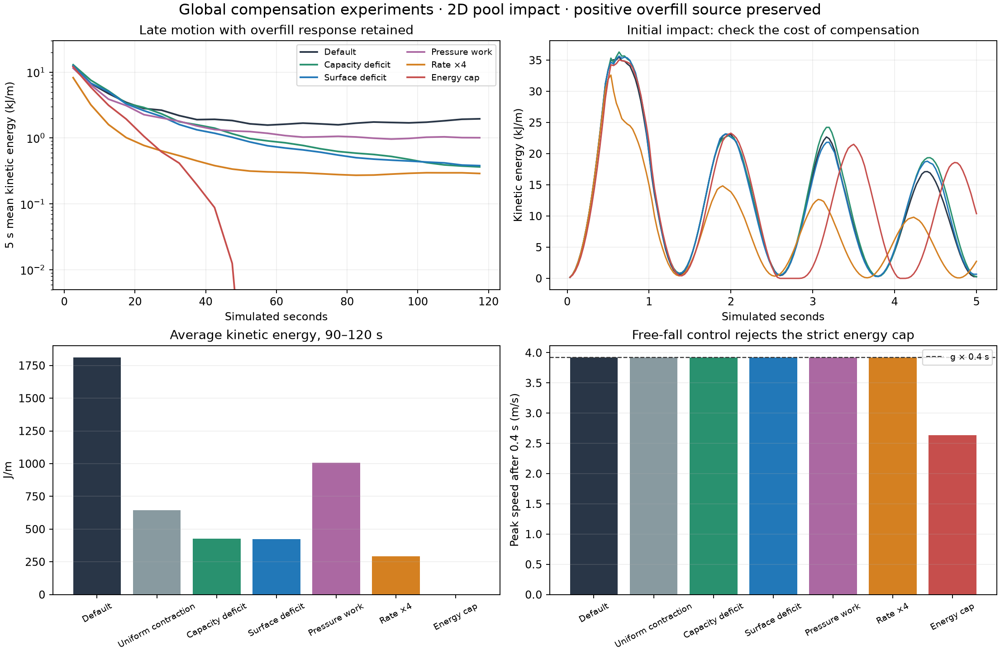

# Preserve overfill, compensate globally

Follow-up to [the late-energy investigation](../uniform-geometric-late-energy-2026-09-20/README.md). All experiments retain the original positive overfill divergence, including its strength and cap. They are opt-in native 2D diagnostics; no shared/UI default changes.

**Best tested compromise: balance the expansion against genuine volume deficits elsewhere in the represented liquid.** Mean kinetic energy over 90–120 s falls from **1,812 to 422 J/m**, while the initial impact peak changes by **+0.37%**. It uses one pressure solve and avoids an arbitrary velocity damping coefficient. It improves decay rather than guaranteeing rest or energy monotonicity.



## What “preserve overfill” means here

For every overfilled pressure-liquid cell, keep exactly:

`s_i = min(0.5 max(V_i − capacity_i, 0), capacity_i) / dt`.

Every published velocity field is produced by the original constrained pressure solve with that positive source enabled. Wall constraints and contact-release flags are computed by the final solve. Other velocities, pressures and later trajectories can change; preserving the source does not mean identical pressure or identical overfill evacuation trajectories.

Scaling velocity **after** projection would scale its divergence and weaken this response. None of the candidates does that. A completely motionless overfilled pool necessarily acquires velocity if it must expand. Compensation must allow that irreducible motion when there are no suitable deficits or other motion to absorb the energy.

## 1. Balance the pressure source globally

The default correction adds net positive divergence, while the area-only phi correction holds total visible liquid area fixed. This experiment addresses that inconsistency at the pressure RHS.

Define recipient weights only in non-overfilled pressure-liquid cells. Three choices were tested:

- **Uniform:** weight by open capacity. Cheap, but contracts cells irrespective of whether their represented liquid is missing volume.
- **Capacity deficit:** `w_i = max(capacity_i − V_i, 0)`. It also counts normally partially filled surface cells as deficits.
- **Surface deficit:** `w_i = max(contourFill_i − V_i, 0)`. It compensates where the represented surface contains more liquid than stored V, avoiding that surface-cell ambiguity.

Let `S = sum(s_i)` over pressure-liquid cells and `W = sum(w_i)`. Add a negative source in recipient cells:

`c_i = −w_i × min(S / W, 1 / dt)`.

The overfilled cells have zero recipient weight, so their original positive source is unchanged. Where sufficient recipient budget exists, the sources sum to zero. The cap prevents contraction from exceeding the recipient budget in one step. If there are no recipients, compensation is zero and the full original expansion remains. The experiment uses uniform physical cell area; a nonuniform-grid implementation would need volume-weighted reductions.

The surface-deficit variant is the most principled of these three. Stored volume changes by only 0.0030% over 120 s, so its damping is not explained by loss of liquid. Its mean KE continues downward across 30–60, 60–90 and 90–120 s: **1,131 → 585 → 422 J/m**, compared with default **1,846 → 1,661 → 1,812 J/m**.

This is not an energy-conserving projection: added contraction can itself do pressure work. It balances volume repair and reduces the observed source/area feedback. Its energy benefit is measured, not guaranteed by the equation.

## 2. Measure pressure work and compensate the remaining flow

The `source-work` experiment computes two pressure outcomes from identical predicted velocities and identical solver history: full overfill and a non-published reference with the source omitted. The positive kinetic difference is the requested global energy removal. The actual output always retains overfill.

To preserve the source, solve the zero-input/full-source problem as well. Approximate projected velocity as:

`u(alpha) = u_expansion + alpha (u_full − u_expansion)`.

Fit its kinetic-energy quadratic and choose the largest `alpha` in [0,1] meeting the target, or the energy-minimizing feasible alpha if the target is unattainable. Then **repeat the original constrained pressure solve with alpha-scaled predicted velocity and the complete overfill RHS**. This final solve handles wall active-set changes and publishes consistent release flags. If it would increase KE above the uncompensated result, keep the uncompensated result instead. The remaining budget miss is recorded; an optional debt variant carries it forward.

Results: **1,008 J/m** late KE, about **44% below default**, and roughly **3.71 pressure solves per step**. The debt variant gives **1,076 J/m**; budget misses are tiny in this scene, so debt does not improve the observed result. Small trajectory differences should not be read as proof that debt is inherently worse.

The method compensates immediate pressure work. It does not capture all delayed changes to advection and surface geometry. That, together with remaining discretization errors, limits what this one-step budget controls. It also globally damps legitimate flow whenever compensation is requested.

## 3. Cheap damping tied to the amount of volume repair

`source-rate` applies the following factor to predicted velocity, then performs one full overfill pressure solve:

`alpha = exp(−gain × dt × sum(s_i) / sum(liquid capacity_i))`.

It applies no damping when the overfill source is zero, preserves mandatory zero-input expansion, and costs one solve. It is a heuristic rather than a measured work balance. Increasing gain improves late damping but increasingly changes the impact:

| Gain | Mean KE, 90–120 s | Initial impact peak |
|---|---:|---:|
| 0.25 | 1,574 J/m | 35,182 J/m |
| 1 | 999 J/m | 33,888 J/m |
| 4 | 293 J/m | 32,616 J/m |
| Default | 1,812 J/m | 35,528 J/m |

Gain 4 damps the initial peak by about 8.2%. This is a useful inexpensive option if that tradeoff is acceptable, but it is less selective than surface-deficit balancing.

## 4. Strict global mechanical-energy cap: reject this version

The `energy-cap` comparator tries to prevent any stepwise increase in surface-weighted kinetic plus gravitational energy, using the same source-preserving projection machinery. It nearly eliminates late motion (**0.01 J/m**), but it also slows an isolated falling drop: after 0.4 s the control's peak speed is **2.638 m/s**, versus the expected/default **3.923 m/s**.

The current split step transports the surface before applying the new gravity impulse. A strict cap based on simultaneous snapshots of K and P mistakes part of this temporal offset for artificial energy. A viable energy cap would need a discrete work budget consistent with the actual stepping, along with accounting for injections, moving boundaries and other external work. The excellent pool damping alone does not validate this candidate.

## Comparison and controls

Same authored pool-impact scene and shared defaults as the prior study: 64 × 48, h=0.1 m, dt=1/30 s, 120 s, rho=998.2 kg/m³, gravity −9.80665 m/s², zero viscosity and surface tension. Energy is the same contour-weighted MAC face-square quadrature, in J/m of depth.

| Candidate | Mean KE, 90–120 s | Pressure solves/step | Main tradeoff |
|---|---:|---:|---|
| Default | 1,812 | 1 | Persistent late motion |
| Uniform negative source | 645 | 1 | Contracts even correctly filled liquid |
| Capacity-deficit negative source | 426 | 1 | Includes normal partial surface fill |
| **Surface-deficit negative source** | **422** | **1** | Nonlocal redistribution; not an energy guarantee |
| Measured pressure work | 1,008 | 3.71 average | Expensive; removes only immediate positive work |
| Work with debt | 1,076 | 3.87 average | No observed advantage here |
| Source-rate damping, gain 4 | 293 | 1 | Initial impact peak reduced by 8.2% |
| Strict energy cap | 0.01 | 2.07 average | Incorrectly slows free fall |

Controls included in the harness:

- **Uniform 5% overfill, zero gravity, initially at rest:** every mode retains the same approximately **519 J/m** one-step expansion energy. Source-preserving compensation cannot legitimately erase it.
- **Mixed overfilled/underfilled stationary pool:** the source-construction test verifies that positive-source cells and air cells receive no negative correction, and that eligible contraction balances the positive source.
- **Isolated falling drop, 0.4 s:** distinguishes selective compensation from suppression of physical acceleration.
- **Correctly filled hydrostatic pool, 30 s:** checks that compensation does not turn a quiet control into a large motion source.

Raw inputs/results and `summary.json` contain final volume, contour area, KE, divergence residual, solve count, minimum damping coefficient, free-fall speed, and hydrostatic KE. Runtime numbers are diagnostic native timings, not optimized 3D GPU cost predictions. The work-based prototype copies fields and performs extra solves; the source-balancing candidates need reductions and an RHS modification instead.

## Recommendation and remaining scope

Continue with **surface-deficit source balancing** as the leading experiment. It directly addresses the mismatch between local expansion repair and fixed global surface area, preserves the original overfilled-cell divergence, and preserves the initial impact far better than strong global damping.

Before promoting it, test disconnected liquid components: a global budget can make one pool contract to compensate a different pool's overfill. Prefer per-connected-liquid-component budgets if independent bodies should not exchange correction. Also test deliberate volume insertion, strong compression with no available deficits, and moving boundaries. The present fallback preserves expansion when no compensation recipient exists; it must remain so. A production 3D implementation would need the corresponding WGSL reduction/RHS changes and 3D validation before changing shared defaults.

A small source-rate damping term could be combined with source balancing if further damping is needed, but that combination was not tested here. Do not substitute the strict global K+P cap without fixing its discrete force-work accounting.

## Reproduction and validation

```bash
node --import tsx tools/wasm/uniform-geometric-compensation.ts --seconds=120 --controls
python3 tools/wasm/plot-uniform-geometric-compensation.py
cargo test --manifest-path rust/Cargo.toml -p fluid-core --lib uniform_geometric
```

The plotting command requires matplotlib and numpy. Use `--modes=balance-surface-deficit,source-work` to select variants, and `--out=...` for another artifact directory. Each saved input includes the exact diagnostic configuration. The new module is `rust/crates/fluid-core/src/uniform_geometric/energy_experiment.rs`.

The default 120 s run exactly matches the previous investigation in all stage energies, receipts and final fields. All 13 focused native tests pass, including mandatory-expansion preservation and source-balancing invariants. Default physics is unchanged; no Dawn/browser run was needed for this opt-in native 2D exploration.
