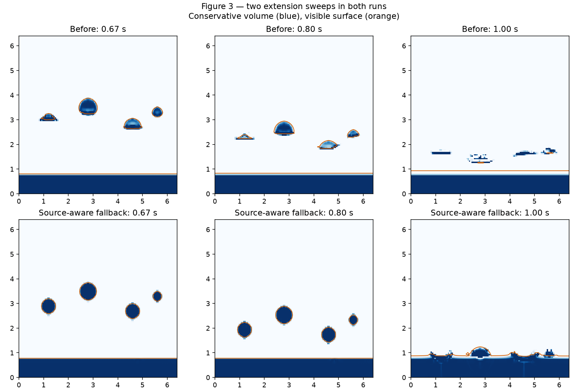

# Figure 3: falling drops disappearing above a pool

## Finding

The conserved volume does not disappear. The level-set surface collapses while
volume is left in cells with positive phi. These cells lose pressure/velocity
ownership, stop following the falling surface, and become invisible stranded
liquid. At frame 30 the prior solver has all 425 drop cell-volumes above y=1.25 m,
but only 3.84 cell-areas of visible liquid there. The global surface-area correction
can inflate the pool to compensate, hiding the local surface loss in total-area
telemetry.

The root cause is the velocity extension hierarchy. Its restriction averages
known velocities, including separate fluid bodies. Prolongation then interpolates
these coarse values through missing fine samples. It does not retain where a
borrowed velocity originated: a stationary pool influences the air immediately
below a moving drop. That artificial velocity gradient compresses the leading
surface as phi is advected.

The pool is the trigger. With the same falling balls but the pool removed, the
original two-sweep run retains 424 negative airborne vertices at frame 20 versus
350 with the pool. Disabling sharpening, redistance, or the two-level sampler did
not remove the failure. More sweeps masked it by reducing reliance on the coarse
fallback; increasing sweeps was rejected and is NOT part of this change.

An isolated uniform-velocity drop makes the defect explicit: liquid falls at
-4 m/s. With a stationary pool far below, the original extension gives -3 m/s at
the second air layer and -2 m/s one layer farther out. Without the pool it gives
-4 m/s. The regression test now requires -4 m/s in both cases, leaves the pool
stationary, and checks that original liquid-face velocities are unchanged.

## 2D change

The Rust 2D hierarchy carries each known sample's fine-grid
location through restriction and prolongation. Choose the candidate with the
nearest original location in physical distance, averaging exact-distance ties.
Do not re-label a filled air cell as a new source location. Restriction has a
child-footprint fallback when its staggered taps have no known candidate.

This is an approximate nearest-source hierarchy, not a global nearest-neighbour
search. It retains the existing front, restriction and prolongation schedules.
The FIM budget remains TWO sweeps; no new pass or connectivity search is added.
Face scratch grows by two 2D source positions. Known liquid and FIM-resolved faces
remain unchanged. Air interpolation between separate bodies can be less smooth
than the former broad average; this is the tradeoff for avoiding remote-body
velocity dilution. The 3D GPU port is described below.

## Measured result

128×128, h=0.05 m, dt=1/30 s, authored Figure 3, 2D lab defaults:

| Measurement | Prior | Fixed |
|---|---:|---:|
| Initial airborne contour area, cell units | 428.4375 | 428.4375 |
| Airborne contour area at 0.8 s | 258.7656 | 398.3438 |
| Drop volume still above y=1.25 m at 1.0 s | 425.000 | 0 |
| Whole-domain volume at frame 40 | 2391.07896 | 2391.07976 |
| Initial whole-domain volume | 2391.08000 | 2391.08000 |

All four drops survive to impact. The corrected surface retains about 93% of its
initial airborne area at 0.8 s. It is not perfect local shape preservation: the
smallest drop retains about 82%; without a pool it retains about 91%. The global
area constraint and ordinary surface-transport error still couple the remaining
shape error. Splash liquid rises above the measurement plane after impact, so
frame 40 airborne volume is not an appropriate stranded-volume metric for the fix.

Surface-deficit balancing on gives almost the same pre-impact result (398.31
cell-areas at 0.8 s), and the drops also reach the pool by frame 30.

A short native timing comparison (24 steps, no field snapshots, three alternating
trials per version) measured median 27.365 ms/step prior and 28.778 ms/step fixed:
about +1.4 ms / +5%. These are host wall times, not isolated extension timings.

## Validation and reproduction

- 16 native Uniform Geometric tests pass, including the new pool/no-pool case.
- Figure 3 regression passes with balancing off/on, no-pool control and the old
  binary as an explicit failing-behaviour control; it requires the two-sweep budget.
- Scalar and SIMD Wasm rebuilt; the existing lab scene/controller integration suite passes.
- Browser Figure 3 runs successfully and displays `2 sweeps`; confirmed paused after running.
- Typecheck has existing unrelated sparse tests/tools errors; no changed-file errors.

Run `node --import tsx tools/wasm/uniform-figure3-regression.ts`.
To regenerate before/after captures, pass `--baseline-bin=/path/to/old/uniform_geometric_scene`
using the native example built from commit e95633ce. Run
`python tools/wasm/plot-uniform-figure3.py` with matplotlib and numpy to render the comparison.



## 3D default and performance recovery

The geometric WebGPU solver now uses the same nearest-original-source fallback
by default; the paper Uniform method retains its original interpolation. The
pipeline panel identifies the geometric fallback as **Nearest source**. No extra
FIM sweeps are used: the geometric default remains two.

Each coarse sample carries three uint fine-face indices. Provenance textures
exist only on coarse levels; the first restriction infers fine source locations.
Actual velocities remain available on the 4h level for the two-level sampler.
Fine liquid and FIM samples stay authoritative. A pipeline specialization makes
fine source index decoding cheap on the grid dimensions already known at creation.

The final prolongation now writes the packed transport shell directly, eliminating
one full-resolution pass and its intermediate write/read. Both current and
predicted paths use this. The FIM scratch cannot simply be removed: it still
carries the local front, convergence and public diagnostics. Coarse levels still
need to span the entire domain for slabs with disconnected liquid bodies.

Focused Dawn regression: a -4 m/s slab drop above a stationary pool previously
extended as -2.5 m/s at the sampled air face; it is now -4, matching the no-pool
control. The test verifies unchanged liquid/pool sources and exact fused/unfused
transport equality, including known/open masks, predicted velocities and a varying
three-component velocity field.

Authored 128×128×8 Figure 3, default geometric controls, two sweeps:

| Measurement | Prior fallback | Nearest source |
|---|---:|---:|
| Initial airborne negative vertices (interior depth planes) | 2898 | 2898 |
| Airborne negative vertices at 0.8 s | 2213 | 2766 |
| Conserved volume above y=1.25 m at 1.0 s | 3359.231 | 0.381 |
| Initial whole-domain cell volume | 19128.6400 | 19128.6400 |
| Whole-domain cell volume at 2.0 s | 19128.6400 | 19128.6406 |

Negative-vertex count is a surface sampling metric, not a geometric volume
integral. Post-impact splashes can rise above the measurement plane. The two
packing schedules can develop small late-time differences through iterative
solver reductions; the frozen extension/packing comparison is bit exact.

One clean sequential Dawn run with the browser renderer unloaded is recorded in
`3d-nearest.json`. Median queue-fenced step times (frames 11–60) were 32.59 →
34.30 ms for Figure 3 and 39.45 → 38.95 ms for MiniDam64 (prior → fixed/fused).
These short whole-step figures are trajectory-dependent, not a general speedup
claim. Frozen extension batches measured Figure 3 at 1.242 → 1.189 ms for
unfused → fused, while MiniDam64 was 2.134 → 2.151 ms: no reliable MiniDam64
saving beyond noise. The definite recovery is one fewer dispatch and one fewer
full-resolution intermediate transfer. Extra provenance storage is about 0.57 MiB
for Figure 3 and 1.14 MiB for MiniDam64; no full-resolution provenance is allocated.

Reproduce with the browser WebGPU viewport unloaded:

```bash
WEBGPU_NODE_MODULE="$PWD/node_modules/webgpu/index.js" node --import tsx --test --test-concurrency=1 tests/uniform-nearest-extension-dawn.test.ts tests/uniform-volume-dawn.test.ts tests/uniform-geometric-boundary-dawn.test.ts tests/uniform-volume-tile-work-dawn.test.ts
node --import tsx tools/probe-uniform-nearest-extension-dawn.ts --out=docs/research/uniform-geometric-figure3-2026-09-20/3d-nearest.json
```

The regular TypeScript check still reports existing unrelated sparse test/tool
errors; it reports none in the files for this fix.
