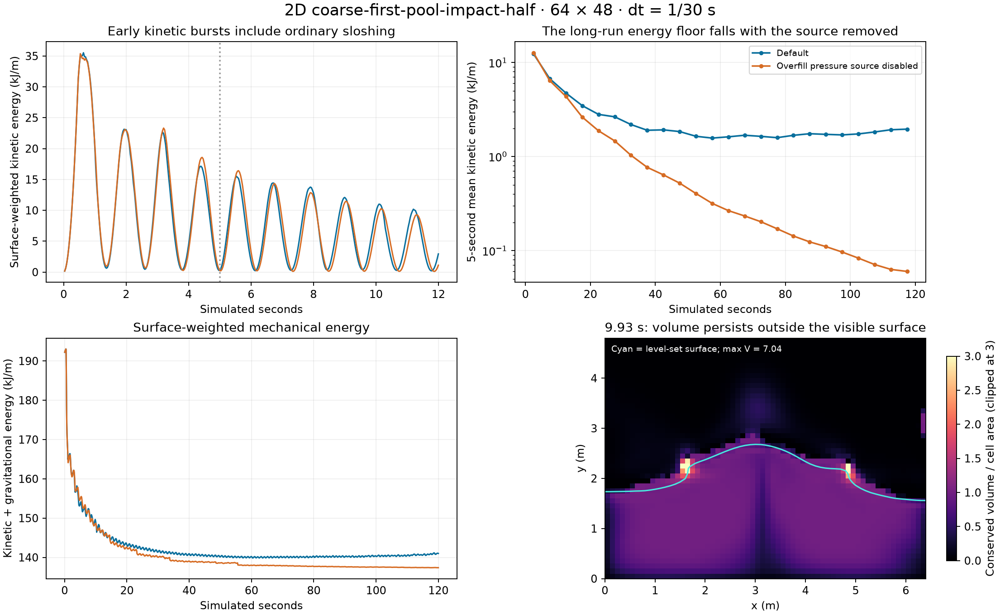

# Uniform Geometric: late energy in the 2D pool impact

The default simulation loses energy initially, but develops a sustained energy floor. The dominant identified numerical driver is the **overfill-to-pressure feedback loop**: conservative volume transport permits local overfill, the independently transported surface disagrees with that volume, and pressure converts overfill into expansion velocity. Global surface-area correction keeps the visible area fixed while this forcing continues.

Disabling only the overfill pressure source reduces mean surface-weighted kinetic energy over 90–120 seconds from **1,812 to 81 J/m** (95.5%). This is a diagnostic ablation, **not a proposed fix**: it leaves substantially more overfill unresolved.

The large kinetic increases immediately after 5 seconds are mostly ordinary conversion of gravitational potential energy into kinetic energy. They should not individually be labelled energy creation.



## Setup and definitions

Native Rust 2D `uniform_geometric_scene`, actual `uniformLabSeed` and `UNIFORM_LAB_VALUES`, `coarse-first-pool-impact-half`, 64 × 48 cells, 0.1 m spacing, dt = 1/30 s, 120 seconds. Source commit: `f769d1a01df1b84e62b5a072c5346b77ab7f6bb7`, plus the diagnostic changes in this investigation. Density 998.2 kg/m³, gravity −9.80665 m/s², viscosity and surface tension both zero. This inviscid scene has no physical viscosity demanding rapid rest; numerical dissipation and artificial pressure work matter.

All energy units are J per metre of out-of-plane depth. For each cell, `macKinetic` weights the mean square of its two bounding MAC faces in each direction by conserved V, density and cell area. `kinetic` instead squares the cell-centred average velocity. `phiKinetic` uses the same face-square quadrature but weights by the reconstructed contour fill. `potential` and `phiPotential` use these respective liquid weights and the cell-centre gravitational potential. These are discrete diagnostic quadratures, not a claim of exact continuum energy conservation.

Both weights are necessary: V and the visible/pressure surface cease to represent the same fluid distribution. A V-weighted total alone gives a misleading picture of visible-fluid energy. Stage changes caused only by moving a weight are distinguished from changes to velocity.

## Which increases occur after 5 seconds?

Selected largest single-step increases in **surface-weighted** kinetic energy:

| Time | Frame | Δ kinetic | Δ potential | Δ total |
|---|---:|---:|---:|---:|
| 5.300 s | 159 | +1,374.6 | −1,436.6 | −62.0 |
| 6.467 s | 194 | +1,371.0 | −1,390.6 | −19.7 |
| 5.333 s | 160 | +1,349.0 | −1,432.1 | −83.1 |
| 6.533 s | 196 | +1,333.8 | −1,340.0 | −6.2 |

At 5 s the flow is near a kinetic minimum, not equilibrium. The next large rise is another slosh. The later plateau is the stronger evidence of persistent forcing:

| Interval | Default mean kinetic | Overfill pressure source disabled |
|---|---:|---:|
| 5–10 s | 6,726.7 | 6,411.5 |
| 10–20 s | 4,103.2 | 3,488.9 |
| 20–30 s | 2,727.2 | 1,673.8 |
| 30–60 s | 1,845.7 | 613.5 |
| 60–90 s | 1,661.0 | 189.9 |
| 90–120 s | 1,812.1 | 80.7 |

Default surface-weighted total energy reaches about 140.14 kJ/m at 90 s and rises to 141.00 kJ/m at 120 s. With the source disabled it falls from 137.64 to 137.38 kJ/m over the same interval.

## Where the apparent stage injection comes from

At frame 298 (9.933 s), V-weighted kinetic energy increases by 1,753.7 J/m over the step. Its stage budget is:

| Stage | Δ V-weighted kinetic | Δ surface-weighted kinetic |
|---|---:|---:|
| Phi advection + redistance | 0 | −188.0 |
| Conservative V transport | −847.5 | 0 |
| Global surface-area correction | 0 | −11.4 |
| V sharpening | +33.0 | 0 |
| Velocity advection/extension sampling | +5,189.7 | +231.3 |
| Gravity | +2,011.1 | +1,823.1 |
| Pressure projection | −4,632.6 | −810.1 |

The enormous V-weighted advection jump is largely velocity being assigned to volume in cells that pressure classifies as air. Projection then clears air–air faces again. This repeated creation/removal of measured energy must not be mistaken for all of it entering the visible liquid.

Spatial evidence from the saved stage snapshots:

- Frame 209: cell (34,32), zero-based, holds V=2.139 and has both stored velocity components zero before advection. Advection assigns approximately (0.410, 6.312) m/s. Its positive-face-only V-weighted contribution increases by about 428 J/m. This local attribution is distinct from the bounding-face quadrature used in the table.
- Frame 298 after sharpening: **199.5 of 1,337 cell-volumes** lie in cells with nonnegative centre phi. Total excess over capacity is 38.0 cell-volumes: 9.43 in pressure-liquid cells and 28.58 in pressure-air cells. Maximum V is **7.04** in a unit-capacity cell.
- By frame 900, 379.6 cell-volumes (28.4%) lie in centre-phi air cells. The global contour area still matches total V. Matching total area does not establish local agreement.

## Root cause and causal checks

The relevant chain in the source is:

1. `transport.rs::Transport::advance` normalizes receiver rows and donor columns three times, ending with donor normalization. This preserves donor mass but does not enforce a final receiver-capacity bound. Compression/overfill remains possible. Phi is transported separately.
2. `surface.rs::sharpen_rounds` runs eight local redistribution rounds. With default compaction off, admission is restricted to the near-interface band; donors also need compatible neighboring receivers. It does not guarantee capacity compliance or recover all volume stranded outside the surface.
3. `grid.rs::pressure_phi` uses phi alone by default (`volumePressureRows: off`). Air–air faces are zeroed in `world.rs::project`; V can remain there and subsequently ride the extrapolated velocity field.
4. In pressure-liquid cells, `world.rs::project` sets a target expansion rate:

   `s = min(0.5 * max(V − open, 0), open) / dt`

   and builds the pressure RHS from `−rho * (divergence − s) / dt`. Thus the solve aims at positive divergence, not zero divergence, when a cell is overfilled. This correction can do positive work, even with an accurately converged solve and no gravity.
5. The default `totalSurfaceVolume: on` applies the global area-only phi correction. It restrains visible expansion without eliminating the local V/phi discrepancy. The observed sustained floor belongs to this coupled default system.

**Minimal causal example:** 32 × 24 grid, flat 12-cell-deep pool, zero initial velocity, zero gravity, V=1.05 in each wet cell, global area correction off. After one step, everything before projection still has zero kinetic energy. Projection produces **519.13 J/m surface-weighted KE** (545.08 J/m V-weighted KE), with pressure residual 0.00260. Disable only the overfill source and KE remains exactly zero. No falling water, area correction, initial velocity, or failed pressure solve is needed.

**Same-state replays:** restarting both alternatives from identical saved start-of-step fields gives identical pre-projection stages. Enabling the source adds 11.80 J/m of surface-weighted projected KE at frame 194, 42.80 at frame 298, and 90.64 at frame 308. These are direct one-step differences, unlike differences between long trajectories. Pressure history is reset equally in both replays; their absolute results need not exactly equal the uninterrupted trajectory.

**Other controls:**

- Tight pressure tolerance (0.001, fixed cycle budget) still produces the 10 s burst: surface KE 9,625 J/m versus default 9,626. The default maximum reported residual over 120 s is only 0.442; this is not the previously observed multigrid blow-up.
- All-fine velocity sampling still produces surface KE 9,697 J/m at 10 s. The coarse sampler is not necessary for this burst.
- Liquid-only velocity advection and disabling sharpening do not remove the 30 s recurrent motion. These are short controls, not 120 s proofs of identical asymptotic behavior.
- Turning off global area correction also permits eventual kinetic decay (90–120 s mean 351 J/m), but the visible area grows from about 1,337 to **1,898.5 cell areas** by 120 s, about **42%**. This is not a successful stabilizing fix. It reveals the role of global area restraint in the feedback loop.
- A correctly filled stationary flat pool stays near 0.003 J/m KE over 30 s, although its V-weighted potential drifts upward. That smaller transport/pressure-residual defect is distinct from the large impact-scene energy floor.

The same overfill RHS expression exists in 3D `webgpu-uniform-reference.wgsl.ts::volumeCorrectionDivergence`. That establishes a shared mechanism in code, not a measured 3D energy result; all quantitative results here are native 2D.

## Implications and reproduction

A useful fix must address the coupled local capacity and V/phi disagreement, and measure the work introduced by volume correction. Simply deleting the source improves damping while leaving overfill; simply deleting area correction permits visible expansion. Neither ablation is promoted to a production setting. A next implementation experiment should prevent or conservatively redistribute receiver overfill, then repeat this energy budget with the pressure correction retained and record its work separately. A local surface/volume agreement approach would also need the same energy checks.

Run from the repository root:

```bash
node --import tsx tools/wasm/uniform-geometric-energy-audit.ts --seconds=120 --controls
python3 tools/wasm/plot-uniform-geometric-energy.py
cargo test --manifest-path rust/Cargo.toml -p fluid-core --lib uniform_geometric
```

The plotting command requires matplotlib and numpy. Gzipped inputs, complete energy stages, pressure receipts, selected field snapshots and one-step replays are alongside this report. `manifest.json.gz` records resolved defaults. The runner also supports `--scene`, `--seconds`, and `--out`.

Code changes are diagnostic observers, field captures, and an opt-in runner-only pressure-source ablation. Default physics remains unchanged. The existing observer invariant test includes the two new stage names and checks that observations do not change fields or receipts. Both final 120 s runs exactly matched their exploratory counterparts for all energy records, receipts, pressure and final fields. No browser or Dawn run was needed for this native 2D investigation.
