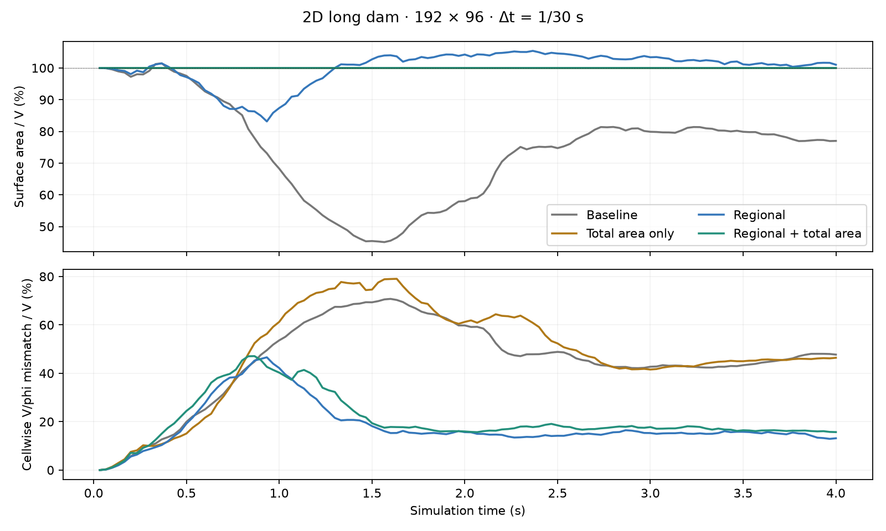
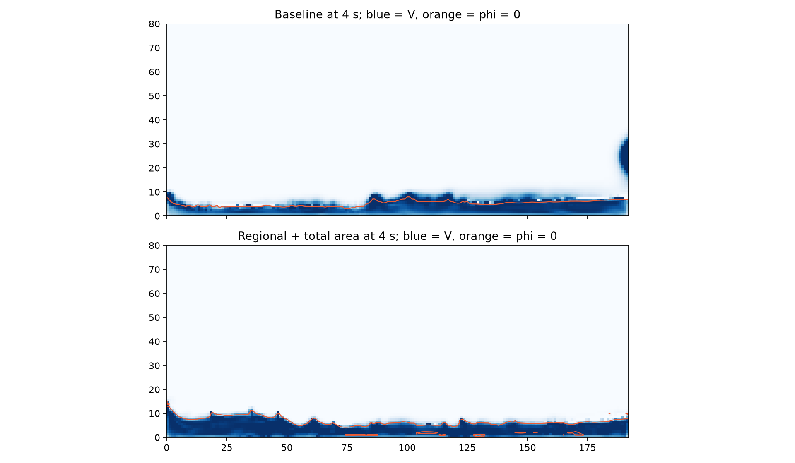

# 2D surface / conservative-volume experiment

> **Retired 2026-09-23.** The 2D Uniform Geometric method now runs the 3D default algorithm (see `docs/research/uniform-geometric-2d-2026-09-20/implementation-status.md`). The Rust-only experiment recorded here was removed together with its driver script; the committed data and plots remain as the record.

Status: the user preferred the total-area-only control over regional correction. Total area is now the default in 2D, and its total-volume counterpart is the default in 3D. The regional variants remain opt-in experiments. The following records the original experiment and review candidate.

Open `/advance-lab?method=uniform-volume&scene=sparse-cm12-ladder-long-dam&surfaceExperiment=regional-area` on the local development server. The **2D surface experiment** selector offers Baseline, Smooth regional correction, Regional + total area, and Total area only (control). Switching resets and pauses. Use 1/30 s and watch the first two seconds; the baseline has its deepest collapse around 1.5 s. The sidebar reports contour area / V and cellwise absolute V/contour disagreement / V.

## What worked sufficiently to review

The candidate retains advected phi and applies smooth normal displacements after conservative V transport and before sharpening/projection. It does not reconstruct a new level set from cell volume fractions. However, it **does use accumulated V as feedback**, and is therefore an approximate consistency repair rather than a solved volume-consistent velocity extension.

1. Measure bilinear-contour occupancy and V minus occupancy per cell.
2. Estimate the area response to a small normal displacement. Use the local phi gradient magnitude, because phi need not remain a distance function.
3. Smooth residual and area response with overlapping binomial filters, two per axis: support extends four cells in each direction. Filter taps stop at solids.
4. Apply their ratio as a normal displacement, gain 0.3, capped at 0.5h per pass, two passes. The correction band starts from cells actually crossed by the zero contour and dilates four vertex edges, tapering outward. Selecting this band by `abs(phi)` failed in fast flow.
5. Optionally find one bounded normal displacement (at most h) that matches total contour area to current V. This is a scalar bisection, not another pressure solve. Stored V is untouched by either correction.

The total-area constraint is global: it can distribute an error across disconnected liquid components. Correction is skipped on frames that inject new liquid. This is not yet a component-aware or moving-solid-validated solution. The local filter is implemented on the fine grid; **this is not a 4h coarse-grid solver**. The four-cell support makes the displacement smoother than cellwise phi seeding.

## Native long-dam results

Actual UI seed, 192 × 96, h = 0.0125 m, initial V = 1280 cell areas (0.2 m²), 1/30 s for four seconds. Contour area is independently integrated from bilinear phi using 64 slices for final metrics. Local mismatch is sum of absolute cellwise V minus contour occupancy. These are deterministic native runs; the browser follows a somewhat different trajectory, so its values should be read directly.

| Variant | Minimum surface area / initial V | Surface area at 4 s | Local mismatch at 4 s |
| --- | ---: | ---: | ---: |
| Baseline | 45.08% | 77.00% | 610.73 cells (47.71% of V) |
| Total area only | ≈100% | ≈100% | 593.93 cells (46.40%) |
| Regional only | 83.14% | 101.02% | 168.22 cells (13.14%) |
| Regional + total area | ≈100% | ≈100% | 200.88 cells (15.69%) |

The combined variant reduces final local mismatch by 67%. Total-area agreement alone is not evidence of local consistency: the area-only control barely improves final local mismatch and worsens it during impact. The regional-only variant ends with the best local match, but temporarily loses nearly 17% of surface area. The combined candidate also preserves area at 1/120 s, with final local mismatch 138.54 cells.





Small ripples, spikes, and thin floor pockets remain. Visual acceptability is the next decision, not an assumed success. A second, much coarser 24 × 16 water-box scene preserves total area with the combined variant but has slightly worse final local mismatch: 60.35 versus baseline 55.99 cells. This is not a universal improvement claim.

Without stage audits, one sequential native comparison measured 23.51 ms/step baseline versus 28.97 ms/step combined (+23%). Both include the new cheap contour diagnostics. These are indicative prototype timings, not a stable performance gate, and the current whole-grid scratch/filter/bisection implementation is unoptimized.

## What did not work

The first family modified extended velocities only in air, keeping liquid-touching and wall faces fixed. It included expanded support alone, local divergence sweeps, a 4h aggregate correction, and their combination. Reducing discrete air divergence was not enough to reliably retain surface area. The coarse-only correction often increased fine-grid divergence and was rejected. More cycles, characteristic substeps, and an H(div) reconstruction with constant per-cell divergence also did not resolve collapse. These outcomes do not establish that a better coarse motion estimate cannot work.

Another variant transported previous-phi occupancy with existing conservative donor weights and corrected only that step's discrepancy. It also failed to prevent accumulated drift. Conservative transport can store surplus density away from the interface, which a local surface adjustment cannot necessarily represent or recover.

Historical `*-summary.json` and compressed runs record these trials. Early projection trials used an abs(phi) air mask; `*-tiles` trials switched to the actual extension tile footprint. Early surface trials also used an abs(phi) band and/or the quantized target estimate. The final algorithm is represented by `regional-geometric-*`, `area-only`, `transport-geometric`, and `regional-area-timing`; old intermediate outputs are historical evidence, not claimed exact reproductions with the final implementation.

## Reproduce and verify

```bash
node --import tsx tools/wasm/uniform-geometric-swept-experiment.ts --mode=off
node --import tsx tools/wasm/uniform-geometric-swept-experiment.ts --mode=regional-volume --gain=0.3 --id=regional-geometric-no-guard
node --import tsx tools/wasm/uniform-geometric-swept-experiment.ts --mode=regional-volume --gain=0.3 --guard --id=regional-geometric-band
node --import tsx tools/wasm/uniform-geometric-swept-experiment.ts --mode=regional-volume --guard --iterations=0 --id=area-only
# Add --timing to omit expensive per-stage audits.
cargo test --manifest-path rust/Cargo.toml -p fluid-core --lib uniform_geometric
node tools/wasm/build.mjs --single
npm run test:uniform-lab:scenes
python tools/wasm/plot-uniform-geometric-swept.py
```

Validation completed:

- Eleven targeted Rust tests passed, including fixed liquid/wall faces for velocity trials, stationary matching contours, correction of stretched phi, unchanged stored V, and no remote cell seeding.
- Scalar and SIMD WASM builds and artifact validation passed. Worker/controller acceptance passed, including all three UI experiment profiles, reset to baseline, source-frame skipping, scalar/SIMD field parity, and query round-trip.
- At native frame 120, all baseline published fields remain exactly equal to the pre-experiment baseline. Adding final diagnostics did not alter candidate fields either.
- Browser: long dam at 1/30 s, candidate paused at frame 120 / 4 s; area / V 100.00%, local mismatch 14.81%. Switching back to Baseline resets, pauses, and removes the experiment query parameter.
- Full TypeScript checking remains blocked by pre-existing errors in unrelated sparse tests/tools; no changed-file errors. `git diff --check` passes.

The Sparse CM12 Dawn gate was not run: no sparse simulation, topology, terrain, publication, or live-edit implementation was changed. This experiment is confined to the 2D uniform backend and its lab UI. No 3D port or default promotion is part of this change.
