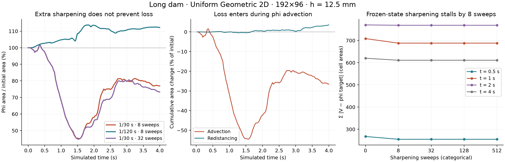
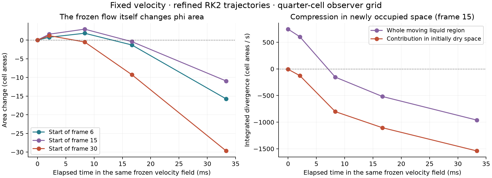

# Long-dam V/phi discrepancy: 2D causal audit

The main failure in this reproduction is **finite-step interface motion through a compressive extended velocity field**, coupled to a separately conservative V transport. Increasing sharpening iterations does not repair it. The evidence identifies a mechanism, rather than selecting a numerical fix.

The surface enters space that was air at the start of the step. The extended/interpolated velocity there does not preserve the area enclosed by phi. V retains its total through donor normalization; phi follows the raw characteristic map. Their shared starting velocity therefore does not imply a shared conservative transport. Sharpening subsequently reaches the limit of its admissible transfers, with substantial disagreement remaining.

## Reproduction and measurement

- Scene: `createSparseCM12ComplexityScene("long-dam")`, the factory behind `sparse-cm12-ladder-long-dam`. Its document ID is `sparse-cm12-long-dam-break`.
- Native Rust Uniform Geometric 2D, initialized through the actual `uniformLabSeed` and `UNIFORM_LAB_VALUES` paths. Central XY slice, 192×96, 12.5 mm cells, closed tank, four simulated seconds.
- Initial V and phi area: 1280 cell areas = 0.2 m². Area numbers below are cell areas, not 3D volumes.
- Defaults retained, including two extension front sweeps, geometric redistance, eight sharpening sweeps, and all phi-from-V/compaction/volume-pressure-row toggles **off**. The lab's explicit whole-domain override remains in effect.
- Base revision: `87e4b2ab4e941c306f89717e58d2db0e479b59c4`; Rust 1.96.1. Additions are diagnostic hooks and probes; no production numerical default or correction has changed.

Measurements occur at start, after phi advection/contact treatment, after redistance, after V transport, after sharpening, and after projection. The existing `Grid::target` uses quarter-cell occupancy sampling for non-affine phi. To avoid mistaking its quantization for surface motion, the audit independently integrates the negative region of the bilinear vertex field. Horizontal slices are integrated exactly; vertical quadrature is split at edge roots. Analytic plane and hyperbola tests check this observer. Final 32-versus-128-slice differences are below 0.001 cell area in these runs.

## Full trajectories

| Arm | Phi area at 1 s / initial | Phi area at 4 s / initial |
|---|---:|---:|
| 1/30 s, eight sharpening sweeps | 68.24% | 77.00% |
| 1/120 s, eight sweeps | 104.75% | 112.19% |
| 1/30 s, 32 sweeps | 68.21% | 73.27% |
| 1/30 s, redistance off | 69.64% | 80.81% |
| 1/30 s, 16 extension front sweeps | 66.76% | 73.44% |
| 1/30 s, pressure tolerance 0.01, fixed budget 3 full + 8 V cycles | 63.34% | 85.29% |

The 32-sweep trajectory initially follows the eight-sweep trajectory almost exactly. Later differences are not evidence that additional sharpening generally worsens the method; the useful finding is that it does not prevent the original loss. All runs are deterministic individual trajectories, not statistical estimates over chaotic-flow ensembles.

The smaller timestep avoids the large shrinkage, but does **not** achieve agreement: its surface is inflated by 12.19% at four seconds. It has 360.41 cell areas of deficit deeper than 2.1h inside phi, versus 152.02 for the baseline. A signed global area difference alone hides such disagreement.

V remains conserved apart from reported dust: even including dust loss, the largest relative change is below 0.002%. After accounting for dust, the absolute conservation residual is below 0.00005 cell area in all six arms. These are not mass-loss failures.



## Sharpening is saturated, not short of iterations

At selected post-transport states, clone the grid, freeze phi and velocity, and apply 0, 8, 32, 128, and 512 sweeps. The actual simulation continues from the untouched original state.

Baseline local disagreement, measured as `Σ |V − Grid::target(phi)|`:

| Time | Before sharpening | 8 sweeps | 32 sweeps | 512 sweeps |
|---|---:|---:|---:|---:|
| 0.5 s | 267.651 | 254.955 | 254.955 | 254.955 |
| 1 s | 708.572 | 688.137 | 688.137 | 688.137 |
| 2 s | 770.253 | 768.526 | 768.526 | 768.526 |
| 4 s | 620.105 | 611.031 | 611.031 | 611.031 |

This is convergence under the existing transfer rules, not convergence to V/phi agreement. At four seconds, 353.89 cell areas of V lie farther than 2.1h into phi-air and 447.20 lie in cells without a phi-liquid centre. More sweeps cannot enlarge the admission band, create unavailable destinations, or move phi.

## Where the surface area changes

For the 1/30 s baseline over four seconds:

- Phi advection/contact stage: **−339.82** cell areas, or −26.55% of initial area.
- Redistancing: **+45.41** cell areas, or +3.55%.
- Net: **−294.41**, or −23.00%.

Redistancing is not the dominant sink in this run. Disabling it still leaves substantial shrinkage. Tightening pressure reduces the maximum reported pressure residual from 2.7291 to 0.00980, but does not remove the early surface collapse. These controls do not establish that redistance or pressure have no effect; they reject either as a sufficient explanation/fix for this loss.

## Frozen advection isolates the mechanism

At the start of frames 6, 15, and 30, freeze the original grid and its extended velocity. Then vary **only** the backtrace integration and the observer's spatial resolution. No pressure, V transport, sharpening, or evolving velocity can confound these replays.

1. Compose 1, 4, 16, or 64 RK2 backtrace segments, with **one** phi interpolation at the final departure point. This avoids introducing repeated scalar interpolation when testing trajectory accuracy.
2. Reconstruct that pullback on 1×, 2×, 4×, and 8× observer lattices. The simulation and velocity lattice remain unchanged.
3. Compare the raw pullback with the actual production phi-advection pass, including its contact treatment.
4. Independently vary extension front sweeps and fine/coarse sampling on the same starting state.

| Starting frame | Production one-step area change | 16-segment, 8× observer raw change |
|---|---:|---:|
| 6 | −16.636 | −15.732 |
| 15 | −10.138 | −11.177 |
| 30 | −28.917 | −29.225 |

Accurate integration does remove inverted triangles in sampled departure maps (frame 15: 13 at one segment, zero at four), but does not recover area. The large loss also survives finer spatial observation. Therefore it cannot be attributed principally to the coarse phi representation or RK2 integration error in these sampled steps.

Forcing fine velocity sampling gives the same frozen-replay results as the default sampler. Sixteen front sweeps change the losses modestly, but preserve the failure. The full 16-front-sweep trajectory above independently confirms that simply extending farther is insufficient.

The decisive check is to shorten the **duration** of motion in this same frozen field. At frame 15, a quarter of the large step (1/120 s) changes area by **+2.932** cells; the whole 1/30 s changes it by **−10.955**, measured on the quarter-cell observer grid. This is not four coupled small simulation steps: velocity remains frozen, and there is no V update or correction.

The integrated divergence over the moving liquid region starts at approximately **+746 cell areas/s**, changes to **−154** after a quarter-step, and reaches **−961** after a full step. At the end, the contribution in space classified as air at the start is approximately **−1540**, partly offset by positive divergence elsewhere. Frames 6 and 30 show the same transition. This spatial attribution uses subcell midpoint classification and finite-difference derivatives of the actual velocity sampler; it is an approximate diagnostic, not an exact flux identity. The area calculations are independent of that divergence estimate.



This explains the timestep sensitivity mechanistically: the large step allows the interface to move substantially into the compressive extrapolated flow before pressure/extension are updated again. The baseline's maximum component Courant reaches 15.35. Shorter coupled steps refresh the evolving liquid support more frequently, as well as changing other time-integration errors. The evidence does not establish that one specific extension formula alone explains every later discrepancy.

## Consequence for the next experiment

Investigate whether the interface's swept region can be given volume-consistent motion: for example, divergence control of the extended/sampled field over that region, or a common conservative transport description for V and phi. A fix must reduce local mismatch and preserve a smooth surface, rather than only improve total enclosed area. A simple increase in sharpening iterations, extension iterations, pressure accuracy, or backtrace substeps has already failed the relevant controls here.

No cellwise phi reseeding was enabled. No proposed repair has been promoted to production. These are native 2D results; they diagnose the intended testbed and must be checked against the 3D GPU implementation before claiming the same quantitative behavior there.

## Reproduction and validation

From the repository root:

```bash
node --import tsx tools/wasm/uniform-geometric-volume-phi-audit.ts
node --import tsx tools/wasm/uniform-geometric-volume-phi-audit.ts --arm=dt30-eight --traces
node --import tsx tools/wasm/uniform-geometric-volume-phi-audit.ts --arm=dt30-no-redistance
node --import tsx tools/wasm/uniform-geometric-volume-phi-audit.ts --arm=dt30-front16
node --import tsx tools/wasm/uniform-geometric-volume-phi-audit.ts --arm=dt30-tight-pressure
python tools/wasm/plot-uniform-geometric-volume-phi.py
cargo test --manifest-path rust/Cargo.toml -p fluid-core --lib uniform_geometric
```

Plotting requires matplotlib/numpy. The probe builds and runs the release native scene runner; no browser or Dawn process is used. Each arm saves its full resolved input, stage ledger, receipts, frozen replays, final fields, and summary. `--seconds` and `--out` permit bounded repeats. Timings include instrumentation/replays and are not solver benchmarks.

Validation: six focused Rust tests pass, including analytic observer checks and bit-identical ordinary versus observed advances with frozen sharpening replays. A pre-edit three-frame long-dam capture also matched every field and receipt after instrumentation. `git diff --check` passes. The full TypeScript check reports errors in unrelated existing sparse tests/tools, with no errors in the new audit tool. No Sparse CM12, terrain, live-edit, or publication behavior was changed, so the large-change Dawn regression gate was not invoked.
