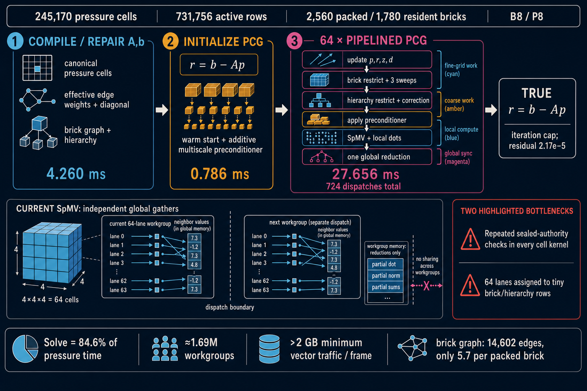

# Sparse CM12 B8/P8 pressure execution image

## Status and decision

This document is the self-contained design and experiment register for improving
the Sparse CM12 pressure solve at B8/P8. It covers the current algorithm, the
ocean-seiche work shape, the failed spatial-tile experiment, the proposed compiled
representation, the exceptional-face cost model, and the sequence of production
cutovers.

The design decision is:

> Compile pressure topology into dense execution pages. Keep masks and general
> topology in the publication path, keep canonical cell order for numerical
> reductions, execute the coarse graph one live entity per lane, derive regular
> face topology arithmetically, and retain explicit records only for exceptional
> faces and ports.

This is one pressure backend and one production arm. An experiment either replaces
the preceding implementation or is removed after its receipt is recorded.

The numerical gate is raw-bit symmetric expansion. The performance lanes are
ocean-seiche and mini-dam 64.



## 1. Current pressure solve

Sparse CM12 solves one globally coupled composite pressure system. The accepted
liquid cells are the pressure unknowns. Accepted regular faces, wall/free-surface
faces, and conservative 2:1 ports provide the directed operator terms. The finest
operator remains the physical composite operator

```text
A = Gᵀ W/θ G
```

and MGPCG uses the brick and hierarchy graphs as a preconditioner. The hierarchy
does not replace or partition the physical solve.

One pressure epoch currently performs:

1. pressure membership and topology repair;
2. effective fine and coarse coefficient refresh;
3. RHS construction and initial residual;
4. brick/hierarchy preconditioning;
5. up to 64 pipelined PCG iterations;
6. periodic true-residual and recovery work;
7. final true residual;
8. compatible face projection and divergence diagnostics.

An ordinary iteration contains these recurring classes:

```text
canonical pressure cells
    update p, r and z

brick aggregate graph
    restrict fine residual
    three brick correction sweeps

pressure hierarchy graph
    restrict residual
    refine correction

canonical pressure cells
    combine coarse correction
    apply preconditioner
    apply A to z
    form the canonical dot-product partial

one global partial reduction
```

The operator and dot-product partial are deliberately fused. Every direction value
must be globally visible before a neighbour reads it, but splitting the operator
from its reduction adds a complete extra pressure-cell pass.

### 1.1 Ocean-seiche B8/P8 receipt

The representative terminal work shape is:

| Quantity | Ocean B8/P8 |
|---|---:|
| Pressure cells | 245,170 |
| Active pressure rows | 731,756 |
| Packed bricks | 2,560 |
| Resident bricks | 1,780 |
| Brick aggregate edges | 14,602 |
| Hierarchy groups | 716 |
| Hierarchy edges | 2,932 |
| Executed iterations | 64 |
| Pressure topology | 4.2598 ms median |
| Pressure RHS | 0.7864 ms median |
| Pressure solve | 27.6562 ms median in the anatomy capture |

The solve accounts for about 84.6% of the complete pressure stage in that capture.

There are 3,831 canonical 64-cell workgroups. An ordinary iteration launches about
25,726 workgroups. The coarse schedule alone is:

```text
5 × 2,560 packed-brick workgroups
+ 2 × 716 hierarchy-group workgroups
= 14,232 coarse workgroups per ordinary iteration
```

That is 55.3% of the ordinary-iteration workgroup count. It is badly mismatched to
the graph: the brick graph averages 5.70 directed neighbours per packed brick and
the hierarchy averages 4.09 edges per group. A lane-sized graph operation is being
assigned an entire 64-lane workgroup, repeatedly.

## 2. Evidence already established

### 2.1 Accepted: implicit interior, compiled seam SpMV

The current accepted operator specialization derives the six neighbours of a
certified strict brick-interior cell as

```text
cell ± 1
cell ± brickWidth
cell ± brickWidth²
```

and retains the compiled directed-edge path for other cells. It passed exact B8 and
B16 raw-bit receipts.

| Lane | Before median / p95 | After median / p95 | Change |
|---|---:|---:|---:|
| Ocean | 26.4765 / 26.7387 ms | 25.3624 / 25.5590 ms | −4.21% / −4.41% |
| Mini64 | 13.5660 / 14.5490 ms | 12.9106 / 13.9592 ms | −4.83% / −4.05% |

This proves that coded topology helps the recurring SpMV. It does not prove that
workgroup-memory staging helps.

### 2.2 Rejected: global pressure-address reorder

A literal 4³ ordering regressed ocean by about 10.4% and mini64 by about 7.3%.
A subgroup-major ordering recovered most of the performance loss but crossed the
mini64 residual gate. Both arms were removed.

Canonical pressure order therefore remains part of the numerical ABI until a
replacement reduction is independently proved.

### 2.3 Rejected: split 4³ tile SpMV and canonical reduction

The split arm staged 64 centre values in a spatial 4³ workgroup, wrote `Az`, and
then launched the unchanged canonical workgroups to form reduction partials. It was
raw-bit exact, including combined SHA-256
`c2ca2b39c0a9f2df2a29d858e9b25cad2acbd07dbe037ac8ab2b57ae9a393644`.

| Lane | Fused canonical | Split tile + canonical | Change |
|---|---:|---:|---:|
| Ocean | 27.5251 / 28.2133 ms | 30.4087 / 31.3262 ms | +10.48% / +11.03% |
| Mini64 | 13.1400 / 15.2371 ms | 13.9592 / 15.0733 ms | +6.24% / −1.08% |

Mini64 made the mechanism explicit: 52,925 cells require 827 canonical workgroups
but occupy 1,033 nonempty 4³ tiles. The operator phase therefore launched 1,860
workgroups instead of 827. Although a full tile reduced neighbour-vector loads from
at most 384 to 160, the second cell pass, repeated authority resolution, barrier,
mask handling, and partial tiles cost more than the saved gathers. Hardware caching
was already recovering much of the apparent neighbour reuse.

The arm was removed. Fine-grid SpMV will remain fused with its canonical reduction.

## 3. Target representation

The target is a compiled pressure execution image built from the accepted topology
and reused by assembly, solve, and projection. It has a publication view and dense
execution views.

### 3.1 Publication view: one B8 topology packet per resident brick

A B8 brick has eight 4³ octants. Its topology packet contains:

```text
brick identity, rung and canonical cell base
8 × u64 pressure membership masks
regular-face classification
exceptional-face/port record range
generation and accepted-slot identity
```

The 512 membership bits are compact: 64 bytes per B8 brick, or about 160 KiB for
2,560 ocean packed bricks before headers. They are used to publish and repair the
pressure epoch, determine whether a brick is wet, and generate the execution pages.

They are not read by every lane in every PCG iteration.

### 3.2 Canonical cell pages

The cell execution view contains 64 direct live-cell addresses per page in the
accepted canonical PCM rank order:

```text
page 0: canonical live cells 0..63
page 1: canonical live cells 64..127
...
tail page: the only partially populated page
```

The publication transaction validates membership, activity, generation, and slot
once. A hot solver invocation performs a bounds check and direct address load; it
does not repeat PCM membership checks and `cellActive` checks.

Keeping canonical order preserves the current 64-lane reduction tree and avoids the
extra reduction pass that defeated the spatial-tile experiment.

### 3.3 Wet-brick pages

The brick execution view concatenates wet bricks, 64 brick IDs per page. A scalar
coarse-graph kernel assigns one brick to one lane. The lane loops over the brick's
small regular or exceptional adjacency and writes one result.

Ocean has 1,780 resident bricks, so its still-unmeasured wet-brick count is at most
1,780 and requires at most 28 dense brick pages. A scalar sweep can therefore use no
more than 28 workgroups rather than 2,560 one-brick workgroups. The exact wet count
must come from the compiler census; residency is not a synonym for pressure wetness.

### 3.4 Live hierarchy pages

The hierarchy execution view concatenates live `(level, group)` tokens, 64 per page.
Regular parent/child and neighbour relations are arithmetic where the hierarchy is
complete. Explicit records cover clipped groups and irregular adaptive adjacency.

Even without culling, 716 ocean groups require 12 lane-major workgroups instead of
716 one-group workgroups per scalar sweep.

### 3.5 Structure and coefficients are separate

Immutable topology contains identities, arithmetic classes, and exceptional record
ranges. Pressure-epoch state contains diagonals and effective weights. Topology is
rebuilt only when the accepted topology generation changes; coefficients may refresh
every pressure epoch without rebuilding structure.

No dense logical-domain grid is introduced.

## 4. Face-granular implicit topology

"Only walls, clipped faces, and 2:1 interfaces remain data-described" must mean
per face or port, not per cell and not per tile.

The current specialization is stricter: a cell must lie entirely inside its brick.
For a full B8 brick, only

```text
6³ / 8³ = 216 / 512 = 42.2%
```

of cells are strict interior. The 296-cell brick boundary shell is 57.8% of the
brick even when every neighbouring brick has the same rung and the domain is
perfectly regular. At rung 4 only 8 of 64 cells are strict interior; at rung 2 no
cell is. Treating that shell as exceptional would make the general path dominate
for reasons created by the storage partition rather than by the physical topology.

The compiled operator must classify each of the six directed faces independently:

| Face class | Representation |
|---|---|
| Same brick, same rung | `±1`, `±r`, or `±r²` |
| Adjacent brick, same rung | logical-neighbour descriptor plus local face arithmetic |
| Physical wall or clipped extent | coded publication/diagonal action; no recurring off-diagonal record |
| Free-surface/Dirichlet face | coded diagonal action; no recurring off-diagonal record |
| 2:1 interface | compact ordered port record containing the exceptional neighbours and weights |

A cell touching one 2:1 port still executes its five regular faces arithmetically.
It does not fall back to a six-edge CSR walk. This prevents a small interface set
from infecting every operation on the adjacent cells.

Regular same-rung cross-brick addressing requires a logical brick descriptor that
maps a brick and face direction to the accepted neighbour brick, rung and cell base.
That descriptor is shared immutable topology and can serve transport, pressure
assembly, solve, and projection.

## 5. Can exceptional faces dominate?

Yes, in two distinct ways, and the design must measure both.

### 5.1 Artificial dominance from an overly broad fallback

If "exceptional" means "not strict brick interior," it is already the majority of
a full B8 brick and becomes worse at coarser rungs. This is a representation bug,
not an unavoidable adaptive-grid cost. Same-rung brick faces must be arithmetic and
mixed cells must specialize per face.

### 5.2 Genuine dominance from physical/adaptive complexity

Even with correct face classification, explicit work can dominate a thin film, a
domain filled with obstacles, or a topology with a large checkerboard-like 2:1
frontier. Exception count scales with interface area while regular work scales with
liquid volume, but ocean-seiche is shallow enough that surface-to-volume arguments
cannot be assumed without a receipt.

Let `f` be the fraction of directed faces that use explicit records and `k` the cost
of an explicit face relative to a regular arithmetic face. Its approximate operator
cost share is

```text
exceptionShare = f k / ((1 − f) + f k)
```

The explicit path exceeds half the operator cost at:

| Relative explicit-face cost `k` | Explicit-face fraction `f` at 50% cost |
|---:|---:|
| 2× | 33.3% |
| 3× | 25.0% |
| 4× | 20.0% |

Therefore "exceptions are a minority" is insufficient. They must be a sufficiently
small minority after weighting by their loads, branches, and average port degree.

### 5.3 Why domination is not automatically a failure

If real 2:1 ports dominate, removing regular topology loads still reduces the work
on every nonexceptional face. More importantly, explicit records can themselves be
compact and direct: no owner lookup, membership query, general incidence walk, or
generation check belongs in the hot path. The exceptional record should contain
exactly the ordered neighbours and coefficient slots needed by the operator.

Walls and free surfaces are exceptional during publication and diagonal assembly,
but they do not add off-diagonal terms to recurring SpMV. The hot explicit stream is
therefore narrower than the publication classification: it contains genuine
multi-cell couplings, principally 2:1 ports.

If measured explicit cost remains dominant after that compaction, the next target is
not a return to full CSR. It is one of:

- reduce explicit bytes per port;
- group records by degree so lanes in a page follow the same loop shape;
- specialize common 2:1 port patterns as coded descriptor classes;
- improve the hierarchy/preconditioner so fewer SpMVs are required.

## 6. Required cost receipt

The execution-image compiler must publish these counts for ocean and mini64:

```text
pressure cell count by accepted rung
wet brick count and 8 × u64 occupancy histogram
regular same-brick directed faces
regular same-rung cross-brick directed faces
wall/clipped directed faces
free-surface/Dirichlet directed faces
2:1 directed ports and total port terms
cells with 0..6 exceptional faces
exceptional terms per port: average, p95 and maximum
canonical cell page utilization
wet-brick and live-hierarchy page utilization
```

Report both count share and estimated byte/operation share. The compiler census is
preferred over hot atomic counters because it is exact for the accepted generation
and adds no iterative cost.

Profiler acceptance additionally requires:

- time per operator application;
- time per complete ordinary iteration;
- achieved occupancy and cache hit evidence where available;
- bytes read from canonical cells, coefficient planes, and exception records;
- workgroups dispatched per kernel class;
- identical executed iteration count and true-residual receipt.

## 7. How the design targets barriers, masks and partial lanes

### Barriers

- Fine SpMV retains no workgroup staging and no new barrier.
- Brick and hierarchy scalar graph kernels use one entity per lane and a short local
  adjacency loop; they require no workgroup reduction.
- Genuine fan-in kernels, initially brick and hierarchy residual restriction, retain
  their proven reduction tree until an exact replacement passes the numerical gate.

### Masks

- Eight `u64` masks are authoritative publication data.
- The pressure compiler expands them once into canonical cells and wet-brick pages.
- Iterative kernels consume dense pages and do not test a mask per entity.

### Partial lanes

- Canonical cells, wet bricks, and live groups are concatenated independently.
- Only the last page of each stream is partial.
- One brick or hierarchy node no longer occupies an entire workgroup.

## 8. Expected schedule effect

Let `W ≤ 1,780` be the measured wet-brick count and `H ≤ 716` the measured live-group
count. The full lane-major target changes the ocean coarse schedule from 14,232
workgroups per ordinary iteration toward

```text
5 × ceil(W / 64) + 2 × ceil(H / 64) ≤ 164 workgroups
```

That is a 98.8% reduction in coarse workgroup count and about a 54.7% reduction in
the complete ordinary-iteration workgroup count before any kernel fusion.

This 164-workgroup target assumes fan-in restrictions have also acquired an accepted
lane-major exact reduction. The safe intermediate leaves those fan-in passes in
their existing workgroup form and converts only scalar graph work.

Workgroup-count reduction is not itself acceptance. A serial per-lane loop can lose
memory coalescing or expose latency. Ocean and mini64 timings decide.

## 9. One-experiment cutover sequence

### PEI-1: lane-major hierarchy combination

Convert only `combinePressureHierarchyCorrection`:

- one brick per global lane instead of one brick per workgroup with lane 0 active;
- dispatch `ceil(packedBrickCount / 64)`;
- preserve the existing per-brick level loop and arithmetic order;
- add no buffer and no runtime arm.

Ocean changes from 2,560 to 40 workgroups each ordinary iteration. This removes
2,520 workgroups, about 9.8% of the complete ordinary-iteration schedule, without
changing a sum association. It is the lowest-risk proof of lane-major coarse
execution.

### PEI-2: reuse existing brick/group manifests

Measure packed-linear dispatch against the existing ascending accepted-leaf manifest
before introducing any new wet-brick authority. Adopt manifest consumption only if
its ID gather and publication cost repay the reduction from 40 ocean packed pages.
Cut scalar brick and hierarchy correction kernels over only after that receipt, and
delete their packed-domain dispatches.

### PEI-3: exact scalar coarse adjacency

Compile page-transposed ELL/AoSoA adjacency so an edge slot is contiguous across 32
or 64 entity lanes. Move brick and hierarchy correction sweeps to one entity per
lane. The current workgroup tree associates contributions in
`32,16,8,4,2,1` order; exact scalar emulation and its maximum-degree/register cost
must be measured. Otherwise this is explicitly a numerical experiment expected to
cross the raw-bit gate. Do not retain both arms.

### PEI-4: trusted canonical cell pages

Seal PCM authority once into PEI and make accepted PEI finalization publish the
solve indirect count in the same transaction. Any generation, count, or fault
mismatch publishes `x = 0`. Only then reduce `pressureCellInvocation` to a bounds
check plus direct address load. Add a forced-publication-fault gate proving no stale
cell executes. Keep the operator and canonical reduction fused.

### PEI-5: face-granular operator image

Extend arithmetic addressing across same-rung brick faces and replace whole-cell
fallback with six ordered face slots. Walls and free surfaces affect diagonal
assembly but emit no hot off-diagonal record. Compact directed exception records
cover genuine multi-cell couplings. Assembly and projection may share one port
identity, but exact SpMV still needs its directed terms in per-cell template order;
that structural view is not legacy duplication. Remove retired neighbour and offset
data only after PCF, SpMV, assembly, and projection share the identity mapping.

## 10. Gates

Every cut must satisfy:

1. B8 raw-bit symmetric expansion, including combined field digest;
2. B16 raw-bit symmetric expansion where the changed ABI is resolution-general;
3. unchanged accepted cells, active rows, executed iterations, convergence reason,
   curvature recovery count and residual-drift state;
4. ocean-seiche B8/P8 pressure-solve median and p95;
5. mini-dam 64 B8/P8 pressure-solve median and p95;
6. total pressure topology/publication + RHS + solve + projection time;
7. no new validation faults or alternate production arm;
8. code and allocation reduction where an old topology structure becomes retired.

A performance regression is registered and removed. A numerically different arm is
rejected unless the change was explicitly authorized as a new solver contract.

## 11. Non-goals

- No independent per-brick pressure solves. Pressure remains globally coupled.
- No dense logical-world pressure grid.
- No spatial reorder of the canonical reduction stream in this rollout.
- No workgroup-memory tile staging merely to reduce apparent neighbour loads.
- No retained generic CSR arm after the face/port image has proved complete.
- No topology recompilation inside an unchanged pressure epoch.

## 12. Adversarial M1 Max review

### 12.1 Hardware actually in the gate

The development machine is a 32-core-GPU Apple M1 Max with 32 GiB unified memory.
The Dawn/Metal adapter reports:

| Limit/feature | Reported value |
|---|---:|
| Maximum compute invocations per workgroup | 1,024 |
| Maximum workgroup X size | 1,024 |
| Maximum workgroup storage | 32 KiB |
| Maximum storage-buffer binding size | 4 GiB − 1 |
| Maximum storage buffers per shader stage | 10 |
| Minimum storage-buffer binding offset alignment | 256 B |
| Subgroups | available |
| `shader-f16` | available |
| Timestamp queries | available |

The current resident pressure layout already binds all ten storage buffers. The
pressure execution image therefore cannot be an additional binding. It must replace
or occupy regions in the existing pressure template/worklist arenas, preferably
binding 15's ordinary-`u32` `pressureWorklists` view. Publishing into the atomic
topology arena and retaining atomic loads in every SpMV would defeat part of the
point. Plane starts remain 256-byte aligned; data inside a plane is word packed.

The full ocean resident allocation is about 502 MiB, so 32 GiB capacity is not the
constraint. The problem is recurring bytes, dependent loads, and cache locality.

### 12.2 Synthetic coarse-schedule challenge

A temporary Dawn/Metal microbenchmark used 2,560 nodes, six neighbour gathers, the
same arithmetic in every node, and 64 dependent sweeps. It compared the current
shape (one 64-lane workgroup per node, lane 0 active) with one node per lane. Two
independent timestamped runs produced:

| Shape | Workgroups/sweep | Run A median | Run B median |
|---|---:|---:|---:|
| One node/workgroup | 2,560 | 1.475 ms | 1.219 ms |
| One node/lane, WG64 | 40 | 0.655 ms | 0.260 ms |
| One node/lane, WG32 | 80 | 0.524 ms | 0.262 ms |

Lane-major was about 2–4.7× faster in this deliberately favourable scalar-graph
test. WG32 and WG64 were effectively tied at the timestamp and run-to-run resolution.
The result supports PEI-1, but falsifies any inference that a 98.8% workgroup-count
reduction should approach a 98.8% time reduction. The production kernel has more
gathers, divergence, intervening passes, and state traffic.

Apple GPUs can also underfill on small compute grids. Forty packed-brick workgroups
roughly cover the 32 GPU cores; a compact wet list may produce fewer than 32. Do not
assume that removing the last dry brick is profitable. PEI-1 should first retain the
40 packed-brick pages. Wet-brick compaction is a later measured cut, with WG32 and
WG64 evaluated as separate construction experiments rather than runtime arms.

### 12.3 Conservative packing budget

WGSL has no `u64` scalar. Each 64-bit mask is `vec2u`, so a B8 brick's eight masks
are sixteen `u32` words, still exactly 64 bytes. Use flat SoA or small AoSoA planes;
do not use padded WGSL structs for the image.

For the 245,170-cell ocean terminal state, a conservative active-image base is:

| Plane | Approximate size |
|---|---:|
| Canonical direct cell addresses (`u32`) | 0.935 MiB |
| Sixteen mask words × 2,560 bricks | 0.156 MiB |
| Six exact `f32` regular coefficient planes | 5.611 MiB |
| One `u32` face-code word per live cell | 0.935 MiB |
| One `u32` exception-range word per live cell | 0.935 MiB |
| 32-byte brick descriptors | 0.078 MiB |
| Eight-byte coarse/hierarchy adjacency records | 0.133 MiB |
| **Base** | **8.785 MiB** |

At an adversarial eight bytes per explicit term, exceptions equal to 20% of six
directed faces bring the image to about 11.03 MiB. Even making every face explicit
is about 20.01 MiB. For comparison, the current full-capacity pressure topology has
about 36.67 MiB of three-word static edge records, 24.45 MiB of neighbour/weight
words, and 1.91 MiB of cell offsets.

This is a capacity proof, not yet a bandwidth proof. Important packing rules are:

- keep canonical cell addresses as `u32`; sub-word extraction would add a dependent
  operation to every hot invocation for less than 1 MiB saved;
- keep coefficients as `f32`; `f16` is available but violates the raw-bit contract;
- place six regular coefficients in direction-major SoA planes so a SIMD instruction
  reads adjacent lane coefficients;
- pack cold brick IDs two 16-bit fields per `u32` only after checking capacity;
- encode an exception term so its array index is its coefficient slot where possible;
- declare and validate capacity widths in the image header rather than silently
  depending on ocean's counts;
- double-buffer or seal the accepted image by generation; never expose a partially
  compiled image to pressure consumers.

### 12.4 Remaining optimization constraints

1. **SIMD contamination.** Canonical order can place regular and exceptional cells
   in one SIMD group. A small exception count may still force both branch paths for
   many groups. The compiler receipt must report the fraction of canonical 32- and
   64-cell pages containing exceptions and the exceptional lanes per contaminated
   page.
2. **Scattered coarse gathers.** Lane-major CSR gives adjacent lanes unrelated edge
   ranges. Fixed six-direction regular slots plus seam overflow are required before
   assuming coalesced coarse reads.
3. **Churn.** Mini64 changes topology. Image publication must be charged to pressure
   topology and must reuse the existing repair transaction rather than adding an
   independent full-domain compile.
4. **Port identity is not the directed SpMV stream.** A mixed row with `k` pressure
   terms expands to `k(k−1)` ordered off-diagonal terms. Re-evaluating `GᵀWG` by port
   during SpMV changes the arithmetic association. Share identity and coefficients,
   but retain the exact directed exception view needed by the consumer.

### 12.5 Adversarial verdict

The plan was viable on this M1 Max after these constraints. The implementation
receipt below supersedes the pre-implementation readiness assessment.

## 13. B8/P8 implementation and correctness receipt

The production cutover is direct. There is no runtime selector or retained full-work
pressure arm.

- PAB finalization owns the fail-closed pressure-cell solve indirect. Recurring cell
  invocation is now a direct accepted-list lookup; repeated PCM and activity checks
  were removed.
- Brick and hierarchy correction sweeps use one entity per lane. Genuine residual
  fan-in remains a workgroup reduction.
- Binding 15 contains a 64-word PEI header, one wet flag per brick, dense wet-brick
  IDs and dense live-hierarchy tokens. Ocean uses 5,952 words / 23,808 bytes. No
  canonical-cell copy, descriptor, adjacency, face-code, coefficient or exception
  planes are allocated.
- PEI publishes four indirect streams: brick reduction, brick lane-major,
  hierarchy reduction and hierarchy lane-major. Dry nodes are removed from every
  iterative sweep.
- Strict interiors use canonical arithmetic neighbours. Certified equal-rung faces
  resolve the normalized target term from the shared immutable IBO patch. Mixed,
  clipped and other exceptional faces retain compiled directed neighbours.
- The full-refresh pressure oracle and its kernels, schedule and options were
  deleted. The old binding-15 dense-neighbour plane was deleted; the one remaining
  immutable neighbour source is shared by PCF repair and exceptional SpMV.

The final construction-topology census removes recurring neighbour-ID reads for
2,778,416 / 3,108,016 ocean B8 directed edges (89.395%) and 927,456 / 958,176
mini64 B8 edges (96.794%). Runtime zero-weight edges can reduce actual reads further.

### 13.1 Correctness failures found and fixed

Two faults were visible only after the aggressive cutover and evolving-ocean gate.

1. Masked coarse sweeps omitted the zero writes formerly performed by structural
   dry nodes. Their stale RHS/A/B values contaminated the next pressure solve. PEI
   compaction now clears every omitted brick and hierarchy node before publishing
   the dense streams.
2. The first equal-rung resolver assumed equal source/target dimensions implied
   identical tangential local coordinates. Ocean has 720 / 313,376 clipped
   equal-rung directed faces whose patch origins differ. SpMV therefore attached a
   valid face weight to the wrong pressure unknown while PCF and projection used the
   authoritative row term. The resolver now reads the normalized target-domain term
   already compiled in the IBO patch.

Before these fixes, ocean executed zero pressure iterations from frame one, relative
residual stayed near one and maximum divergence grew from 4.0 to 25.3. PCM, PAB and
topology receipts remained healthy, which isolated the failure to solve execution
rather than topology publication.

### 13.2 Corrected ocean trajectory

The corrected 32-step ocean-seiche B8/P8 run passed with unchanged source hashes:

- 64 pressure iterations on every frame;
- relative residual range 1.9618e-5 to 2.3801e-5;
- final mass drift -0.00934%, worst -0.01025% at frame 29;
- wet cells 1,853,440 to 1,885,913 (no collapse);
- peak maximum divergence 0.0043616, final 0.00205445;
- zero PCM, PAB, validation or trajectory-gate faults;
- exact PAB expected/materialized/executed cell counts on every frame.

Receipt: `artifacts/ocean-volume-b8-correctness-32.json`.

The mini64 B8 gate also completes 64 iterations with no recovery or residual drift
and relative residual 7.822539e-6. TypeScript passes and Dawn compiles 618 WGSL entry
points across the three generated B/P variants. Unit tests were intentionally not
run for this experiment.

## 14. Source anchors

- Pressure invocation and current authority checks:
  `lib/methods/adaptive-mass/webgpu-sparse-cm12-resident.wgsl.ts`
- Implicit-interior and compiled-edge SpMV:
  `lib/methods/adaptive-mass/webgpu-sparse-cm12-resident.wgsl.ts`
- Brick and hierarchy preconditioner kernels:
  `lib/methods/adaptive-mass/webgpu-sparse-cm12-resident.wgsl.ts`
- Pressure scheduling and indirect dispatch:
  `lib/methods/adaptive-mass/webgpu-sparse-cm12-resident.ts`
- PCM membership publication:
  `lib/methods/adaptive-mass/sparse-cm12-pressure-membership.ts`
- PTR topology repair and persistent pressure cache:
  `lib/methods/adaptive-mass/sparse-cm12-pressure-topology-repair.ts`
- Existing experiment register:
  `docs/sparse-cm12-masked-full-transform-plan.md`
