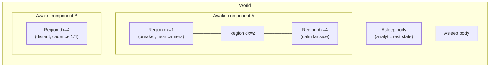

# Uniform-region multiresolution fluid — implementation handoff

Date: 2026-08-11 (updated same day after an adversarial claims audit against
HEAD; corrections are inline and marked where they reverse an earlier claim)

Status: implementation handoff. Supersedes
`docs/activity-adaptive-multiresolution-fluid-plan.md` (the octree
activity plan), which is retained for its research interpretation but must not
be implemented.

Goal: large worlds with many bodies of water. Bodies with interesting activity
or close to the camera receive higher fidelity than others. Multiple regions
can be connected. Fast. Loss of accuracy is tolerable; loss of stability,
conservation, or plausibility is not.

## 0. Decision record

The octree plan is dead for three independent reasons, each verified:

1. **GPU evidence (literature).** Every fast GPU adaptive system is
   sparse-uniform — uniform kernels over blocks, adaptivity expressed as
   *which blocks exist at which level*: SPGrid (Setaluri 2014), DCGrid
   (Raateland 2022, real-time), NVIDIA Flow, EmberGen 2.0, Chentanez–Müller
   2011 tall cells (real-time). No published system runs a graded-octree
   *liquid* pressure operator at interactive rates on any GPU. Honesty note:
   most of that list is smoke (DCGrid, Flow, EmberGen) or a heightfield
   hybrid (tall cells) — by the same standard, no published system runs
   real-time adaptive *liquid* in any representation, so the replacement is
   unprecedented too; P1 owns that (it is the load-bearing experiment, not a
   formality). Ando–Batty's
   contribution splits: the graded-octree discretization is the GPU-hostile
   half (dropped); the sizing *policy* (curvature + velocity-derivative
   activity with advected, exponentially decaying demand) is
   representation-independent (kept, Section 7).
2. **Industry evidence.** No shipped title runs adaptive 3D liquid. The
   universal pattern is representation tiers: analytic rest state → spectral or
   baked far field → bounded uniform simulation windows near activity → hard
   sleep elsewhere, with waking implemented as *spawning* a window from an
   analytic rest state, never as thawing a frozen grid.
3. **Repo evidence** (re-verified at HEAD; refs corrected). The octree
   plan's own foundation was overstated: the 8-bit sizing score never fires
   at factor 1 — stronger, its producer is not even encoded on that path
   (the live factor-1 advance returns at `lib/webgpu-octree.ts:5667` before
   the fine-transport encode); the lane hard-codes
   `crossesInterface -> unit leaf` (`lib/webgpu-octree.ts:10016`, grading
   policy `uniform-fine-free-surface-shell` in
   `lib/webgpu-octree-losasso-backend.ts:887`), so a calm surface cannot
   coarsen except where an authored refinement region outranks the rule
   (added in `af5ce69`, after this doc's first draft); and the dense
   finest-domain tracker (`lib/webgpu-octree-coarse-summary.ts:434` chain)
   is allocated and its bytes charged at factor 1, though its encode is
   reached only by the historical coarse-only and power2017 bootstrap paths
   — the memory-cost argument stands, the earlier per-frame-dispatch claim
   does not. The plan's headline outcome was unreachable on its target lane
   without first landing the still-open band-invariance work.

The replacement: **the existing uniform method runs inside every region**, at
a per-region resolution, with conservative seam coupling and one global coarse
correction per connected liquid component. This is block-structured AMR
(Berger–Colella) with a FAC-style composite solve (McCormick), which is the
established GPU-friendly form of spatial adaptivity.

## 1. Architecture overview

Three tiers, coarsest first:

- **Asleep body.** No grid exists. State is analytic: solid boundary, stored
  water level(s), stored conservative volume, stored still-water pressure
  gauge. Cost: one AABB/trigger test per frame. Waking *constructs* regions
  initialized from hydrostatic rest — this sidesteps the thaw-transient
  failure family (coarse faces resetting to `0 + dt*g`) entirely, because
  there is no stale grid to thaw.
- **Awake body = a set of uniform regions.** A region is an axis-aligned box
  running the unmodified uniform-method kernels at one dyadic cell size
  (`dx = finest * 2^k`). Face-adjacent regions differ by at most one level.
  Fidelity policy (Section 7) chooses each region's `dx` and extent.
- **Connected component = one composite solve.** Regions of one connected
  liquid component couple through conservative seam fluxes plus a global
  coarse correction. Disconnected components are fully independent solves —
  independent command encoding, independent cadence, independent
  sleep decisions — from day one, not a later phase. This is where most of
  the "many bodies" win lives and it requires none of the seam machinery.



Pairwise-only coupling with no global correction remains forbidden: the
previous plan's warning stands — low-frequency pressure error and hydrostatic
imbalance span the whole connected component, and every surveyed paper that
decomposes a liquid solve keeps a global/interface coarse level (Liu 2016;
all distributed work).

## 2. Vocabulary and invariants

- **Region**: axis-aligned box, one dyadic `dx`, dense uniform state inside,
  ghost halo outside (Section 5.2).
- **Seam**: the face interface between two adjacent regions. Same-`dx` seams
  are trivial (halo copy). 2:1 seams carry the transition operator.
- **Component**: maximal set of regions connected by liquid through seams.
- **Regrid epoch**: one transactional change to the region set (Section 6).

Invariants on every accepted frame:

1. Region `dx` values are dyadic on one global finest lattice; region origins
   and extents are aligned to their own `dx` *and* to the coarser neighbor's
   `dx` at every seam.
2. Regions differ by at most one level (2:1) across faces **and** across
   edges and corners (Berger–Colella proper nesting). Face-only grading is
   not enough: halo corners are filled from edge/corner-diagonal neighbors
   (MacCormack traces and FIM sweeps move diagonally), and boxes tiling a
   component can be corner-adjacent with a two-level jump unless the
   invariant forbids it.
3. A 2:1 seam decomposes into non-overlapping atomic subfaces at the fine
   `dx`. Each subface has one area, one normal flux value, and at most two
   pressure rows; both sides reference it with opposite incidence signs.
   Restriction fine→coarse is area-weighted and preserves total normal volume
   flux.
4. The conserved scalar authority is the uniform method's conservative
   surface density `rho` (fixed-point scatter transport). **Correction: the
   exactness this invariant needs is a target, not a current property.** At
   HEAD the scatter rounds each corner deposit independently with no
   residual carry (`lib/webgpu-uniform-reference.wgsl.ts:420`), the gather
   accumulates in f32 (`:456-472`), `max(rho, 0)` clamps mass away, and
   unplaceable mass is logged rather than conserved (`:896-898`). P0 item 1
   makes the fixed-point sum exact first; only then does "seam exchange and
   regrid handoff preserve the sum exactly absent authored sources" mean
   anything. Phi/isosurface remains presentation/reconstruction only.
5. The composite pressure operator is symmetric across seams (pairwise-equal
   off-diagonals, exact single counting of subface areas) and retains the
   CM11a separating-boundary (LCP) semantics on every row.
6. Regrid, wake, and sleep are transactional: the complete candidate tuple
   validates or the accepted generation is retained bit-identical.
7. **Mandatory tripwires** (lesson from the octree lane's two absorbing
   failure states — the gen-91 cleanly-empty accept, and fail-closed retry
   deadlock):
   - a candidate that retires every cell of a previously non-empty component
     without an authored drain is **fatal**, never a valid accept;
   - repeated candidate rejection follows **bounded-retries-then-fatal** with
     a published reason, never silent carry-forever;
   - sleep is loud: a sleeping body's wake sensors publish every frame; a
     consumer reading a generation it does not hold is fatal, not fallback.

## 3. Reused foundation (verified at HEAD)

| Foundation | Where | Role here |
| --- | --- | --- |
| Dense uniform solver (CM11 transport, sharpening, bounded MacCormack, forces) | `lib/webgpu-uniform-reference.ts` + `.wgsl.ts` | The per-region kernel set, unmodified where possible |
| CM11a LCP multigrid pressure | `lib/webgpu-uniform-pressure-multigrid.ts` | Per-region smoother inside the composite solve |
| JRW/FIM velocity extension | `lib/webgpu-uniform-velocity-extrapolation.ts` | Per-region extension, halo-seeded (Section 5.4) |
| Host allocation | `lib/uniform-host-allocation.ts` | Generalize from one lattice to N region lattices |
| Method plugin | `lib/methods/uniform.ts` | Parent of the new `uniform-regions` method id |
| Comparison lane and gates | `tools/benchmark-symmetric-expansion-comparison.ts`, `docs/symmetric-expansion-uniform-losasso-benchmark.md` | D4 symmetry, conservation, and dissipation metrics reused as the region gate harness |
| Scene lattice planner | shared planner via `SceneDescription.voxelDomain` | Region alignment source of truth |
| Authored refinement regions | `lib/octree-refinement-regions.ts` | Authored floors/ceilings and test oracle (policy only, no octree dependency) |

**Deliberately not reused** (comparison arms only, never on the new critical
path): the Losasso adaptive surface graph, adaptive mass handoff, adaptive
phi, extension band, owner pages, and the dense coarse tracker. Their
*lessons* are encoded in Sections 2, 6, and 10; their code is octree-shaped.
`power2017` is not the base method here — it force-normalizes factor 4 +
cadence 1 (`lib/methods/octree.ts:70-77`) — but **correction**: it does
carry a shipped seam-face coefficient
(`openFraction * area * inverseDistance`,
`lib/octree-power-operator.ts:144`, consulted only at seam faces per
`lib/octree-power-hybrid.ts:367`, with the triples baked into a GPU
catalog). That makes it the first-line upgrade candidate if the simple
area-weighted seam coefficient fails the hydrostatic gate (Section 10),
ahead of building an Ando–Batty-style coefficient from scratch.

## 4. Prerequisite work on the uniform lane (blocking)

Under this architecture the uniform method's quality is the **ceiling
everywhere**, not a reference arm. Before any region machinery:

1. **Exact conservation.** Invariant 4's authority does not exist yet: the
   scatter rounds each of the eight corner deposits independently with no
   residual carry, the gather accumulates in f32 and converts fixed-point
   back to float, negative clamps discard mass, and unplaceable mass is
   logged to a reduction slot rather than conserved
   (`lib/webgpu-uniform-reference.wgsl.ts:420`, `:456-472`, `:471`,
   `:896-898`). Make the transport's fixed-point sum exact — deterministic
   remainder distribution at the scatter, fixed-point gather, and a receipt
   for the clamp/unplaceable paths. The seam ledger and every regrid receipt
   are denominated in this currency; without this item they are meaningless.
2. **Dissipation.** The lane is currently recorded as "very dissipative"
   (commit `0284d41`). Diagnose with the existing A/B indicators
   (`lateToMiddleKineticEnvelopeRatio` in
   `tools/benchmark-symmetric-expansion-comparison.ts:137`;
   `normalizedLateMechanicalEnergySlopePerSecond` lives in
   `tools/webgpu-smoke-executor.ts:1880` via the settling diagnostic — the
   comparison lane re-computes a sibling rather than importing it)
   attributed per stage: gamma-diffusion repetition count and axis-order
   bias, sharpening return path, MacCormack limiter, LCP schedule. Fix or
   bound it; publish the residual as a per-(`dx`, `dt`) dissipation
   surface, **not** a per-`dx` curve: inside a component every region runs
   at the finest region's `dt` (coarse regions at low CFL take more steps
   per distance traveled, with different — typically worse — semi-Lagrangian
   dissipation than the same `dx` standalone), and temporal-LOD components
   step at `N*dt`. Section 7's policy reasons about "coarse `dx` costs X
   amplitude" and needs the surface, at composite operating points, to be
   honest.
3. **Conservative inflow receipt.** **Correction to the first draft:** the
   uniform lane already applies authored inflow as a mass source —
   `rhoNext += min(inflowReceiverSource(...), max(0, 1 - rhoNext))` at
   `lib/webgpu-uniform-reference.wgsl.ts:468-470`, fed by
   `lib/inflow-boundary.ts`. What is missing is the receipt: the add is
   clamped by free volume with no accounting of requested vs. applied. (The
   adaptive lane is the one that discards inflow outright — `void inflow;`
   at `lib/webgpu-octree-losasso-backend.ts:1487`.) Wake-on-inflow and the
   forcing activity channel need the existing source made conservative with
   a fixed-point receipt — smaller work than building a source from scratch.
4. **Wall/lid conformance.** The uniform lane's cut-cell + LCP separation
   path is believed sound, but the repo's wall-sticking history (lid welding,
   release spikes) was measured on the octree lane only. Run the free-fall
   drop and hydrostatic-tank oracles on the uniform lane and record the
   result before regions inherit it.
5. **Per-region overhead census.** One region = dense state + a CM11a
   pyramid. Measure fixed overhead (allocation, bind groups, pyramid levels,
   encode time) versus region size so Section 7's budget policy can price a
   region honestly. Small regions are only cheap if their fixed overhead is.

## 5. Region and seam design

### 5.1 Geometry

- Regions tile the awake liquid of a component with no overlap of ownership;
  every liquid cell has exactly one owning region.
- Extents quantize to the coarser neighbor's cell size at each seam so every
  coarse seam face is covered by exactly `2x2` fine subfaces (or `1x1` at
  equal `dx`).
- **Submerged-seam policy**: prefer placing 2:1 seams below the free surface
  and away from expected breaking. A calm body's surface then lives entirely
  inside one region at one `dx` — the free-surface transition problem that
  blocked the octree lane does not arise at all in the common case. The policy
  is a preference, not an invariant: a wave may cross a seam and must survive
  it (P1 gate), but the fidelity policy should steer seams out of the surface
  band when it can.

### 5.2 Halos

Each region face carries a ghost halo at the region's own `dx`, filled from
the neighbor before transport:

- equal-`dx` seam: direct copy;
- fine side of a 2:1 seam: conservative prolongation of coarse `rho`
  (piecewise-constant first; limited-gradient later) and coarse face
  velocities;
- coarse side: area-weighted restriction of fine `rho` and fluxes.

Halo width is **not** a static stencil census: MacCormack's back-and-forth
trace and the forward scatter reach `dt * |u| / dx` cells — dynamic and
CFL-dependent. Census the genuinely static stencils (gamma diffusion at its
configured **maximum** repetition count — it is a dial — sharpening's
one-cell trace, force stencils) and assert that in code; then enforce a
per-region CFL bound so the advective reach stays inside the halo:
`dt * maxSpeed <= (haloWidth - staticReach) * dx`, checked every frame.
Violations clamp the trace/deposit at the halo boundary and are counted in
the conservation receipt — never read or write past the halo silently.
Corner halo cells are filled from edge/corner-diagonal neighbors (invariant
2's proper nesting guarantees at most one level difference there). Halo
cells are read-only inputs; they never own mass.

### 5.3 Conservative scalar exchange

The uniform transport is a fixed-point scatter. Scatters that would land in a
halo cell instead accumulate into a per-seam **flux ledger** (fixed-point, at
fine-subface granularity). After both sides' transport, each ledger entry is
applied exactly once to the owning neighbor cell (restricted or prolonged as
needed). A scatter that would land *beyond* the halo is a CFL-bound
violation (Section 5.2): it deposits into the outermost ledger entry along
its ray and increments a violation counter — dropped mass is never an
outcome. The pairwise ledger is the conservation receipt: its signed sum is
zero by construction, and the per-frame publication includes per-seam totals
and the violation count.

### 5.4 Velocity and extension

- Seam-normal face velocity is single-valued: the atomic subface value is
  authoritative; the coarse face reads the area-weighted restriction.
- The JRW/FIM extension runs per region over its own lattice, seeded from
  interior liquid faces *plus* halo liquid faces, so extended velocity is
  consistent within one halo width of the seam. A seam farther than one halo
  width from the interface (submerged-seam policy) makes this exact enough;
  the P1 fixtures measure the residual for surface-crossing seams.

### 5.5 Composite pressure solve

Requirements: one converged solve per component per advance; symmetric
composite operator; LCP (separating) semantics preserved; global coarse
correction present.

Recommended construction, in order of increasing ambition:

1. **P1 (two regions):** composite projected PCG over the union of rows. The
   operator applies each region's uniform 7-point stencil internally and the
   seam subface coefficients at boundaries. Preconditioner: one region-local
   multigrid cycle per region (block preconditioner) **plus** one global
   coarse-grid correction assembled at the coarsest common `dx`.
   **Correction to the first draft, two parts.** (a) The uniform lane
   sequences no PCG at all — it is pure projected multigrid (3 Full-Cycles +
   4 V-Cycles of PRBGS with the min-clamp inside every sweep,
   `lib/webgpu-uniform-pressure-multigrid.ts:278-418`), so the outer
   projected-PCG loop is new numerical work, not reuse. (b) The existing
   cycle cannot serve as the preconditioner as-is: the in-sweep projection
   makes it nonlinear, and a nonlinear operator is not a valid SPD
   preconditioner for CG. The preconditioner must be a **linearized
   (unclamped) variant** of the region cycle with symmetric pre/post sweeps,
   with the LCP projection applied only in the outer iteration; the gate
   list below gains "preconditioner is linear and symmetric" (apply it to
   random vectors, check `x^T M^{-1} y = y^T M^{-1} x`). If linearized-cycle
   projected PCG misbehaves on the LCP active set, skip ahead to the P3+
   FAC form, which keeps projected smoothing and needs no SPD
   preconditioner.
2. **P3+:** promote to true FAC if PCG iteration counts grow with region
   count: smooth per region, restrict composite residual to the global coarse
   grid, correct, prolong.

Gates carried from the old plan's Section 10 — all nine, an earlier draft
dropped one — now applied only at seams (few faces, so a higher-order
coefficient is affordable if the simple area-weighted one fails):
reciprocal incidence; exact single counting of subface area; pairwise-equal
off-diagonals; **diagonal equals the sum of incident liquid couplings plus
valid boundary terms** (this is the gate that catches subface double
counting on the diagonal); `x^T A y = y^T A x` within the f32
exact-reduction bound; constant field ⇒ zero interior gradient; a
manufactured **linear** field is reproduced *exactly* across a stationary
2:1 seam (a consistent operator is exact on linears — this is an exactness
oracle, not a convergence one) and a smooth quadratic manufactured field
converges at the expected order; **hydrostatic water spanning a seam
develops no growing parasitic current**; projection meets the uniform
lane's divergence contract; preconditioner linearity/symmetry (above).

## 6. Regrid, wake, and sleep transactions

Events: region `dx` change (one level per epoch), region split/merge, region
extent growth/shrink (following activity), body wake, body sleep.

Every event is the same transaction shape:

1. build candidate region set (aligned, 2:1-closed at region granularity);
2. allocate candidate state; transfer by exact dyadic overlap. `rho`
   restriction is a fixed-point sum — exact as-is. Prolongation divides one
   fixed-point value by 8, which **leaves a remainder**: exactness requires
   a deterministic remainder-distribution rule, and that rule must itself be
   D4-symmetric (a raster-order "first child gets the remainder" rule fails
   the symmetric-expansion gate by construction — distribute to the child
   nearest the domain centre, or spread by a symmetric fixed pattern);
3. face velocities: retained seams copy; refine initializes children from the
   parent plus a uniform correction so `sum(area_i * u_i)` matches the parent
   flux; coarsen restricts area-weighted;
4. validate receipts: exact fixed-point mass; aggregate flux at the f32
   floor; **no positive kinetic-energy drift in a stationary no-force
   transfer** (restriction loss is allowed and reported); finite values;
   generation coherence;
5. atomic flip on the next frame head, or retain the accepted generation.

Section 2's tripwires apply. Additional rules:

- refine reacts in one epoch; coarsen/sleep requires sustained quiet evidence
  (initial: 8 epochs) and respects the support radius (Section 7);
- sleep additionally requires near-hydrostatic state (kinetic energy under a
  scene-scaled floor, surface slope under a threshold); the stored rest state
  is written from the conservative volume, not from phi;
- wake constructs regions from the analytic rest state plus the wake impulse
  (falling body, inflow, authored event) — never from retained stale fields.

## 7. Fidelity policy

Built fresh — the repo finding is that nothing reusable exists on the target
lane (the factor-4/8 sizing score never fires at factor 1, and its bool
collapse lives in a summary ABI we are not carrying). The *design* follows
Ando–Batty 2020 sizing plus two repo-specific products per region:

- `requiredDx`: finest `dx` any policy channel demands anywhere in the
  region (regions subdivide when internally bimodal);
- `supportRadius`: physical reach residency must cover before the next regrid
  epoch (`k*dt*maxSpeed + 0.5*(k*dt)^2*aMax + extension band + halo`),
  dilating region extents without forcing fine `dx`.

Channels, each clamped to `[0,1]`, combined by max, all computed on region
lattices (cost proportional to awake cells, never the finest world lattice):

| Channel | Signal |
| --- | --- |
| Interface geometry | `dx * |kappa|` at the 0.5-isosurface, zero-crossing flag |
| Deformation | `dt * max(norm(strain), norm(vorticity))` |
| Hierarchical defect | region field vs. its own restriction-prolongation round trip (the Richardson-style estimator; measured before any coarsen) |
| Forcing | inflow, wake events, moving-solid swept volume, authored regions |
| **Camera** | screen-space cell size: required `dx` such that a cell projects to ≤ `p` pixels at the region's nearest point (`p≈2` quality, `4` balanced, `8` performance); frustum-culled and occluded bodies fall to a floor `dx` and become sleep-eligible sooner |
| Wavelength floor | ≥ 8–12 cells per dominant surface wavelength (estimator can land late; authored corridors substitute until then) |

Demand is advected with the flow and decays exponentially
(`R(dt) = T1^(dt/T2)`, seed `T1=0.9`, `T2=0.01 s`, per Ando–Batty) — this is
the hysteresis and the prediction in one mechanism, replacing separate
quiet-counters for `dx` selection (quiet counters remain for sleep).

**Budget policy (replaces the capacity cliff).** A global awake-cell budget
(and bytes budget) is a first-class dial. Regions are priority-ranked
(camera channel × activity × authored weight, DCGrid-style k-selection); when
demand exceeds budget, the lowest-priority regions coarsen or sleep
**deterministically and visibly** (published per-frame), rather than any
candidate failing allocation. Capacity exhaustion inside a transaction still
rejects atomically — but the budget policy runs first so exhaustion is the
exception, not the steady-state regulator.

**Temporal LOD is allowed** (reversing the old plan's non-goal, per the
activity-handoff conclusion that cadence is the fidelity axis): all regions
of one component share one `dt` and cadence, but distant/calm *components*
may advance every Nth frame with `N*dt` steps, and asleep bodies advance
never. Per-region subcycling within a component stays out of scope.

**Component topology is dynamic and must be handled explicitly** (a gap in
the first draft): liquid connects components — overflow from one pool into
another, a splash bridge — and until a connection is *detected* the two
bodies run with no coupling at all, which is a strictly worse version of
the pairwise-only state Section 1 forbids. Rules:

- detection is conservative and pre-contact: trigger on proximity plus
  approach velocity (or an inflow/trajectory predictor for falling water),
  never on "liquid already touches";
- merge is a Section 6 transaction at the next common frame: the laggard
  component first catches up to time parity with steps at its own `dt`,
  then the merged component adopts the finer cadence of the two;
- split is lazy: a component that separates keeps one cadence until the next
  regrid epoch reassesses;
- the P2/P3 fixtures include a connect-under-distinct-cadences case, not
  only region merge/split within one component.

## 8. Phases

### P0 — Uniform-lane prerequisites and baselines

Section 4 items, plus: capture uniform-lane artifacts (existing comparison
lane) for symmetric expansion, mini dam, hydrostatic tank, ocean-seiche at
two uniform resolutions — these are the quality/dissipation reference curves
per `dx`. When comparing against the Losasso lane, run the pass census first
(`FLUID_GPU_PASS_TIMESTAMP_COMMAND_BUFFERS=8 … --pass-timestamps`): the
factor-1 dense tracker chain must be attributed or excluded, or every
"regions are Nx faster" claim is corrupt.

Exit: transport fixed-point sum exact with a published receipt; dissipation
attributed with a per-stage table and a per-(`dx`, `dt`) surface sampled at
composite operating points (coarse `dx` at fine-`dt` CFL, and `N*dt`
cadence points); inflow source receipted; wall oracles recorded; repeated
runs publish comparable artifacts.

### P1 — Vertical slice: one seam

Two static regions, 2:1 `dx`, one seam; composite PCG with block-multigrid
preconditioner and global coarse correction. Fixtures: the Section 5.5
operator gates; stationary hydrostatic spanning the seam; dam break crossing
the seam. **Seam-sweep oracle** (the analog of the band-sweep front oracle,
far cheaper than wave instrumentation): sweep the seam plane's position and
the coarse `dx` — the front-position trajectory must collapse across seam
placements and converge monotonically toward all-fine as the coarse side
refines.

Exit: all operator gates green; seam-sweep collapse; conservation exact;
dissipation across the seam within the P0 per-(`dx`, `dt`) surface at the
composite operating point plus a reported seam increment.

This phase is the load-bearing experiment, not merely de-risking: by
Section 0's own evidence standard, no published system runs real-time
adaptive liquid in any representation, so the seam + LCP composite has no
precedent either — P1 is where the program earns or loses its premise.
Reach it as fast as the P0 prerequisites allow.

### P2 — Many bodies

**Prerequisite (correction to the first draft): an authored multi-body
schema does not exist.** `SceneDefinition` has no water-body list — water is
one implicit body in `lib/model.ts:163-183` (`dam-break`/`tank-fill` plus a
flat `initialBrickSeeds_m` paint list, with `fillFraction` validation
hard-coupled to the dam volume), and "bodies are entities" is true only of
editor *selection* (`lib/editor-fluid-body.ts`; its `fluidBodies` comment
is stale — no such symbol exists in the repo). Land an authored
`waterBodies` list (box / level / seed forms) with migration from the
implicit fields; component discovery then reads it.

Then: independent solves and cadence per component; component connection
detection and cadence-parity merge (Section 7); sleep/wake with analytic
rest state and loud sensors; wake-from-drop and wake-from-inflow fixtures.

Exit: a scene with N calm bodies and one active body costs the active body
plus N trigger tests; sleeping and re-waking a body 1,000 times conserves
its volume exactly and injects no energy at wake beyond the impulse's own
plus a tolerance derived from the sleep thresholds (sleep admits kinetic
energy and surface slope under floors, and wake reconstructs flat
hydrostatic, so wake may legitimately perturb energy by up to what the
thresholds admitted — the gate budget is exactly that, not zero); two
components at cadence 1 and cadence 4 connect via overflow without a
conservation or stability violation.

### P3 — Dynamic regrid

Activity/camera-driven `dx` changes and region growth/shrink through the
Section 6 transaction; demand advection/decay; budget ranking; a breaker
region following a wave packet across a basin; two active regions that merge
and split; two *components* that connect and later separate (Section 7
rules), exercised at distinct cadences.

Exit: stationary refine/coarsen cycle x1,000 with exact mass, no energy
drift, no churn after stabilization (< 0.5% of regions change per epoch in
steady scenes); moving activity crosses seams without holes or missing
support; budget over-demand degrades deterministically with published
attribution.

### P4 — Controls, presets, overlays

Presets `off / quality / balanced / performance`; overlay showing region
boxes, `dx`, priority, seam type, sleep state, wake sensors; deterministic
"freeze regions" debug action; config object per Section 11 stored separately
from authored refinement regions.

### P5 — Scale-out (conditional, measured first)

Only what profiling demands, in this order of likelihood:

1. sparse residency *within* large regions (brick pool per region) if dense
   region interiors dominate memory;
2. a tall-cell region kind for deep calm interiors (the uniform lane is
   already CM11; Narita 2025's quadtree tall cells is the reference — this
   is a representation tier, not more octree);
3. wave-quality instrumentation: phase/reflection/transmission probes do not
   exist today — `tools/ocean-wave-propagation-probe.ts` measures far-half
   disturbance and crest reach only, and is already wired into the
   ocean-seiche smoke gate, so extend it rather than assuming green means
   wave quality — promoted into gates once there is a system worth
   calibrating;
4. Schur/regional decomposition of the composite solve — only if the
   composite MGPCG itself, not transport or regrid, is the measured wall
   (two independent prior findings say pressure convergence is not the
   bottleneck; do not start here).

## 9. Acceptance

Hard gates (stability/conservation — cheap insurance, never relaxed):
topology validity; transactional atomicity and tripwires; exact fixed-point
mass across seams, regrid, sleep/wake; no positive energy drift in
stationary transfers; composite operator symmetry/SPD-with-LCP gates;
hydrostatic seam current bounded and non-growing; D4 symmetry on the
symmetric-expansion lane at parity with the uniform lane's own bias
disclosure — noting that this constrains the lane's *layout*: the region
partition there must itself be D4-symmetric (one region, or a symmetric
split) and the fixed-point remainder rule symmetric, because an asymmetric
seam placement fails D4 by construction, which is a fixture-layout error,
not a solver bug; divergence within the uniform lane's contract.

Reported telemetry, promoted to gates only after calibration (the goal says
accuracy loss is tolerable — measure it, don't gate on guesses): wave phase /
reflection / damping numbers; front-velocity deltas vs. all-fine; seam
dissipation increments; per-preset visual acceptance.

Value gates before claiming success: a localized-activity large-basin scene
reduces awake cells ≥ 4x vs. all-fine at matched plausibility; GPU frame time
≥ 2x better on that scene; the N-bodies scene scales with awake bodies only.

## 10. Risk register

- **Seam reflection vs. dissipation conflation** — measure incident /
  transmitted / reflected separately against a *uniform-coarse* control (the
  all-fine arm is the quality target, not the seam-isolation baseline).
- **Parasitic seam currents** — the hydrostatic gate is a default-enablement
  blocker; if area-weighted coefficients fail it, promote the shipped
  power2017 seam coefficient first
  (`lib/octree-power-operator.ts:144`, Section 3), then an
  Ando–Batty-style coefficient — at seams only.
- **Undetected component connection** — two touching components run
  uncoupled, the exact pairwise-only state Section 1 forbids; detection is
  conservative and pre-contact, and merge is transactional with cadence
  catch-up (Section 7). A missed detection that lets liquid overlap is
  fatal under the tripwires, not a warning.
- **Absorbing failure states** — the two documented octree-lane deaths
  (empty-accept, retry deadlock) are answered by the Section 2 tripwires;
  they are not optional.
- **Coarsened-away detail declared permanently calm** — the hierarchical
  defect channel is measured *before* coarsening, demand advects with the
  flow, forcing/camera channels wake regions, and sleep requires
  near-hydrostatic state, not just low score.
- **Region chatter** — decay hysteresis, one level per epoch, minimum region
  lifetime, published churn counters.
- **Fixed overhead per region** — the P0 census; if small regions are
  expensive, the policy must prefer fewer/larger regions (the budget ranker
  prices this).
- **Uniform-lane dissipation is the ceiling** — P0 item 2; the
  per-(`dx`, `dt`) dissipation surface is the honest currency the whole
  fidelity policy trades in.
- **Fast feature outruns support** — `supportRadius` dilation over the full
  cadence interval; coverage failure rejects the epoch (bounded, then fatal).

## 11. Configuration sketch

```ts
interface UniformRegionAdaptivity {
  enabled: boolean;
  finestDx_cells: 1 | 2 | 4;          // per-scene finest region resolution
  coarsestDx_cells: 2 | 4 | 8 | 16;
  cameraPixelsPerCell: number;         // screen-space error target
  budgetAwakeCells: number;            // global, deterministic degradation
  quietEpochsToCoarsen: number;
  quietEpochsToSleep: number;
  componentCadenceMax: 1 | 2 | 4;      // temporal LOD for distant components
  regridCadence: number;
}
```

Scene-authored refinement regions remain art-direction bounds and the test
oracle; runtime dials remain experiments; defaults preserve current behavior
until the acceptance suite passes.

## 12. PR sequence

1. Uniform-lane exact-conservation receipt; dissipation attribution + fixes;
   wall oracles; inflow receipt (P0 — no region code).
2. Region host: N-lattice allocation, halo ABI, equal-`dx` seam exchange
   (two same-`dx` regions must be bit-comparable to one merged region — the
   free correctness oracle).
3. 2:1 seam: ledger exchange, restriction/prolongation, operator
   coefficients, operator gate fixtures.
4. Composite solve (projected PCG with linearized block-MG preconditioner +
   global coarse correction); hydrostatic + dam-crossing + seam-sweep
   fixtures.
5. Authored multi-body schema; component discovery, independent solves,
   cadence, connection detection + merge.
6. Sleep/wake with analytic rest state + tripwires.
7. Regrid transaction + receipts (behind opt-in flag).
8. Fidelity policy: channels, demand advection, camera, budget ranking.
9. Presets, overlays, config persistence.
10. Default-enablement decision on the Section 9 matrix.

Every PR retains: type checks, focused CPU structural tests, focused Dawn
tests for touched GPU publication, the symmetric-expansion D4 gate for
recurring-physics changes, and at least one seam-conservation fixture for any
seam or transfer change.

## 13. References

- Repo: `docs/UNIFORM_GPU_REFERENCE.md` (the per-region kernel contract);
  `docs/symmetric-expansion-uniform-losasso-benchmark.md` (gate harness);
  superseded octree plan `docs/activity-adaptive-multiresolution-fluid-plan.md`
  (its Sections 2, 10, 13, 16 informed this doc). Deleted Losasso handoffs are
  recoverable via `git show 7d129cb^:docs/<name>.md`.
- Papers in `docs/papers/`: Chentanez–Müller (`massConservingLiquids`,
  `tallCells`) — the uniform lane's sources and the tall-cell tier;
  Narita 2025 (`sg2025narita`) — quadtree tall cells, the deep-calm-water
  endgame; Raateland 2022 (`raateland-2022-dcgrid`) — budgeted GPU
  adaptivity/k-selection; Ando–Batty 2020 — sizing policy and, if needed,
  seam coefficients; Liu 2016 — why the global coarse correction stays.
- External: Berger–Colella block-structured AMR; McCormick's FAC (the
  composite-solve pattern); Setaluri 2014 SPGrid (pyramid-of-sparse-uniform
  precedent).
